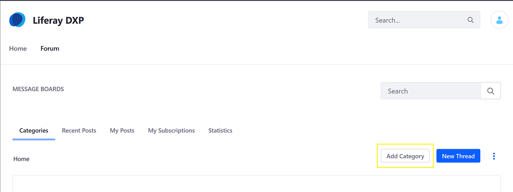
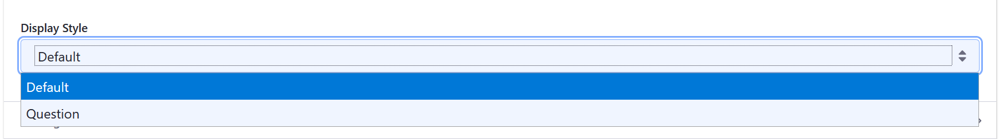
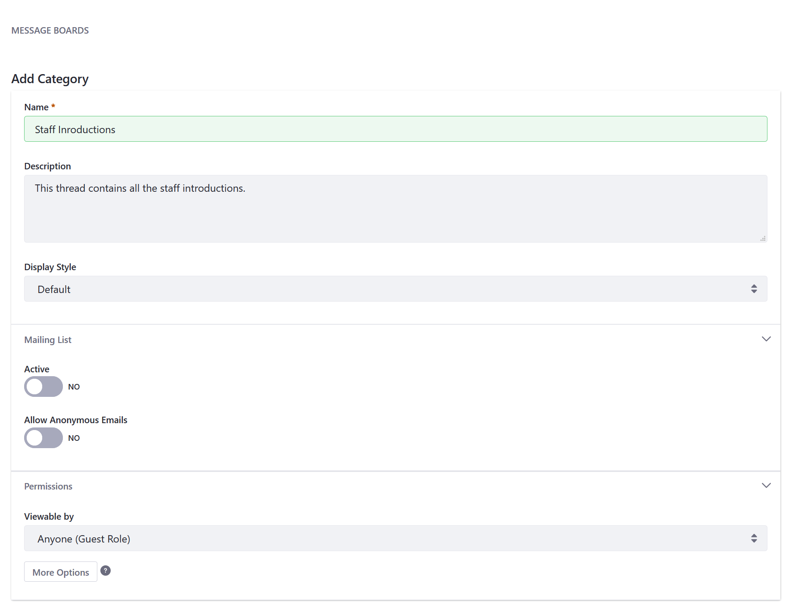
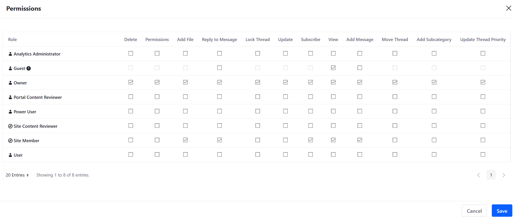
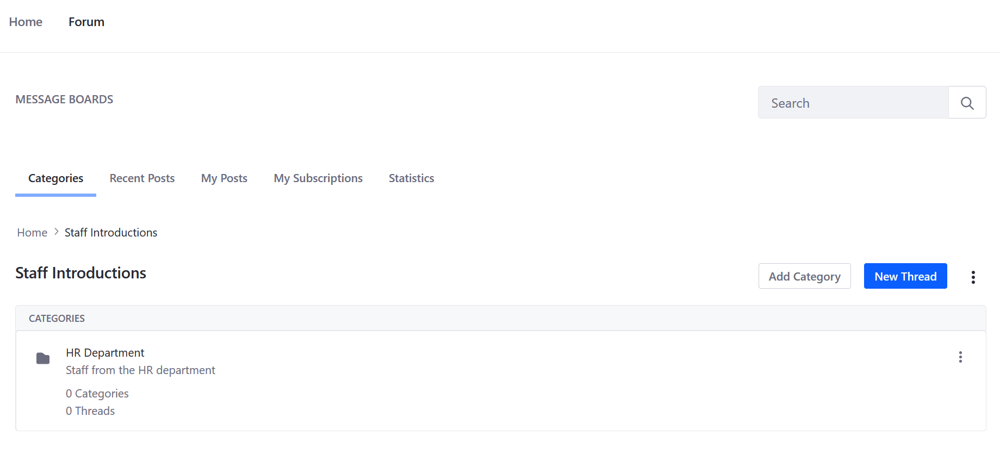
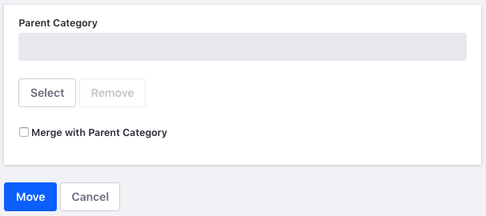

# Creating Message Boards Categories

Message Boards Categories organize threads by topic. Only authenticated users with the [requisite permissions](./message-boards-permissions-reference.md) (at minimum, _Add Category_, _Add Subcategory_) have the ability to create categories. To learn more about DXP Roles and Permissions in general, see [Roles and Permissions](https://help.liferay.com/hc/articles/360017895212-Roles-and-Permissions).

## Adding Categories

The most common way to add a new category is by directly using the the _Message Boards_ widget.

1. On the Message Boards widget, click the _Add Category_ button.

    

1. Enter a name for the category (for example, **Staff Introductions**).
1. Enter a description.
1. Select the category's _Display Style_. This controls how threads in the category appear. By default, you can choose these display styles:

    * **Default:** Classic display style for general purpose discussions.
    * **Question:** Threads appear in a question and answer style.

    

1. In the _Mailing List_ section, leave the _Active_ toggle to _NO_ to disable a mailing list for the category. If switched to _YES_, fill in the mail server settings. For more information, see the [Setting up Mail](../../../installation-and-upgrades/setting-up-liferay-dxp/connecting-to-a-mail-server.md) article.
1. Leave the _Allow Anonymous Emails_ toggle to _NO_ to prevent anonymous users from posting to the category. Otherwise, if you do want to let anonymous users send emails to post to the message board category, switch the _Allow Anonymous Emails_ toggle to _YES_.

    

1. Leave the _Viewable by_ to **Anyone (Guest Role)** for now. This allows non-authenticated users (Guests) to view the Category if the site page is a public page. For more information about the different permissions available, see the [Message Boards Permissions Reference](./message-boards-permissions-reference.md)
1. Click _Save_.

The new category now appears in the table.

New categories appear on the message board's home screen. The list displays the category names and the numbers of subcategories, threads, and posts in each one.

## Modifying Permissions

For more information about the different permissions, see the [Message Boards Permissions Reference](./message-boards-permissions-reference.md#general-category-permissions)

To modify a category's permissions:

1. Click _Actions_ icon () next to the _Category_.
1. Click _Permissions_.
1. The default permissions for this _Category_ are displayed. Check the boxes for the other roles to grant a permission.

    

1. Click _Save_ when finished.

## Adding Subcategories

Categories can contain as many subcategories as you like.

Follow these steps to add a subcategory to a category:

1. Click the category's name in the list (continuing the example above: **Staff Introductions**).
1. Click the _Add_ icon () and select _Category_.
1. Enter a name for the subcategory.
1. Enter a description for the subcategory.
1. Although the subcategory inherits the parent category's settings, administrators and content creators can change the values for the subcategory's _Display Style_ and _Mailing List_ options.
1. Click _Save_.

The subcategory now appears in the table.

## Moving and Merging Categories

Administrators can also move and merge categories.

Follow these steps to move a category or merge it with another:

1. Click the category's _Actions_ icon () and select _Move_. This brings up the Move Category form.
1. Select a new parent category via the _Select_ button under the _Parent Category_ field. Note that this field is empty for top-level categories.
1. If you want to merge the category with the selected parent category, select _Merge with Parent Category_.
1. Click _Move_.

    

Regardless of how many categories (and subcategories) there are, a category is just a container to organize a message board's threads. To start creating threads, see the [Creating Threads](./creating-message-boards-threads.md) article.

## What's Next

Once you have created categories and a few subcategories, you can learn how to create [Message Board Threads](./creating-message-boards-threads.md)

## Additional Information

* [Message Boards Configuration Reference](./message-boards-configuration-reference.md)
