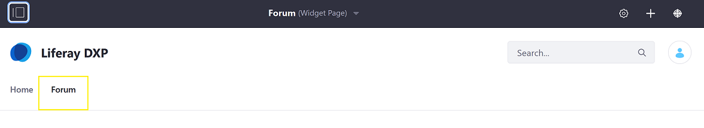
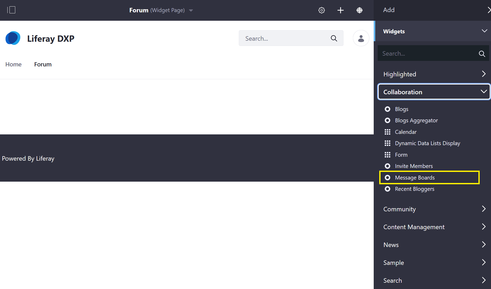
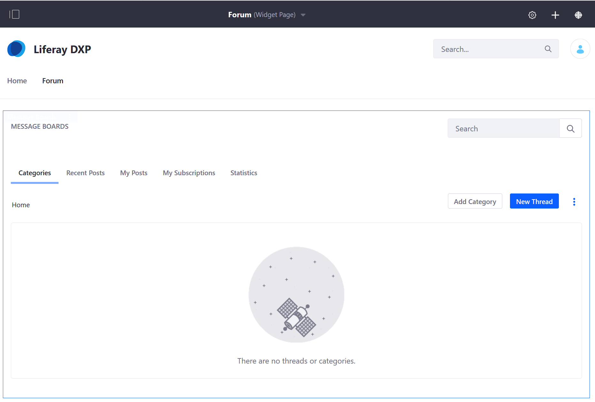

# Getting Started with Message Boards

Liferay DXP's Message Boards app is a forum application which can be added to any DXP site page. A Message Board on DXP can be [scoped to a site](https://help.liferay.com/hc/articles/360028819992-Widget-Scope), including a regular site, an organization’s site, or a user's profile site or dashboard site.

## Adding Message Boards to a Site

The fastest way to begin using the _Message Boards_ app is to deploy the widget to a [Site Page](https://help.liferay.com/hc/articles/360029132211-Creating-Pages).

1. Navigate to the site and page desired (e.g. _Forum Page_).

    

1. Click the _Add_ button.
1. Click _Widgets_ then _Collaboration_ to expand the menu.

    

1. Drag and drop the _Message Boards_ widget to the desired location on the page.

    

Site members are able to create forum posts using the _Message Boards_ widget. Note that there can be only one _Message Boards_ widget per page.

## What's Next

Learn how to use the features of the Message Boards application:

* [Creating and Managing Message Boards Categories](./creating-message-boards-categories.md)
* [Creating Threads](./creating-message-boards-threads.md)
* [Subscribing to a Message Board](./subscribing-to-a-message-board.md)
* [Moderating Message Boards](./moderating-message-boards.md)
* [Configuring a Message Boards Mailing List](./configuring-a-message-boards-category-mailing-list.md)
* [Advanced Topics: Understanding Message Boards Scope](./scoping-your-message-boards.md)

### Reference

* [Configuration Reference](./message-boards-configuration-reference.md)
* [Permissions Reference](./message-boards-permissions-reference.md)
