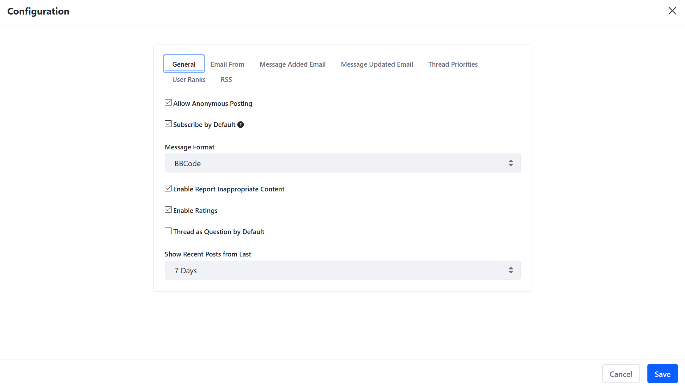
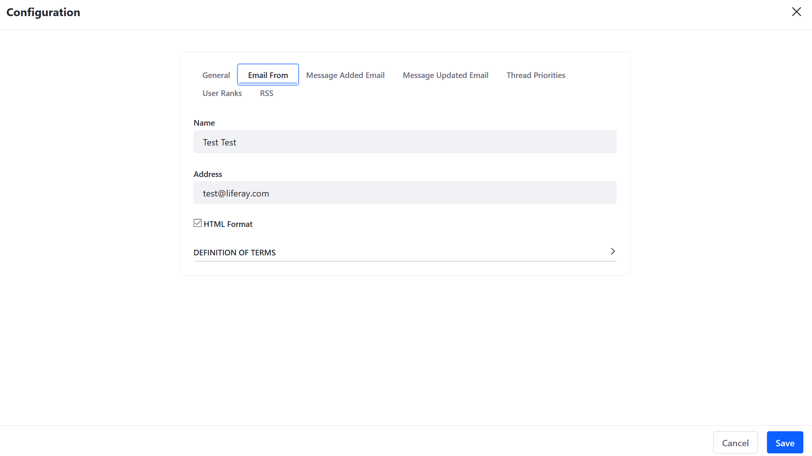
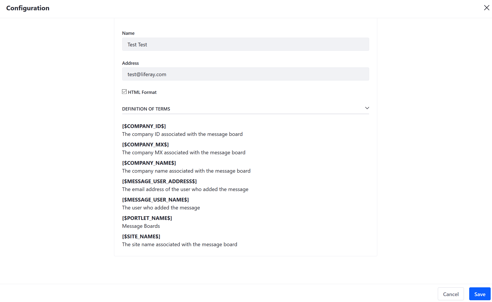
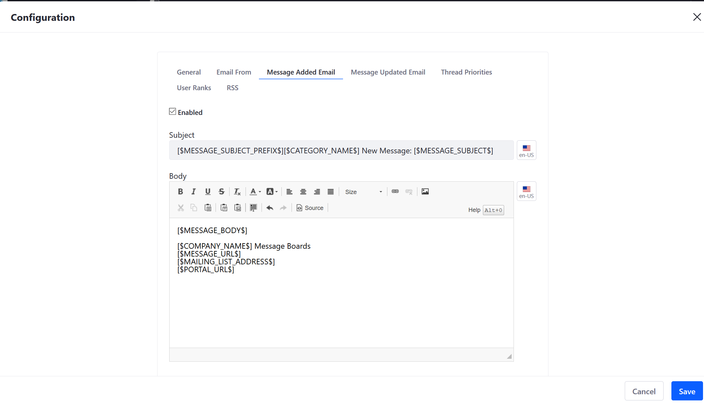
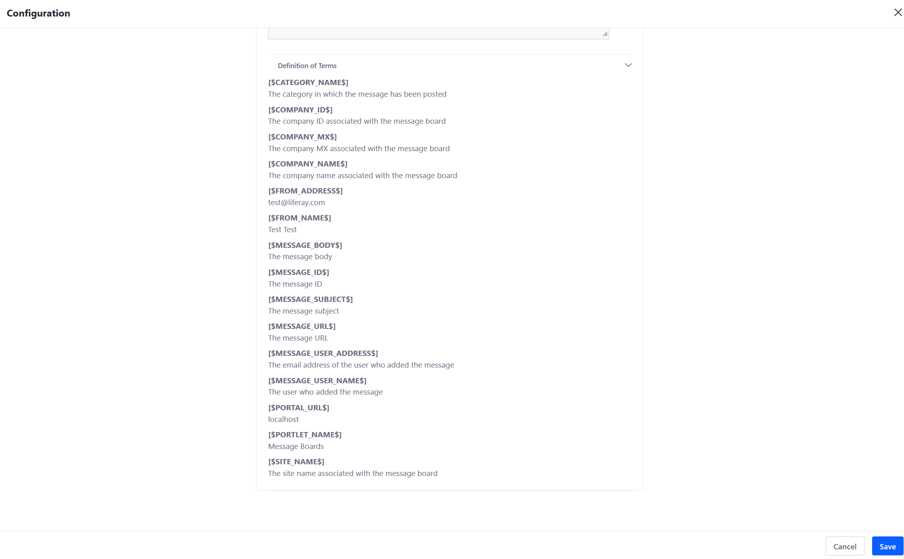
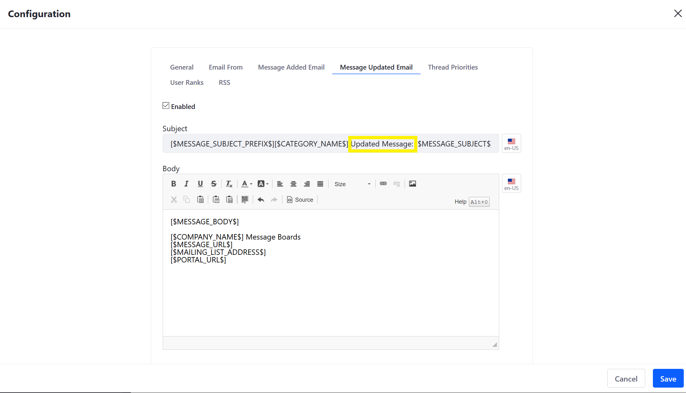
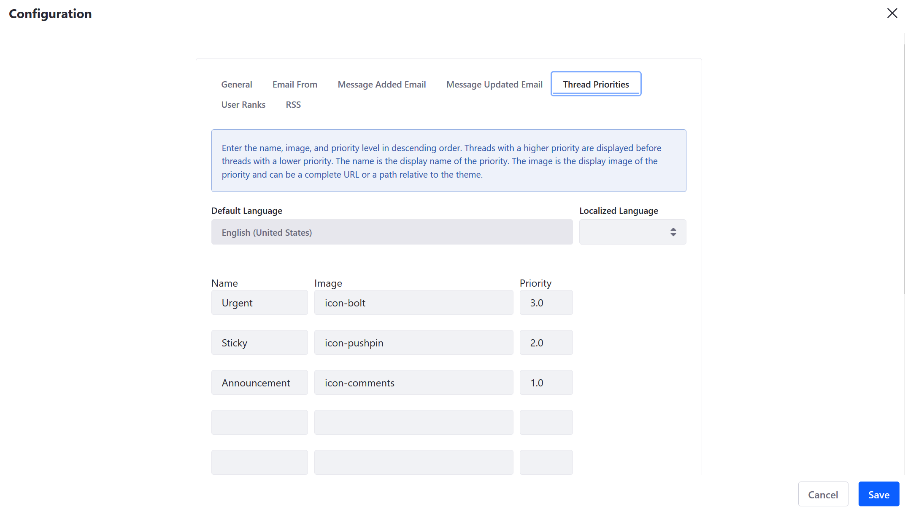
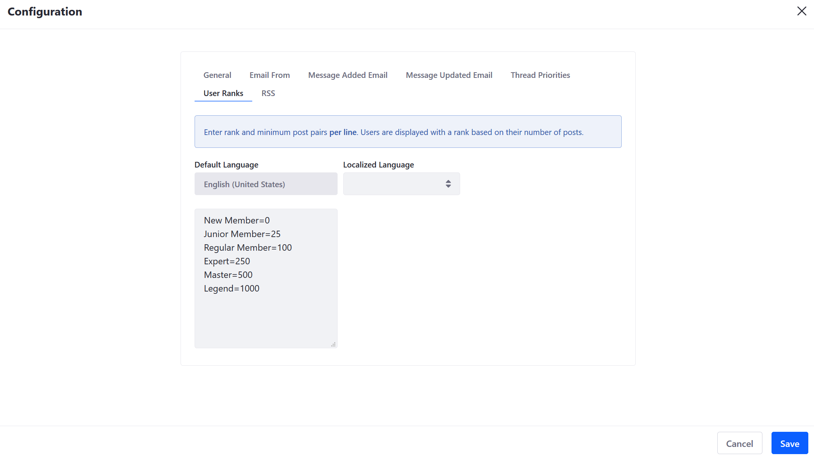
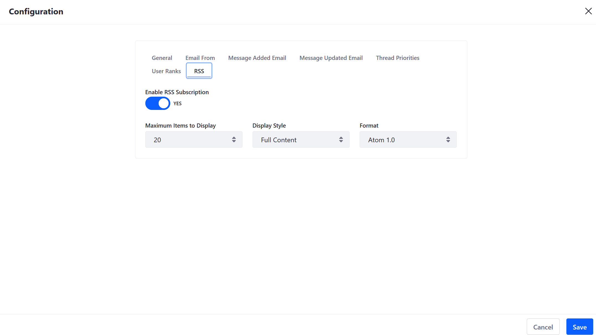

# Message Boards Configuration Reference

This article documents configuration settings available in the _Message Boards_ app. To view the _Message Boards_ app's Configuration screen:

1. Navigate to _Site Administration_ &rarr; _Content & Data_ &rarr; _Message Boards_.
1. Click the _Options_ menu &rarr; _Configuration_.

## General Tab

| Name | Description |
| --- | --- |
| Allow Anonymous Posting | Allows guest (non-authenticated) users to post threads. |
| Subscribe by Default | Subscribe users by default to threads they participate in. |
| Message Format | Dropdown menu to select BBCode or HTML as the editor |
| Enable Report Inappropriate Content | Enables users to report threads for Terms of Use <!-- It'd be nice if we made a link to an article on how to define the ToS for a site here --> violations |
| Enable Ratings | Enables users to rate threads |
| Thread as Question by Default | If enabled, the first threads are always questions and subsequent threads can be marked as answers; disabled by default |
| Show Recent Posts from Last | Dropdown menu to select how many previous posts are displayed based on time: _24 Hours_, _7 Days_, _30 Days_, or _365 Days_ |

## Email From

| Name | Description |
| --- | --- |
| Name | Name of the forum owner or moderator |
| Address | Email address of forum owner or moderator |
| HTML Format | Checkbox to select the email's format |

Expand the _Definition of Terms_ menu to learn more about how to create an automated email that import data and metadata from each thread:

## Message Added Email

The _Message Added Email_ tab contains the template for emails that are sent whenever a message board thread is created.

Expand the _Definition of Terms_ menu to learn more about how the variables used to create an automated email that import data and metadata from each thread.

## Message Updated Email

The _Message Added Email_ tab contains the template for emails that are sent whenever a message board thread is updated.

Expand the _Definition of Terms_ menu to learn more about how to create an automated email that import data and metadata from each thread

## Thread Priorities

| Name | Description |
| --- | --- |
| Default Language | The instance's default language is set to English and cannot be modified here. |
| Localized Language | Dropdown menu for all supported languages; allows administrators to input different ranks in different languages. |
| Name | Name of the priority level |
| Image | Name of the icon associated with the priority level <!-- how do I change the icon? --> |
| Priority | Priority level of the thread; threads with a higher number are more important; enter them in the descending order. |

## User Ranks

Message Boards users can configured to have a visible rank based on the number of posts they contribute.

| Name | Description |
| --- | --- |
| Default Language | The instance's default language is set to English and cannot be modified here. |
| Localized Language | Dropdown menu for all supported languages; allows administrators to input different ranks in different languages. |
| User Ranks Text Area | Text area where the user-defined ranks are entered |

## RSS

| Name | Description |
| --- | --- |
| Enable RSS Subscription | Toggle to enable or disable RSS subscriptions |
| Maximum Items to Display | Dropdown menu to select maximum number of threads in the RSS feed |
| Display Style | Dropdown menu to select how the threads are displayed as an abstract, full content, or title only |
| Format | Dropdown menu to select which format: Atom 1.0, RSS 1.0, or RSS 2.0 |
