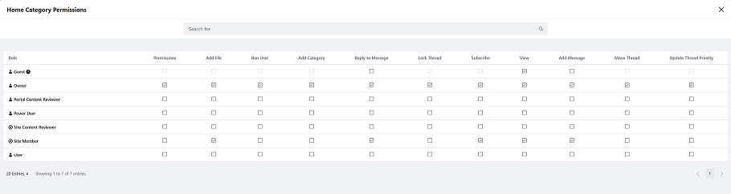
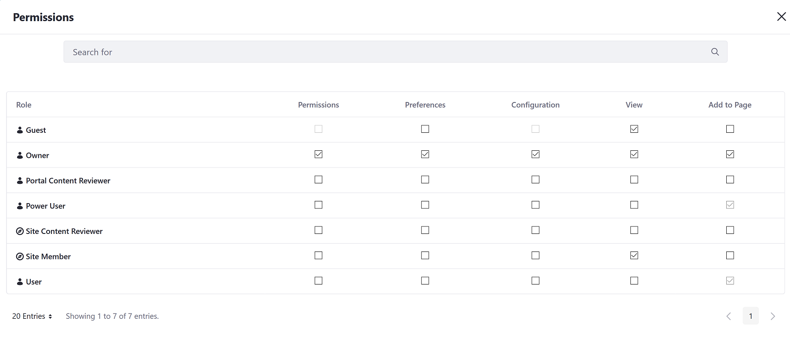
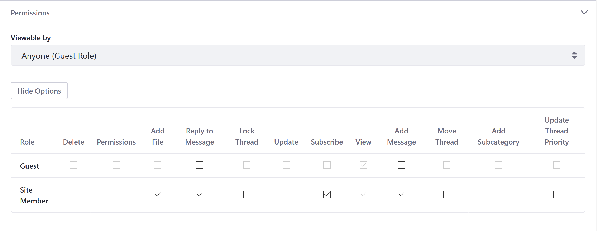

# Message Boards Permissions Reference

This article documents permissions in the _Message Boards_ widget and serves as a reference when assigning permissions to users and roles. To learn more about DXP Roles and Permissions in general, see [Roles and Permissions](https://help.liferay.com/hc/articles/360017895212-Roles-and-Permissions).

## Home Category Permissions

The _Message Boards_ permissions screen is for granting and revoking access to _Message Boards_ functions.

1. Navigate to the _Site Administration_ for the host site (for example, Liferay DXP's guest site).
1. Click _Content & Data_ &rarr; _Message Boards_.
1. Click the *Options* icon () then *Home Category Permissions*.

    

The permissions enable users who have a particular Role to perform the following actions:

| Permission Name | Description |
| --- | --- |
| **Permissions:** | Grants the ability to view and modify permissions. |
| **Add File:** | Grants the ability to attach a file to a message. |
| **Ban User:** |Grants the ability to forbid a user from participating in the message board. |
| **Add Category:** | Add a new category to the message board. |
| **Reply to Message:** | Respond to an existing message. |
| **Lock Thread:**  | Stop any further additions or modifications to a thread's messages. |
| **Subscribe:** | Receive notifications on new and modified posts. |
| **View:** | View all the contents of message threads. |
| **Add Message:** | Post a new thread. |
| **Move Thread:** | Move a thread to a different category or subcategory. |
| **Update Thread Priority:** | Modify a thread's priority. |

## Widget Permissions

After adding a Message Boards widget to a page, administrators can access that widget instance's general permissions. To do so, select the widget's *Options* menu () and select *Permissions*.

| Permission Name | Description |
| --- | --- |
| **Permissions:** | Grants the ability to view and modify the widget's permissions. |
| **Preferences:** | Grants the ability to view and modify widget's preferences. |
| **Configuration:** | Grants the ability to view and modify the widget's configurations. |
| **View:** | Grants the ability to view the widget. |
| **Add to Page:** | Grants the ability to add the widget to a site page. |

## General Category Permissions

This set of permissions determine what changes Guests and Site Members can make to a Category.

| Permission Name | Description |
| --- | --- |
| **Delete:** | Remove the category. |
| **Permissions:** | View and modify permissions. |
| **Add File:** | Attach a file to any of your messages. |
| **Reply to Message:** | Respond to existing messages. |
| **Lock Thread:** | Stop any further additions or modifications to a thread's messages. |
| **Update:** | Edit the category. |
| **Subscribe:** | Receive notifications on new and modified posts. |
| **View:** | View the category. |
| **Add Message:** | Post a new thread. |
| **Move Thread:** | Move a thread to a different category or subcategory. |
| **Add Subcategory:** | Add a new category within this category. |
| **Update Thread Priority:** | Modify a thread's priority. |

## Thread Permissions

 This set of permissions determine what changes users can make to a Thread.

| Permission Name | Description |
| --- | --- |
| **Delete:** | Remove the thread. |
| **Permissions:** | Grant/revoke thread permissions. |
| **Update:** | Edit the thread. |
| **Subscribe:** | Receive notifications for thread activity. |
| **View:** | View the thread. |
