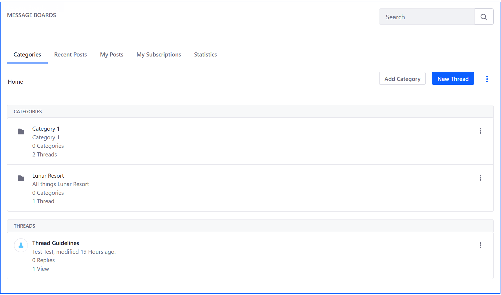
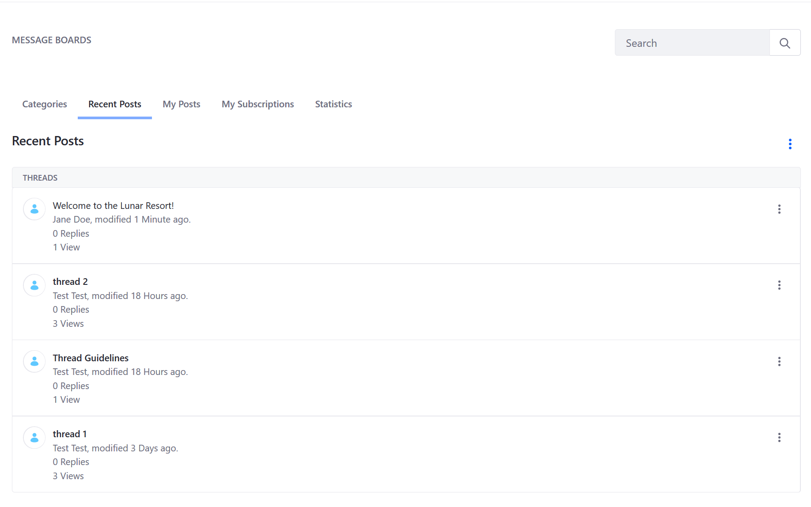
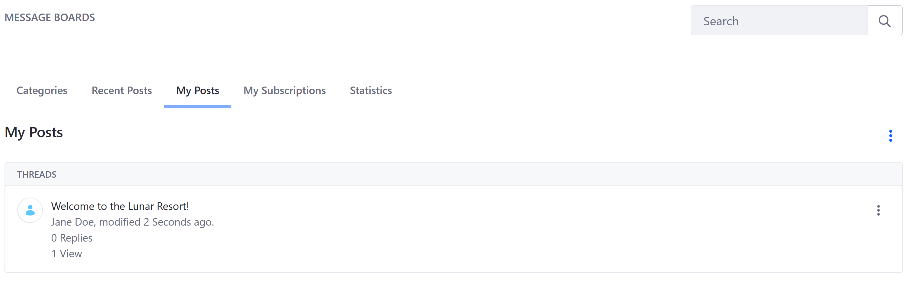
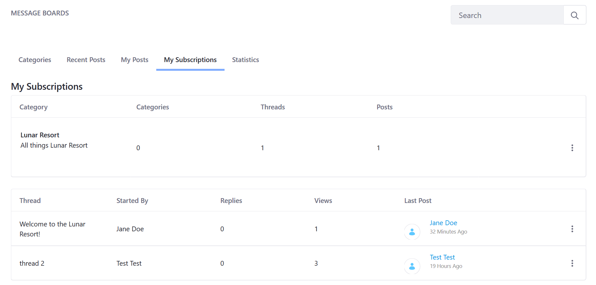
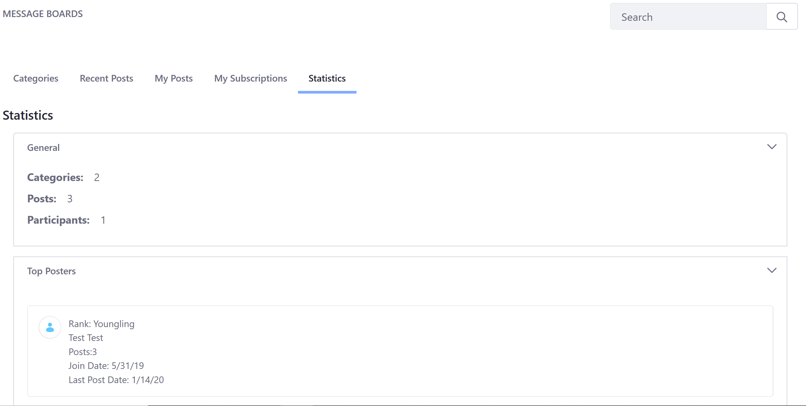

# Message Boards Widget UI Reference

## Categories

The _Categories_ tab is the default landing page when navigating to the _Message Boards_ widget. All the categories are displayed on this tab. In addition, all the threads created at the root level are displayed here.

## Recent Posts tabs

The _Recent Posts_ tab lists _all_ threads, starting with the most recent and irregardless of which category the thread is posted in.

## My Posts

The _My Posts_ tab tracks all the posts authored by the current user (for example, _Jane Doe_).

## My Subscriptions

Subscribing to a thread causes Message Boards to send the user an email whenever a new message is posted to the thread. If you have enabled the mailing list feature for the thread's category, users can reply to these messages to post back to the thread without having to visit your site.

The _My Subscriptions_ tab displays all the categories and threads that the current user has subscribed to.

## Statistics

The _Statistics_ tab displays information about the number of categories, posts, and participants.

