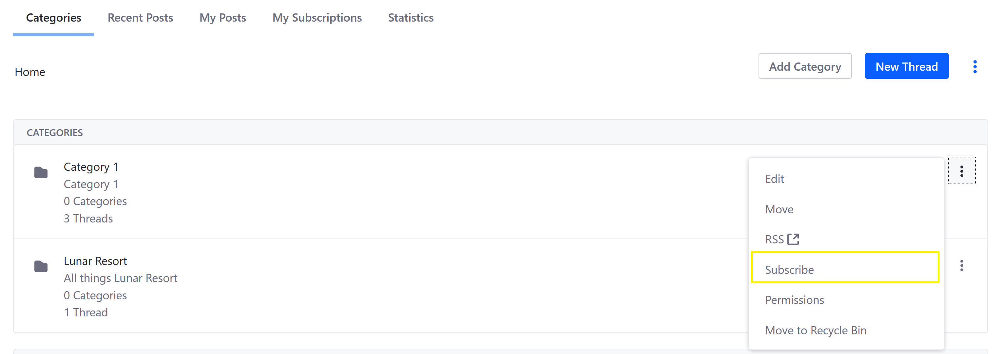
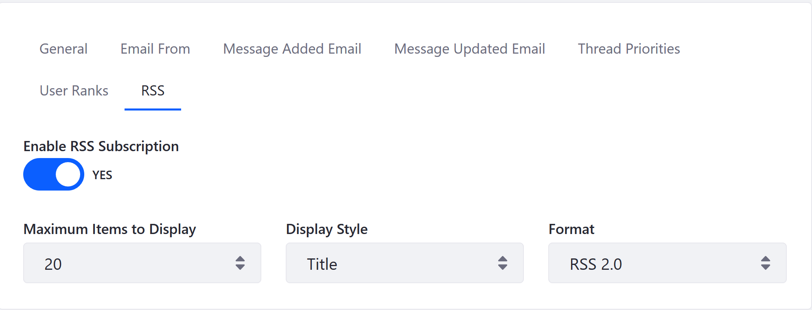

# Subscribing to a Message Board

Subscribing to a message board is a great way to receive notifications about the latest updates. In Liferay DXP, forum members are automatically subscribed on all the threads they created.

This article documents how to subscribe to a message board.

## Subscribing to a Category or Thread

To subscribe to a thread or category:

1. On the _Message Boards_ widget (on a site page), click the _Actions_ icon next to a Category or Thread (in this example, _Category 1_)
1. Click _Subscribe_.

The user has now subscribed to _Category 1_. The user will be notified of any changes, such as new threads and subcategories being created under _Category 1_.

To see which categories and threads you have subscribed to:

1. On the _Message Boards_ widget (on a site page), click _My Subscriptions_.

## Subscribing using RSS Feeds

Message Boards can be published as [RSS](https://en.wikipedia.org/wiki/RSS) feeds. RSS for _Message Boards_ are enabled by default and Liferay DXP supports the following formats: RSS 1.0, RSS 2.0, or Atom 1.0.

To configure RSS feeds:

1. Navigate to _Site Administration_ &rarr; _Content & Data_.
1. Click _Message Boards_.
1. Click _Options_ &rarr; _Configuration_.
1. Click the _RSS_ tab.
1. Select _RSS 2.0_ from the _Format_ dropdown menu.
1. Select _Title_ from the _Display Style_ dropdown menu.

    

1. Click _Save_.

## Additional Information

* [Message Boards Mailing Lists Overview](./message-boards-mailing-lists-overview.md)
* [Configuring a Message Boards Category Mailing List](./configuring-a-mb-category-mailing-list.md)
