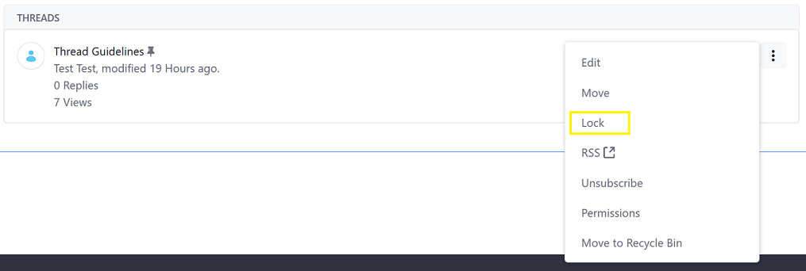
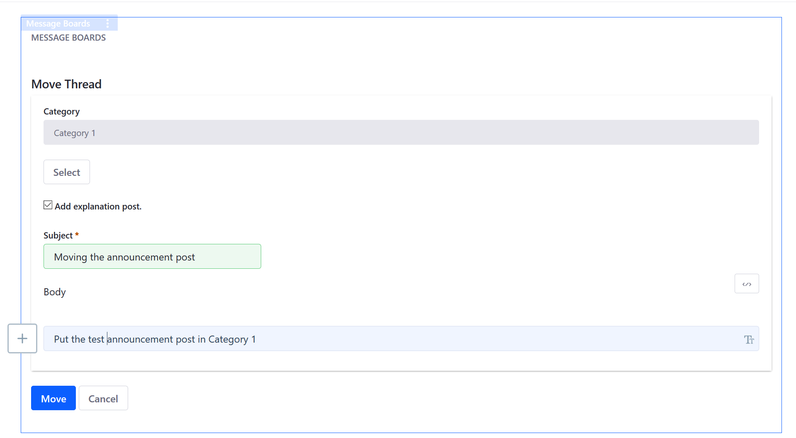
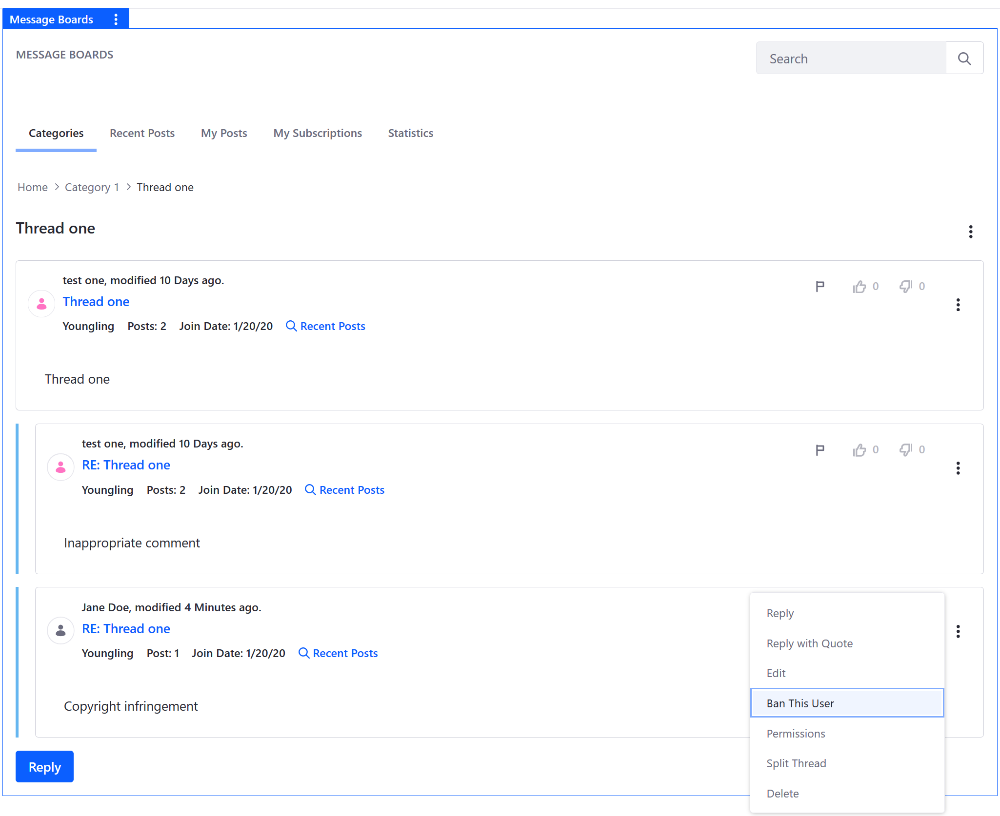
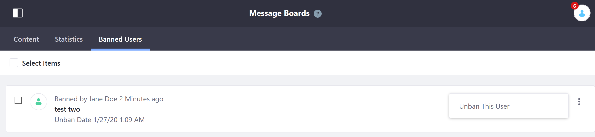
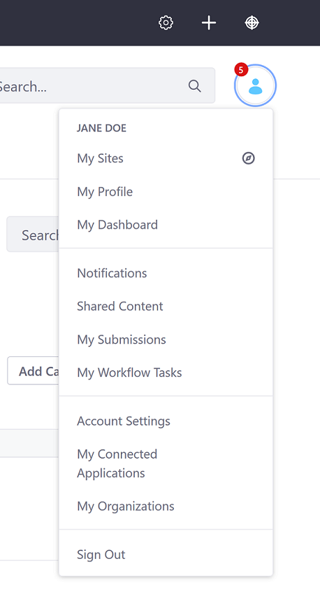
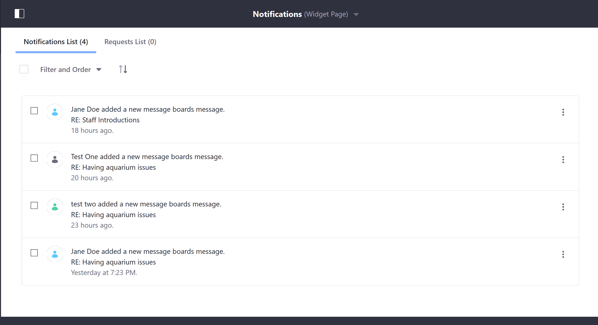

# Moderating Message Boards

Liferay DXP's _Message Boards_ include features that enable effective day to day administration. This includes thread locking, thread moving and merging, user bans, and thread flagging. See the [Message Boards Permissions Reference](./message-boards-permissions-reference.md) for more information on assigning _Message Boards_ permissions to a role. To learn more about the generic Roles and Permissions, see [Roles and Permissions](https://help.liferay.com/hc/articles/360017895212-Roles-and-Permissions).

## Locking Threads

Site administrators can halt activity on a thread by selecting _Lock_ from the thread's Actions menu. Once a thread is locked, no one can reply to the thread.

To lock a thread:

1. Click () next to the thread to be locked.
1. Click _Lock_.

    

To unlock a thread:

1. Click () next to the thread to be unlocked.
1. Click _Unlock_.

The thread is now unlocked.

## Moving Threads

If someone posts a thread to the wrong category, site administrators can move it to the proper one. Follow these steps:

1. Select _Move_ from the thread’s Actions menu ()).
1. Click the _Select_ button and select the new category.
1. To add a post explaining the move, check _Add explanation post_.

    

1. Click _Move_ to move the thread.

The thread is now in the new category.

## Banning Users

1. Click on the thread that contains the user to be banned.
1. Click the post’s Actions menu () and select Ban this User.

The user is now banned.

To reinstate a banned user:

1. Navigate to the _Site Administration_.
1. Click _Content & Data_ &rarr; _Message Boards_. (If there is a page scope, select the scope from the _scope selector_.)
1. Click the _Banned Users_ tab.
1. Click on Actions menu (Actions) next to the user and click _Unban This User_.

This user has been reinstated.

## Reviewing Flagged Threads

When a thread has been reported for possible abuse, the _Message Boards_ apps uses the _Notifications_ widget to notify the moderator to review the thread. A red number around their icon appears around their profile icon.

1. Click _Notifications_.

    

1. Click on the reply that has been reported.

Moderators have the option to delete the thread if it was deemed offensive or violates the terms of use. To delete a thread:

1. Click _Actions_ ()
1. Click _Delete_
1. Click _OK_ to confirm the deletion.

The thread is now deleted.
