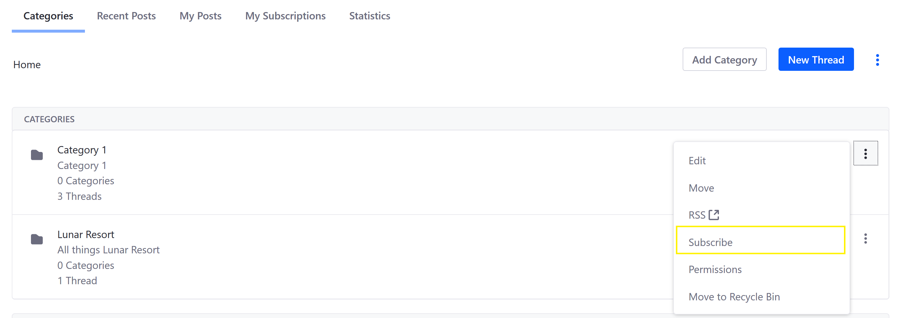

# Subscribing to a Message Board

Users can receive email updates and in-product notifications by subscribing to a Message Board. By default, users are automatically subscribed to any threads they create and can opt in to subscribe to categories or specific threads via email or RSS feed.

## Subscribing to a Category or Thread

To subscribe to a thread or category:

1. On the _Message Boards_ widget (on a site page), click the _Actions_ icon next to a Category or Thread (in this example, _Category 1_)
1. Click _Subscribe_.

    

The user has now subscribed to _Category 1_. The user will be notified of any changes, such as new threads and subcategories being created under _Category 1_.

<!-- This section needs more content. ### Managing Message Boards Subscriptions

To see which categories and threads you have subscribed to:

1. On the _Message Boards_ widget (on a site page), click _My Subscriptions_.

    Screenshot

-->

## Subscribing using RSS Feeds

Message Boards can be published as [RSS](https://en.wikipedia.org/wiki/RSS) feeds. RSS for _Message Boards_ are enabled by default and Liferay DXP supports RSS 1.0, RSS 2.0, or Atom 1.0.

## Additional Information

* [Message Boards Mailing Lists Overview](./message-boards-mailing-lists-overview.md)
* [Configuring a Message Boards Category Mailing List](./configuring-a-mb-category-mailing-list.md)
<!-- * Connecting to a Mail Server -->
