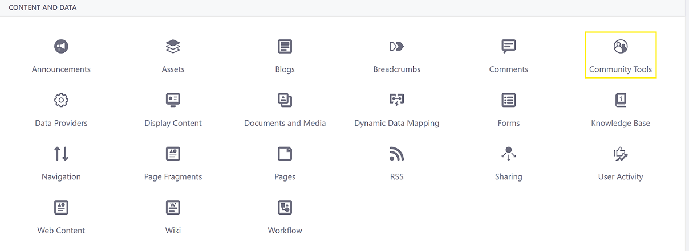
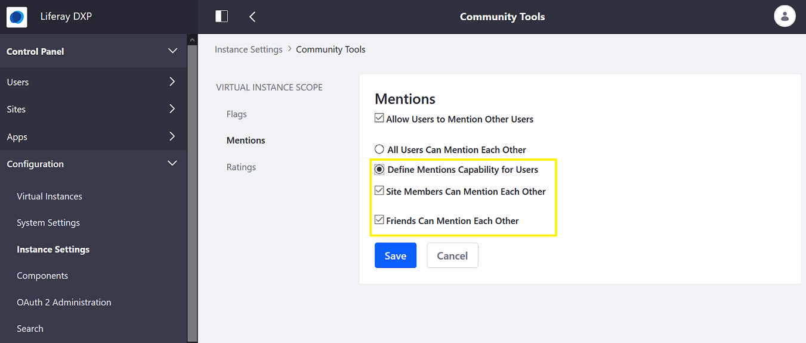
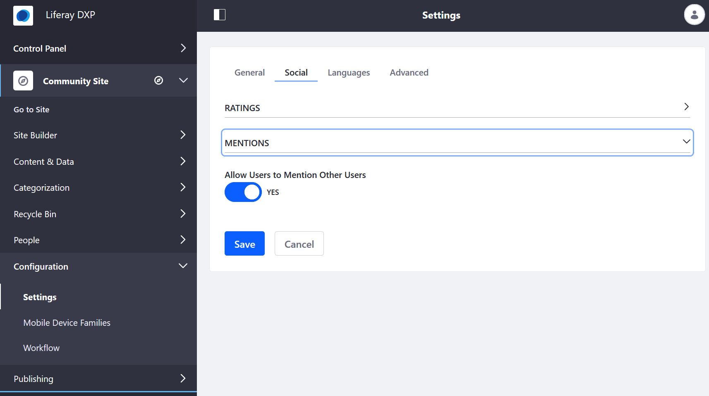

# Configuring Mentions

Mentions are enabled by the _Mentions_ app. By default, the _Mentions_ app is enabled globally. However, this can be enabled or disabled either globally or per site.

## Configuring Mentions on a Global Scope

To access the global Mentions settings for your Virtual Instance:

1. Open the *Menu* ().
1. Navigate to _Control Panel_ &rarr; _Configuration_.
1. Click _Instance Settings_.
1. Click _Community Tools_.

   

1. Click _Mentions_ on the left menu.
1. By default, all users are allowed to mention fellow site members and friends. To fine tune these options, select *Define Mentions Capability for Users* and specify the settings you want.

    

1. Click _Save_.

The _Mentions_ app has been configured globally.

## Configuring Mentions in a Site

Site administrators can enable or disable _Mentions_ for a site.

1. Open the _Product Menu_ (), then click the compass icon () on the Site Administration menu. This opens the Select Site dialog.
1. Click on _[your site name]_ &rarr; _Configuration_.
1. Click _Settings_.
1. In the _Social_ tab, expand the _Mentions_ section.
1. Switch the toggle to _YES_ or _NO_ under _Allow Users to Mention Other Users_.

    

1. Click _Save_ when finished.

_Mentions_ has been configured at the site scope.
