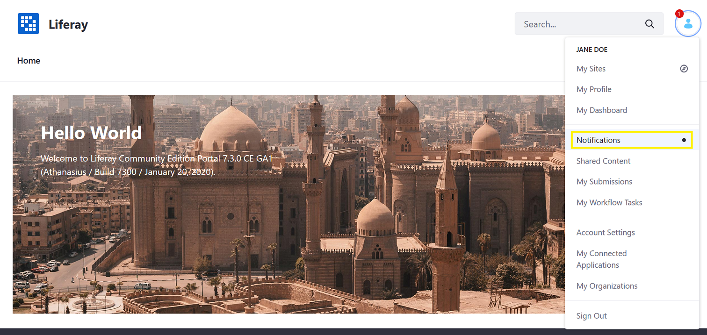
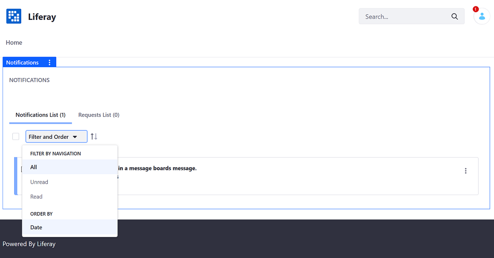
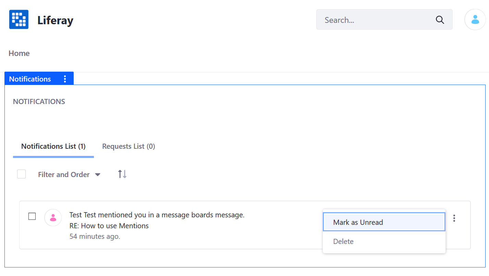
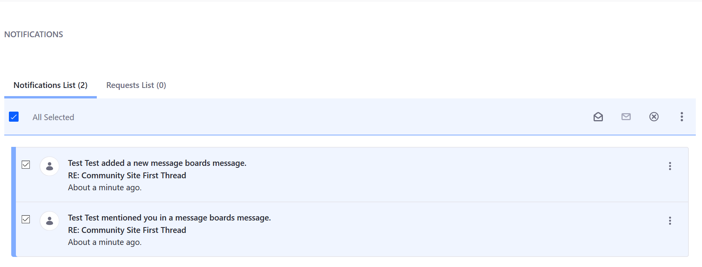
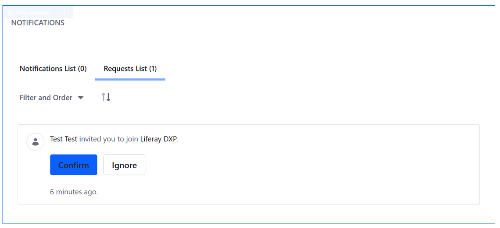

# Managing Notifications and Requests

Users receive notifications and requests if they have subscribed to a blog or message board, or if someone sent them a private message, invitation, event reminder, or were mentioned in a post.

To access notifications and requests:

1. Click your avatar and select *Notifications*.

    

1. The _Notifications List_ tab shows all unread notifications. Here, the user was mentioned in a Message Boards comment.

    

## Managing Notifications

Notifications can pile up after some time, especially if you were away for a few days. To filter and sort your notifications:

1. Click the _Filter and Order_ dropdown menu.
1. Choose from:

    * **All:** The default option. Displays both read and unread notifications.
    * **Unread:** Displays notifications that haven't been marked as read. Unread notifications are indicated with a blue border on the left-hand side of the notification.
    * **Read:** Displays notifications that have been marked as read.
    * **Date:** Order notifications by date.

By default, notifications are listed by date in descending order. To sort notifications by ascending order, click the up/down arrow icon in the management bar.

To change your notification's status:

1. Click the *Actions* menu () next to the notification.

    

1. Click _Mark as Read_ or _Mark as Unread_ to keep the notification fresh.
1. Alternately, click _Delete_ to remove the notification completely.

### Managing Multiple Notifications

You can also manage multiple notifications at once:

1. Select the checkbox next to the _Filter and Order_ dropdown menu. This selects all the notification messages.
1. Several icons appear:
    * **Mark as Read** ()
    * **Mark as Unread** ()
    * **Delete** )

    

## Managing Requests

When a user gets a request to join a site, it appears in the *Requests List* tab. Users have the option to click _Confirm_ to join the site or click _Ignore_ to decline.

## Additional Information

* [Mentioning Users](./mentioning-users.md)
