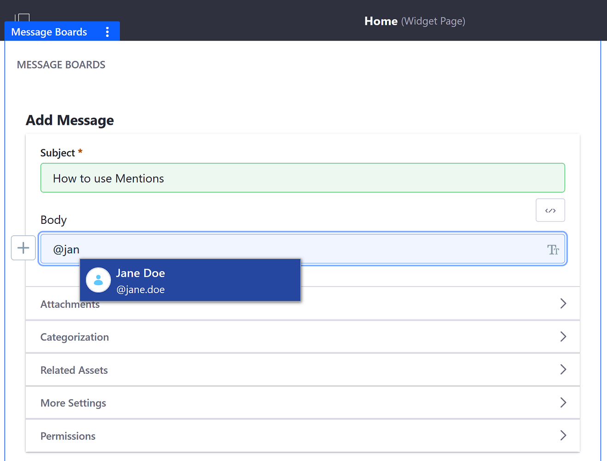
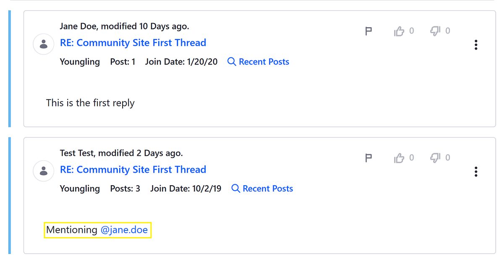
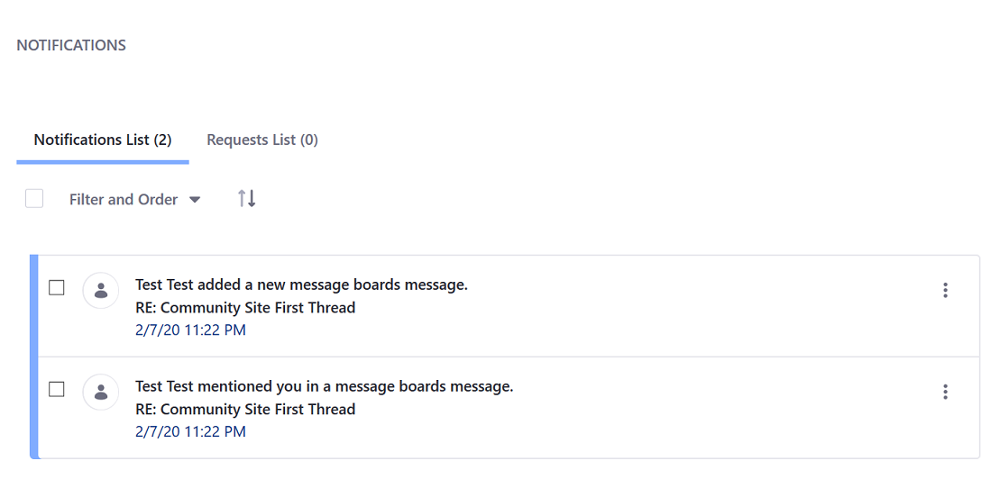

# Mentioning Users

Mentioning other users in a DXP asset draws their attention to a particular asset (for example, a _Message Boards_ or blog post or comment) by sending them a notification and a link. To "mention" other users, enter the `@` character in front of each user's user name (`@john.smith`) in a blog entry, [a message boards post](../../message-boards/user-guide/creating-message-boards-threads.md), or comments in any app that supports comments.

## Using the Mentions Function in a Message Boards Thread

1. Navigate to the site page where a _Message Boards_ widget has been deployed.
1. Click on _Add Message_.
1. In the _Body_ field, enter the `@` character followed by the first few letters of a person to be mentioned.

    

1. The selector displays users who best match the person's name.

On publishing the content, there is a link to the user's profile page.

Mentioned users receive a notification and an email informing them that they've been mentioned.

The notification and email indicate the author's name and content type, and contain links to the content. You can access your notifications by selecting *Notifications* from your user menu. See [Managing Notifications and Requests](./managing-notifications-and-requests.md)

## Additional Information

* [Configuring Mentions](./configuring-mentions.md)
