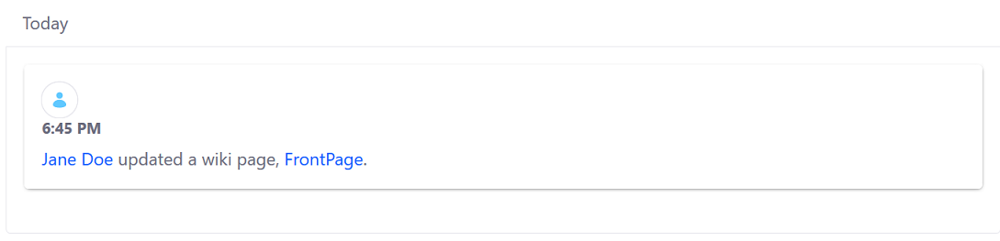
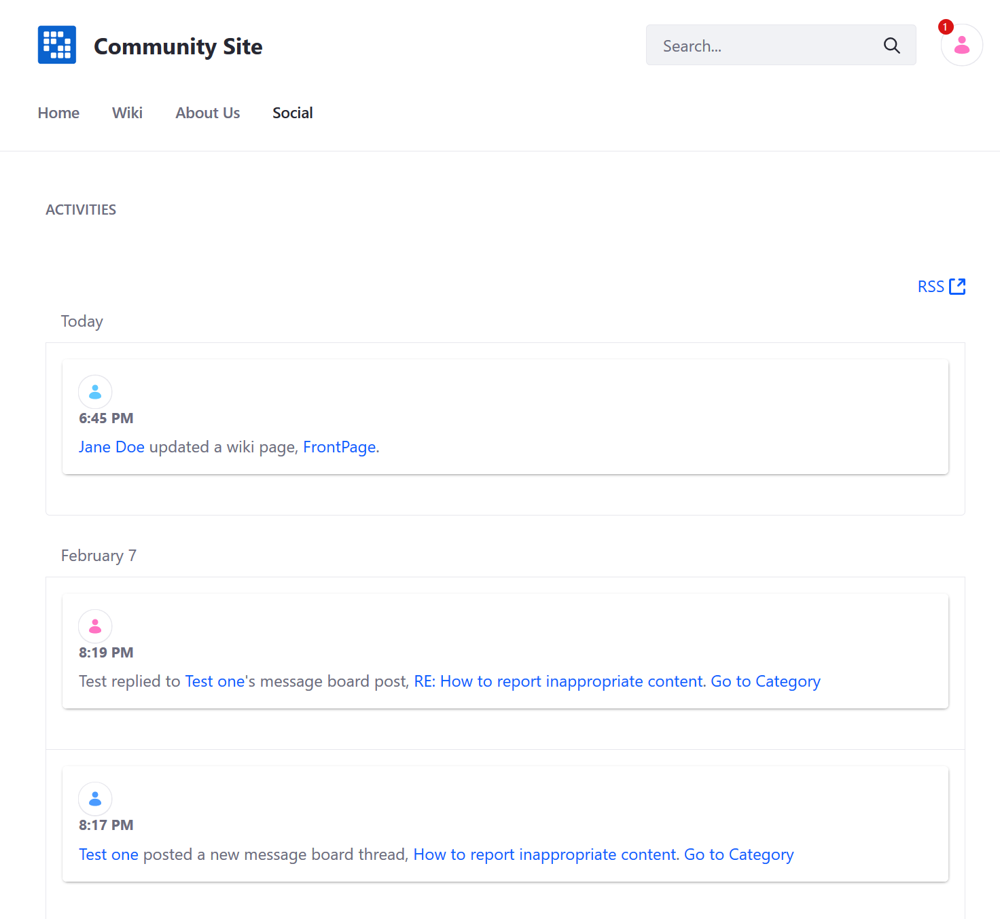
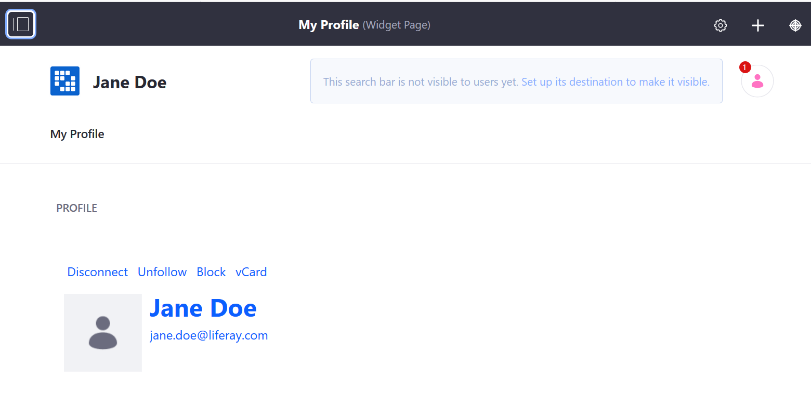

# Using the Activities Widget

The _Activities_ widget is used to track user activities on a site.

To begin using the _Activities widget:

1. Navigate to the site page where it is to be deployed (for example, the _Community Site_'s _Social_ page).
1. Click the _Add_ button.
1. Click _Widgets_ then _Social_ to expand the menu.

    

1. Drag and drop the _Activities_ widget to the desired position on the page.

Each item listed in the widget contains a link to the user and the asset (for example, a _Message Boards_ post, or a wiki page). Clicking on the user redirects to the person's profile.

Clicking on the link redirects to the site page where the asset is located.

Lastly, click _RSS_ to subscribe to the user activities.

## Additional Information

* [Using the Contacts Center Widget](./using-the-contacts-center-widget.md)
