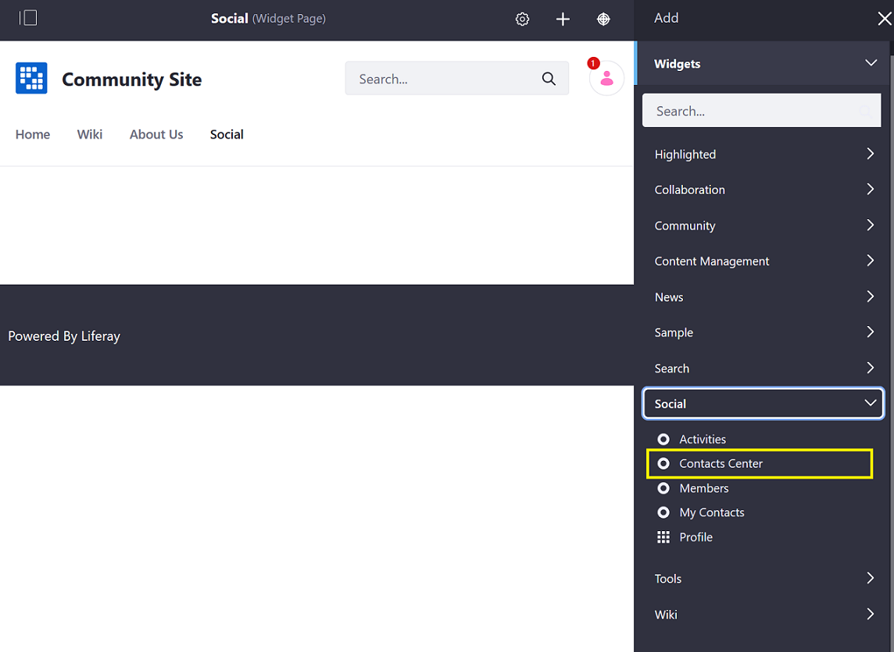
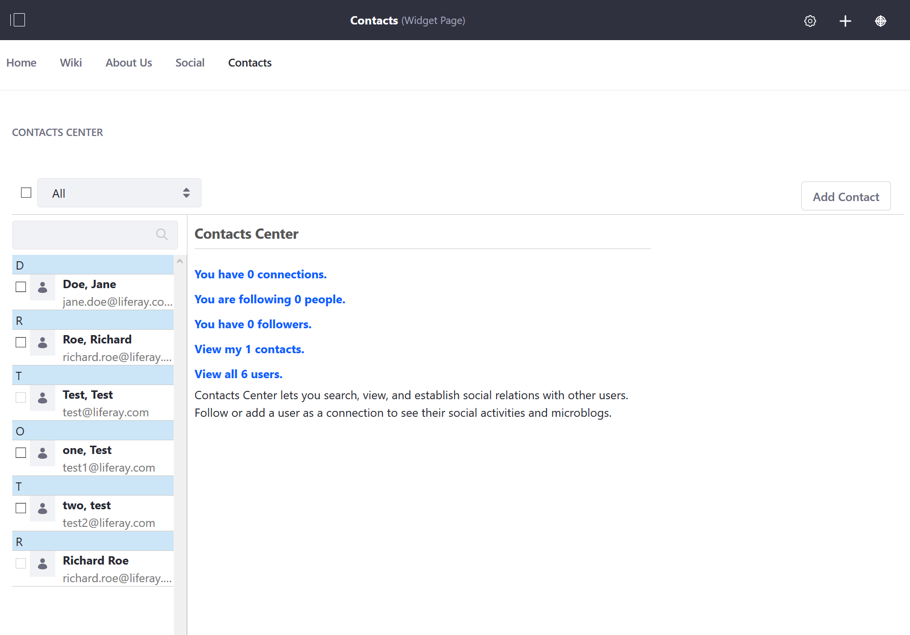
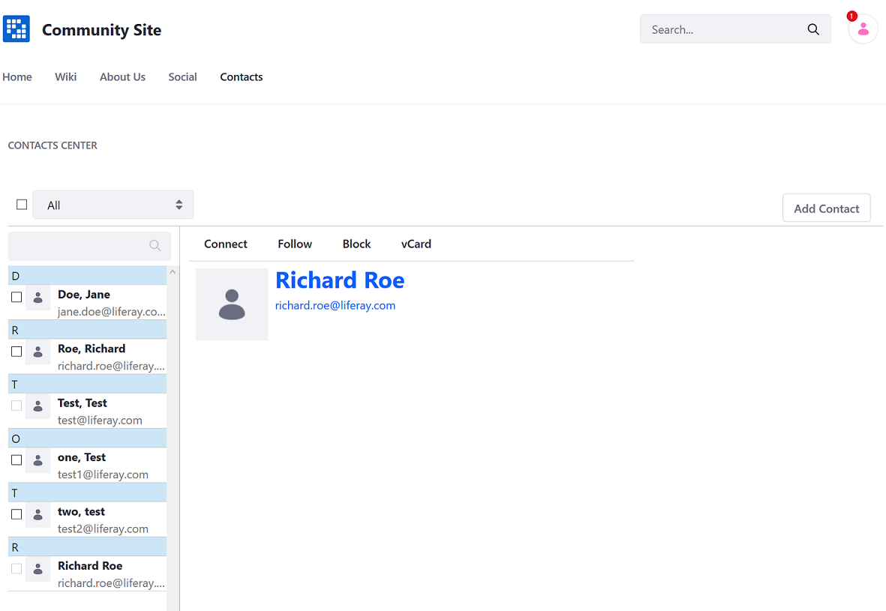
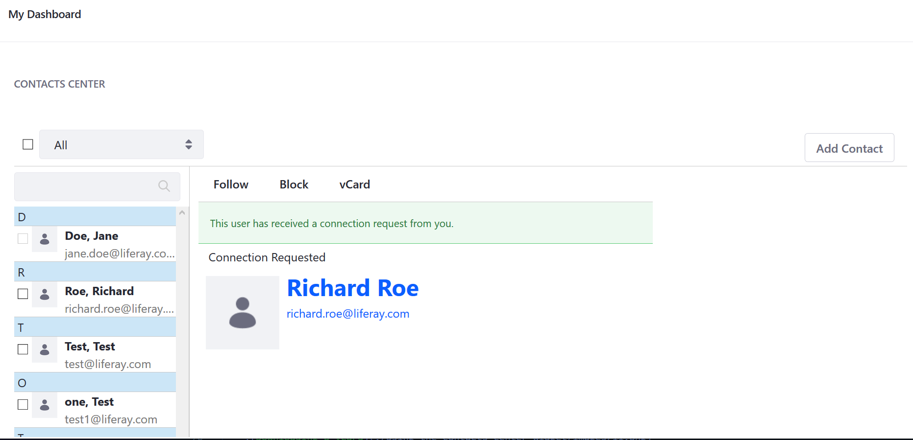
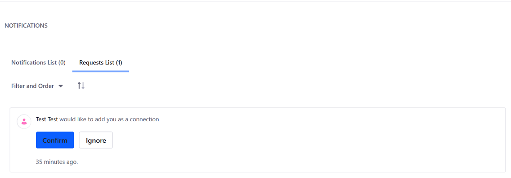
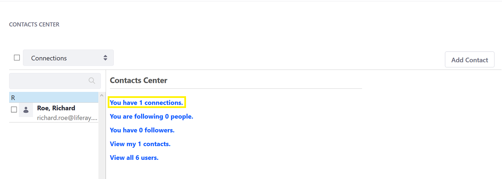
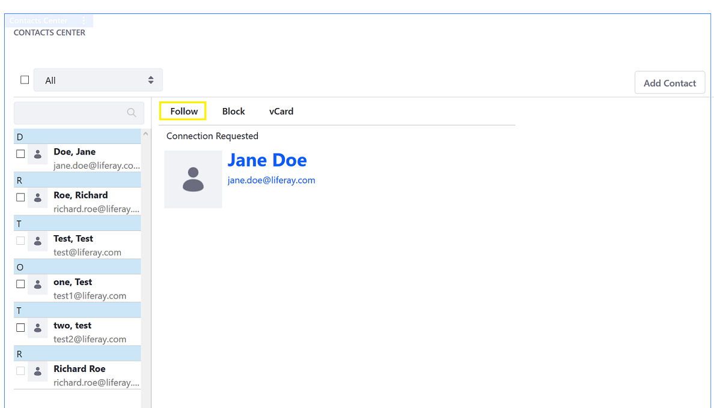
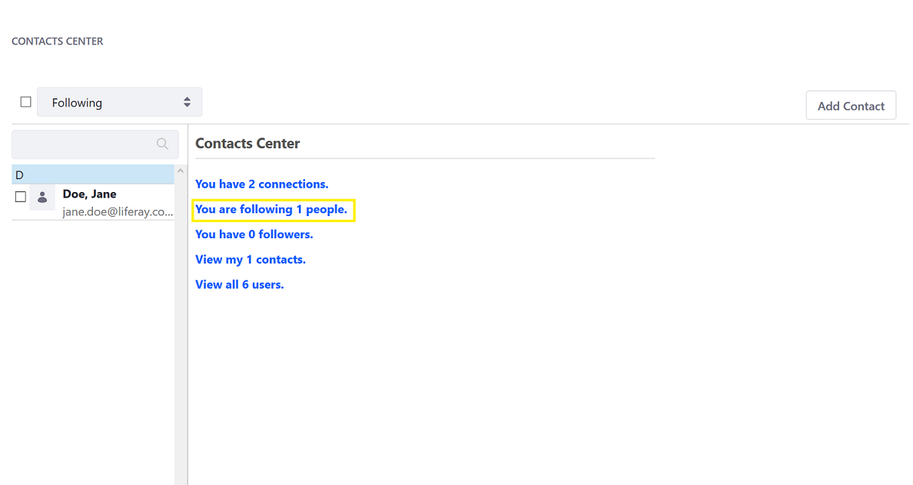
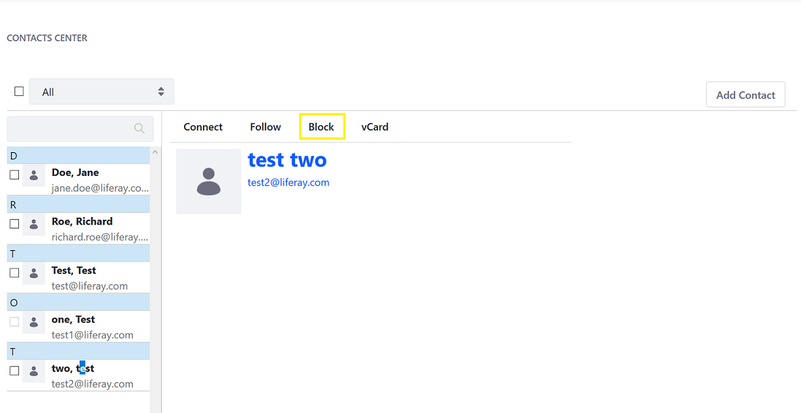
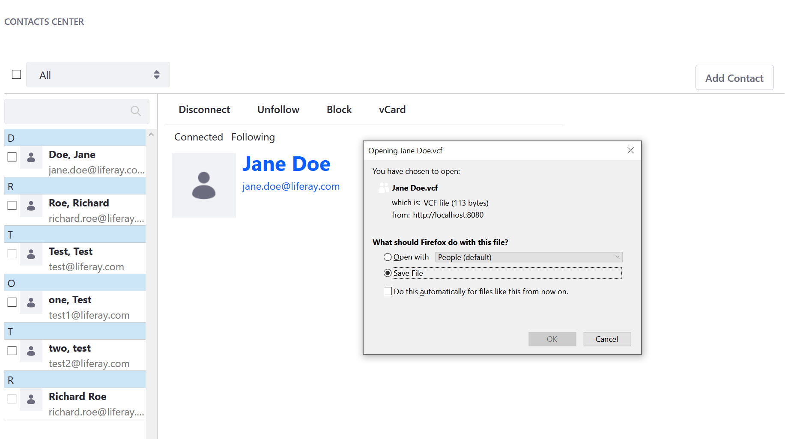

# Using the Contacts Center Widget

## Adding the Contacts Center to a Site Page

1. Navigate to the site page where it is to be deployed (the _Community Site Social_ page).
1. Click the _Add_ button.
1. Click _Widgets_ then _Social_ to expand the menu.

    

1. Drag and drop the _Contacts Center_ widget to the desired location on the page.

    

## Connecting a User

1. Click the person you want to connect to (_Richard Roe_).
1. Click _Connect_.

    

1. Verify that the confirmation message displays.

    

1. The person receives a request in their notifications menu.

    

Once the person accepts the connections request, he or she appears in the list of connections. To disconnect, click on the user avatar then _Disconnect_.

## Following a User

1. Click on the user you want to follow in the _Contacts Center_ widget.
1. Click _Follow_.

    

1. On the widget home page, click _You are following (x) people._ to see the list of users you are following.

    

To unfollow a user, click on the user avatar then _Unfollow_.

## Blocking a User

1. Click on the user you want to block.
1. Click _Block_.

    

1. To unblock a user, click _Unblock_.

    

## Downloading a vCard

Users can download their connections as [vCards](https://en.wikipedia.org/wiki/VCard) in the `.vcf` format.

1. Click on the person (_Jane Doe_).
1. Click _vCard_.
1. The browser opens a confirmation window; click _Save_ then _OK_ to download the user's electronic business card.

    

Users can upload the `.vcf` file to their email and SMS system of their choice.

## Additional Information

* [Managing Notifications and Requests](../../notifications-and-requests/user-guide/managing-notifications-and-requests.md)
