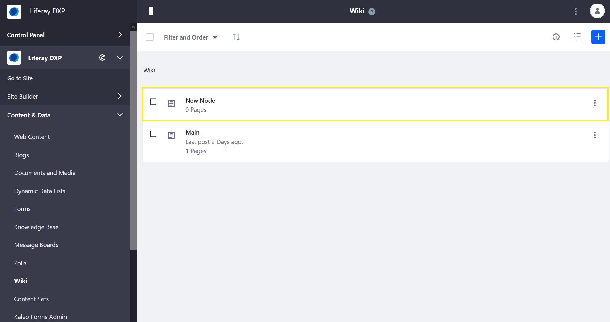
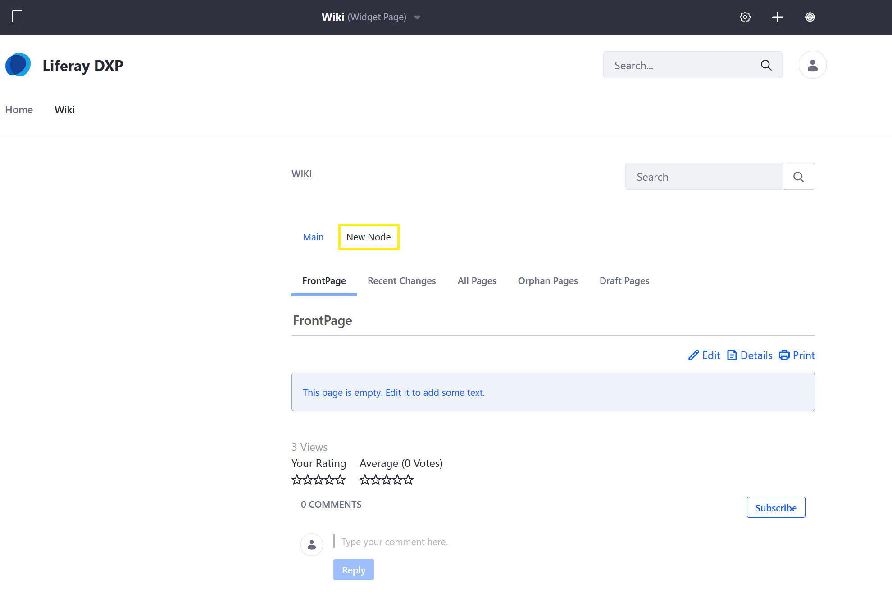

# Creating a Node

As more wiki pages are created in a single DXP site, creating additional wiki nodes can provide a loose structure to organize your wiki pages accordingly. Users can create a nodes to segment articles that cover different topics.

Only authenticated users with the [requisite permissions](./wiki-permissions.md) (at minimum, _Add Node_ and _Permissions_) can create a node. To learn more about DXP Roles and Permissions in general, see [Roles and Permissions](https://help.liferay.com/hc/articles/360017895212-Roles-and-Permissions).

## Creating a New Node

1. Navigate to the site where the wiki is located (for example, _Liferay DXP_).
1. Expand the _Product Menu)_ and then the _Site Administration_ menu.
1. Click _Content & Data_ &rarr; _Wiki_.
1. Click the _Add Wiki_ () button.
1. Enter the following:
    * **Name**: New Node
    * **Description**: This is a new node for DXP Guest wiki site.
1. Click _Save_.

A new Node has been created. You can create multiple nodes on the same site.

## Selecting the New Node

To create new wiki pages on the new node:

1. From the _Site Administration_ menu, click _Go to Site_.
1. Navigate to the page where the _Wiki_ widget is deployed (for example, _Liferay DXP_'s _Wiki_ page.)
1. Verify that _New Node_ displays inside the _Wiki_ widget.
1. Click _New Node_.

Once on the new node, click _This page is empty. Edit it to add some text._ to edit the current node's _FrontPage_ page.

## Additional Information

* [Creating Wiki Pages](./creating-wiki-pages.md)
