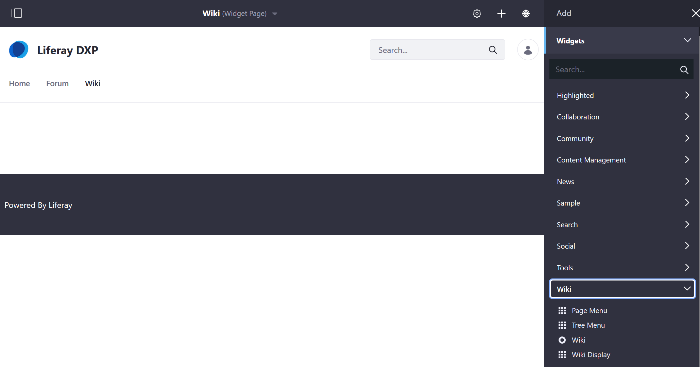

# Getting Started with Wikis

The _Wiki_ application includes a rich-text WYSIWYG editor, version tracking, and the ability to create multiple wiki nodes. Wikis are integrated with Liferay DXP's users and permissions.

## Adding a Wiki Widget to a Site

The fastest way to begin using the _Wiki_ widget is deploying it on a [Site Page](../../../site-building/creating-pages/understanding-pages.md).

1. Navigate to the site page where the wiki will be created (for example, the DXP _Guest_ site's _Wiki page_).
1. Click the _Add_ button.
1. Click _Widgets_ then _Wiki_ to expand the menu.

    

1. Drag and drop the _Wiki_ widget to the desired location on the page.

    

Site members are now able to create and edit wiki pages. Note that there can be only one _Wiki_ widget per page.

## Complementary Wiki Widgets

Liferay DXP offers three additional widgets to be used in conjunction with the _Wiki_ widget which makes it easier to navigate to and view the other wiki pages on the same DXP instance. This is because the _Wiki_ widget displays only the _FrontPage_.

* [Page Menu](./using-the-page-menu-widget.md)
* [Tree Menu](./using-the-tree-menu-widget.md)
* [Wiki Display](./using-the-wiki-display-widget.md)

## What's Next

Learn about the features in the _Wiki_ widget:

* [Creating Wiki Pages](./creating-wiki-pages.md)
* [Creating a Wiki Node](./creating-a-node.md)
* [Scoping Your Wikis](./scoping-your-wikis.md)
* [Exporting and Importing a Wiki](./exporting-and-importing-a-wiki.md)
