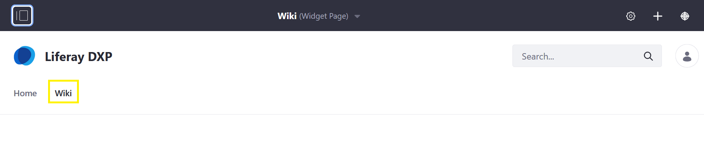

# Getting Started with Wikis

Liferay DXP's _Wiki_ is a knowledge base website app which can be deployed to any DXP site page. Here, users collaborate on creating and modifying wiki pages directly from a web browser.

## Adding a Wiki Widget to a Site

The most fastest way to begin using the _Wiki_ widget is deploying it on a [Site Page](https://help.liferay.com/hc/articles/360029132211-Creating-Pages).

1. Navigate to the site page where the wiki will be created (for example, the DXP _Guest_ site's _Wiki page_).

    

1. Click the _Add_ button.
1. Click _Widgets_ then _Wiki_ to expand the menu.

    

1. Drag and drop the _Wiki_ widget to the desired location on the page.

Site members are now able to create and edit wiki pages. Note that there can be only one _Wiki_ widget per page.

## Using an Existing Site Built with the Community Site Template

If you had created a Site using the out-of-the-box _Community Site_ template from the [Creating Your First Site](../../../getting-started/creating-your-first-site.md) article, there is already a page with the _Wiki_ widget deployed.

1. Using the site selector, navigate to the _Community Site_.
1. Click the _Wiki_ page.

    

The advantages of having using the site template are speedy page creation and having two related widgets: the _Tag Cloud_ and the _Categories Navigation_. These two widgets are populated with tags and categories so that users can find related wiki articles with the same tag or category.

## What's Next

Learn about the features in the _Wiki_ widget:

* [Creating Wiki Pages](./creating-wiki-pages.md)
* [Creating a Wiki Node](./creating-a-node.md)
* [Scoping Your Wikis](./scoping-your-wikis.md)
* [Exporting and Importing a Wiki](./exporting-and-importing-a-wiki.md)

### Using Wiki-Related Widgets

Liferay DXP offers three additional widgets to be used in conjunction with the _Wiki_ widget which makes it easier to navigate to and view the other wiki pages on the same DXP instance. This is because the _Wiki_ widget displays only the _FrontPage_.

* [Page Menu](./using-the-page-menu-widget.md)
* [Tree Menu](./using-the-tree-menu-widget.md)
* [Wiki Display](./using-the-wiki-display-widget.md)

## Reference

* [Wiki Permissions](./wiki-permissions.md)
* [Wiki Widget UI Reference](./wiki-widget-ui-reference.md)
