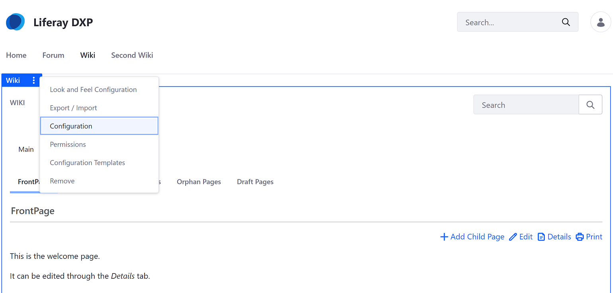
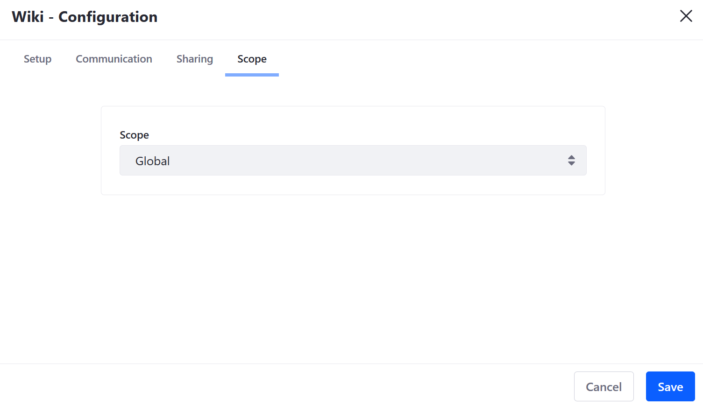
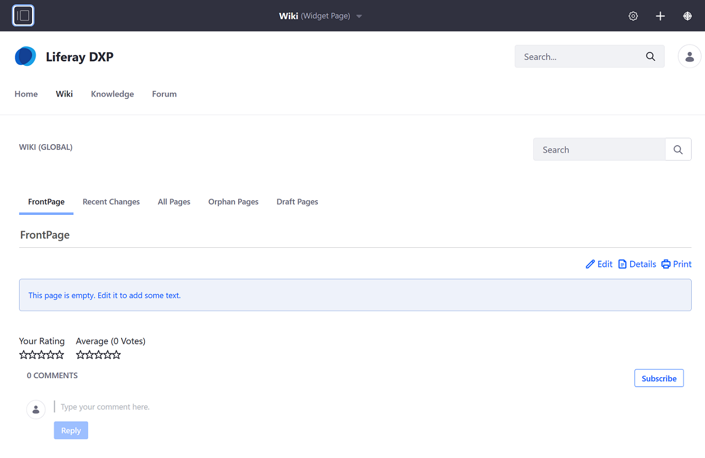
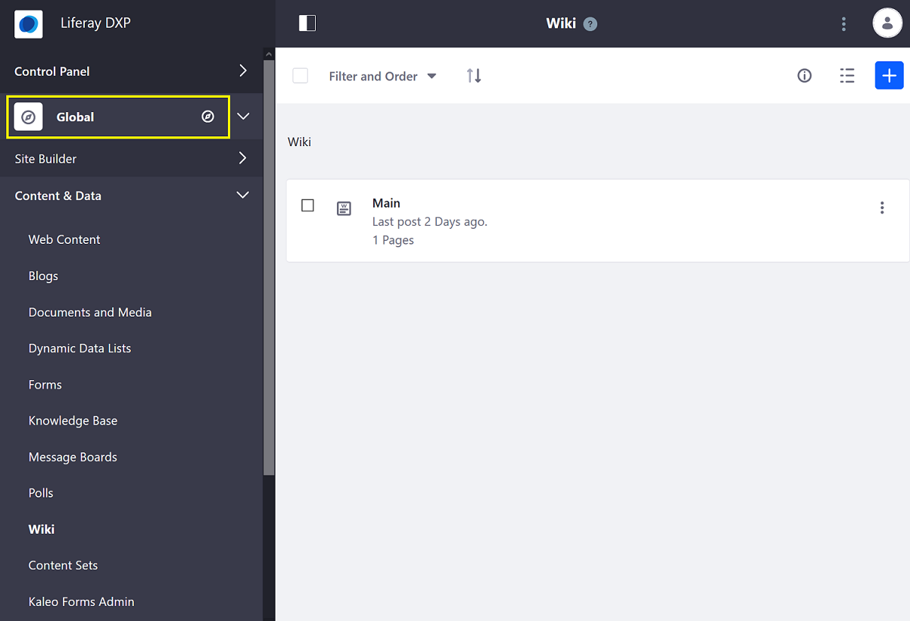
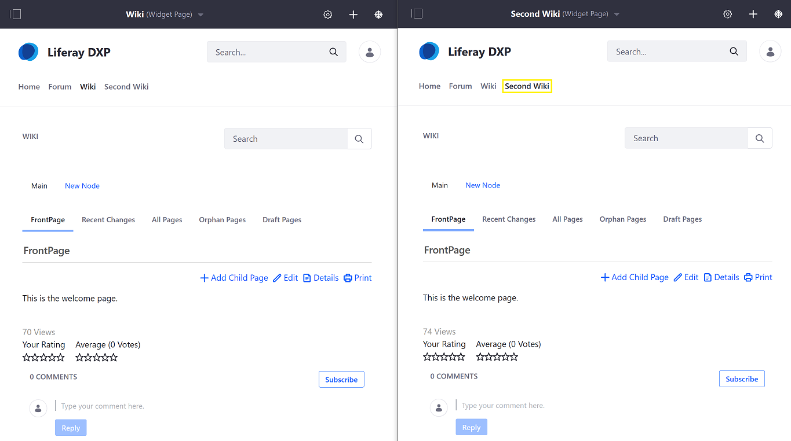
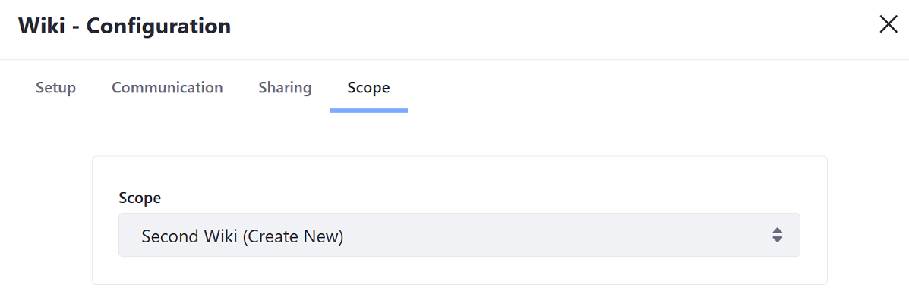
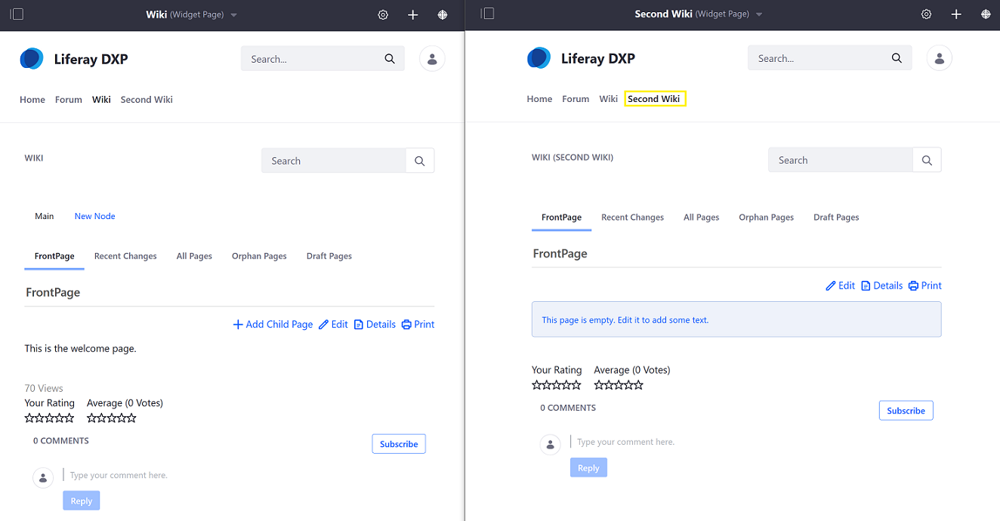
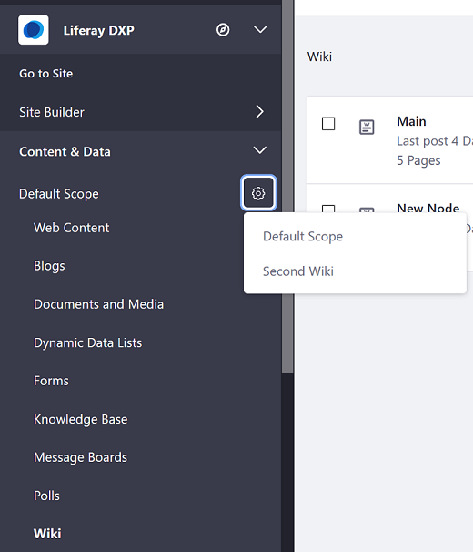
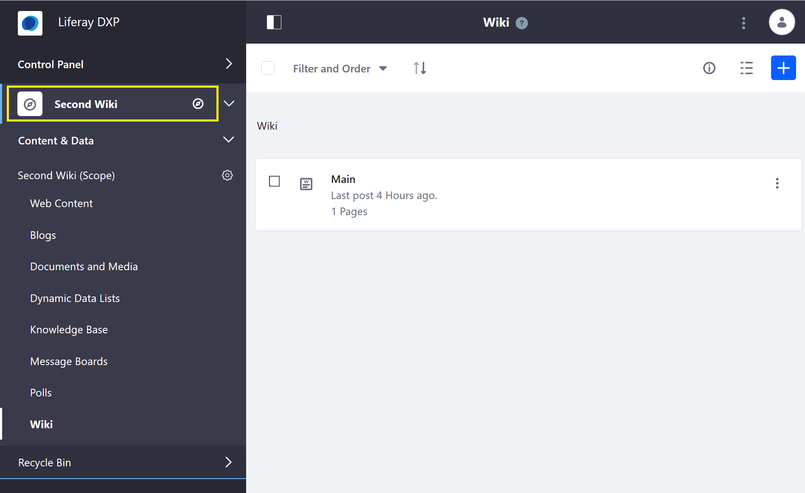

# Scoping Your Wikis

Besides using [Wiki Nodes](./creating-a-node.md) to organize your content, you can scope a wiki to the [Global, Site, or Page Scopes](https://help.liferay.com/hc/articles/360028819992-Widget-Scope).

## Global

Wiki pages created at the global site scope level are available on all other sites. However, content will not be automatically published. Administrators must configure the _Wiki_ widget's scope to _Global_.

### Creating Globally Scoped Wiki Pages

1. Navigate to the site page where the _Wiki_ widget is deployed.
1. Mouse over the _Wiki_ widget's name and click _Options_  then _Configuration_.

    

1. Click _Scope_.
1. Select **Global** from the _Scope_ dropdown menu.

   

1. Click _Save_ and close the window.

The _Wiki_ widget has been configured to display content for the _Global_ scope.

### Managing Globally Scoped _Wiki_ Pages

1. Open the _Product Menu_ (), then click the compass icon () on the Site Administration menu. This opens the Select Site dialog.
1. Select the _My Sites_ tab, then select _Global_.

    

1. Click _Content & Data_ &rarr; _Wiki_.

Any changes made here apply to the global scope.

## Site

By default, the _Wiki_ app is scoped to the current selected Site. Wikis scoped to a particular site are not visible when viewing wikis that may be created on another site in the same instance.

## Page

Creating page scoped message boards allows forum members to view different wikis on different pages housed on the same site.

### Creating a Page Scoped Wiki

1. Navigate to the page that which will be scoped (_Second Wiki_).

    

1. Click the _Options_ icon () in the widget's title bar and select _Configuration_.
1. Click the _Scope_ tab.
1. Select the page's name or _[YOUR-PAGE] (Create New)_ if the page scope doesn't exist yet.

    

1. Click _Save_ then close the dialog window.

The second page has been configured for page scope.

### Managing Page Scoped Wikis

Note that administrators must still use the _Site Administration_ menu to administer a page scoped Wiki widget by setting the _Site Administration menu_'s active scope. Follow these steps:

1. Open the _Product Menu_ (), expand the menu for your Site, and then click _Content & Data_.
1. The current scope appears just below the Content & Data heading. Default Scope is the current Site. To change this, click the gear icon () and then select your desired scope. This changes the Site Administration menu to reflect scope you selected. To work in a page's scope, for example, select that page from the gear icon. That page's name then becomes the Site Administration menu's title.

    

1. Click _Wiki_.

Any changes you make here apply to the scope that you selected in the previous step.

## Additional Information

* [Widget Scopes](https://help.liferay.com/hc/articles/360028819992-Widget-Scope)
