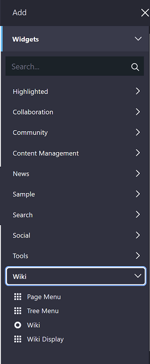
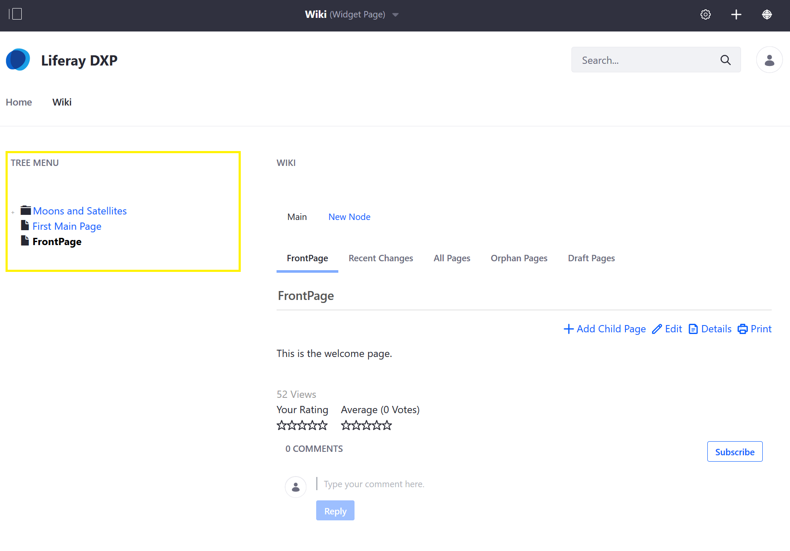
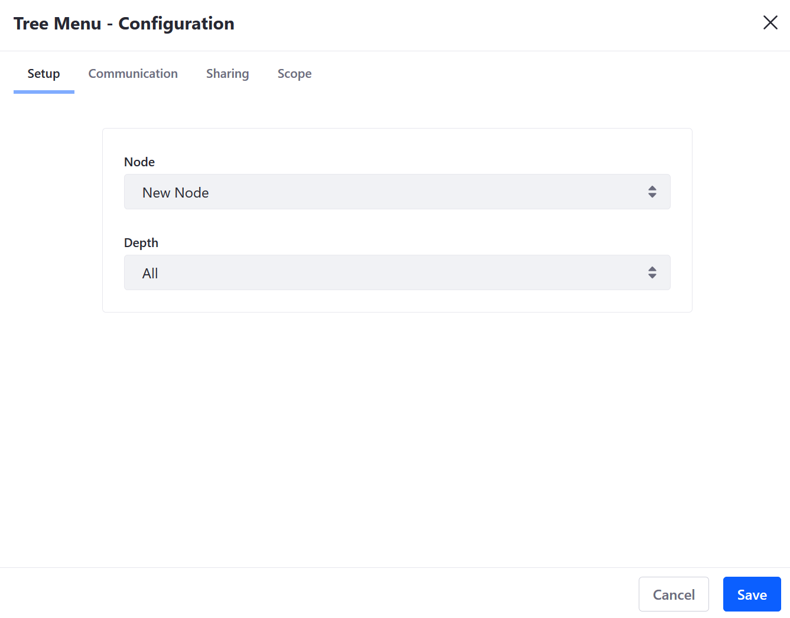
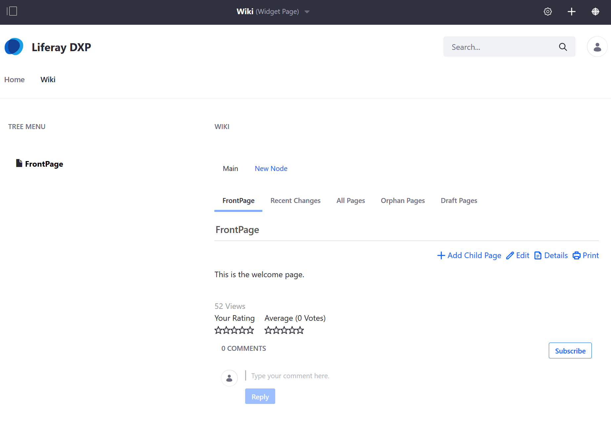

# Using the Tree Menu Widget

The _Tree Menu_ widget lists all the wiki pages and child pages in a particular node. To use the _Tree Menu_ widget:

1. Navigate to the site page where the _Wiki_ widget has been deployed.
1. Click _Add_ &rarr; _Widgets_.
1. Expand _Wiki_.

    

1. Drag and drop the _Tree Menu_ widget to the desired location on the page.

    

Once the _Tree Menu_ widget has been added to a page, it lists all the pages and child pages in the _Main_ node by default. To switch to another node:

1. Mouse over the widget's border and click _Options_ ().
1. Click _Configurations_.
1. On the _Setup_ tab, select **New Node** from the _Node_ dropdown menu.
1. Select **All** from _Depth_ dropdown menu.

    

1. Click _Save_ and close the window.

## Additional Information

* [Page Menu widget](./using-the-page-menu-widget.md)
* [Wiki Display widget](./using-the-wiki-display-widget.md)
