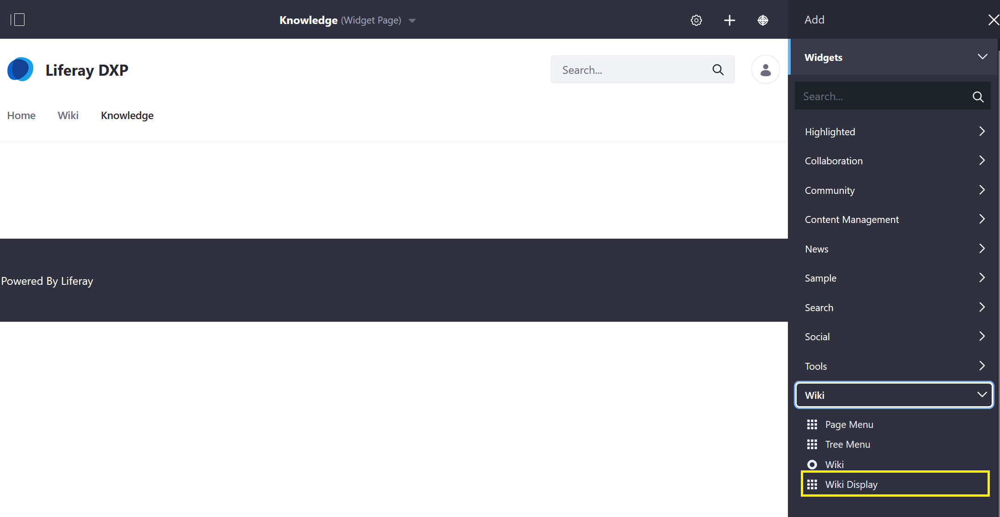
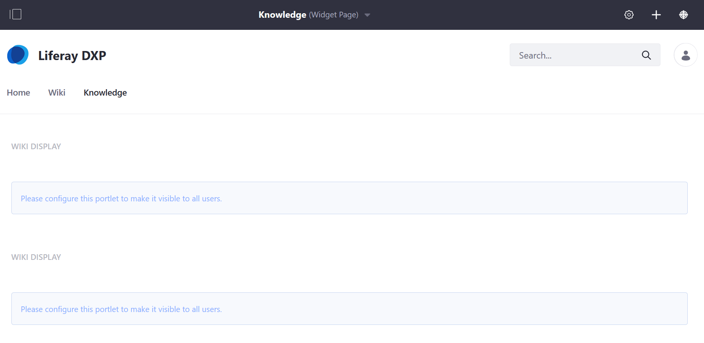
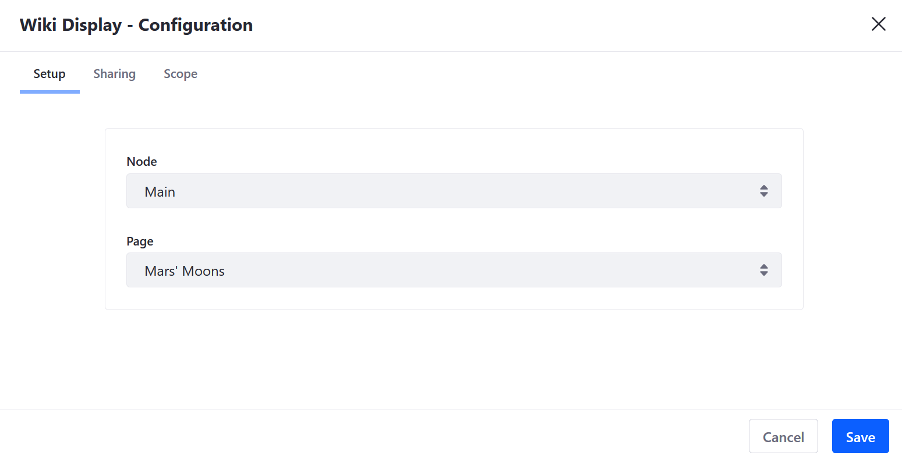
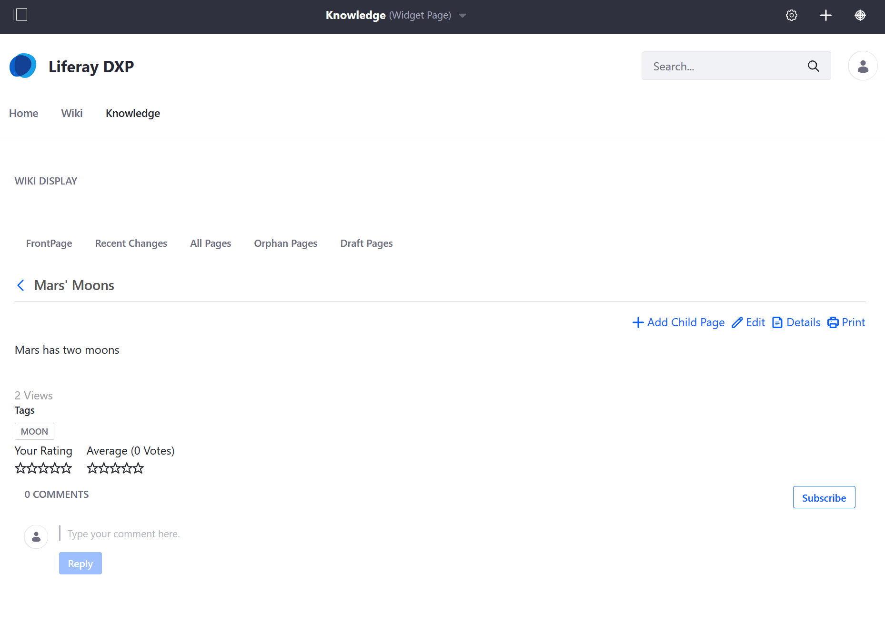

# Using the Wiki Display Widget

Users can use the  _Wiki Display_ widget to highlight a specific wiki page regardless of whether it is a top level page or a child page. To use the _Wiki Display_ widget:

1. Navigate to the site page where the _Wiki_ widget has been deployed.
1. Click _Add_ &rarr; _Widgets_.
1. Expand _Wiki_.

    

1. Drag and drop the _Wiki Display_ widget to the desired location on the site page. Note that unlike the _Wiki_ widget, multiple _Wiki Display_ widgets can be deployed on a page.

    

1. Click _Please configure this portlet to make it visible to all users._
1. On the _Setup_ tab, select **Main** from the _Node_ dropdown menu.
1. Select the wiki page from the _Page_ dropdown menu. Wiki pages can be either a top-level page or a child page.

    

1. Click _Save_ and close the window.

The _Wiki Display_ widget now displays the selected _Wiki Page_.

## Additional Information

* [Page Menu Widget](./using-the-page-menu-widget.md)
* [Tree Menu Widget](./using-the-tree-menu-widget.md)
