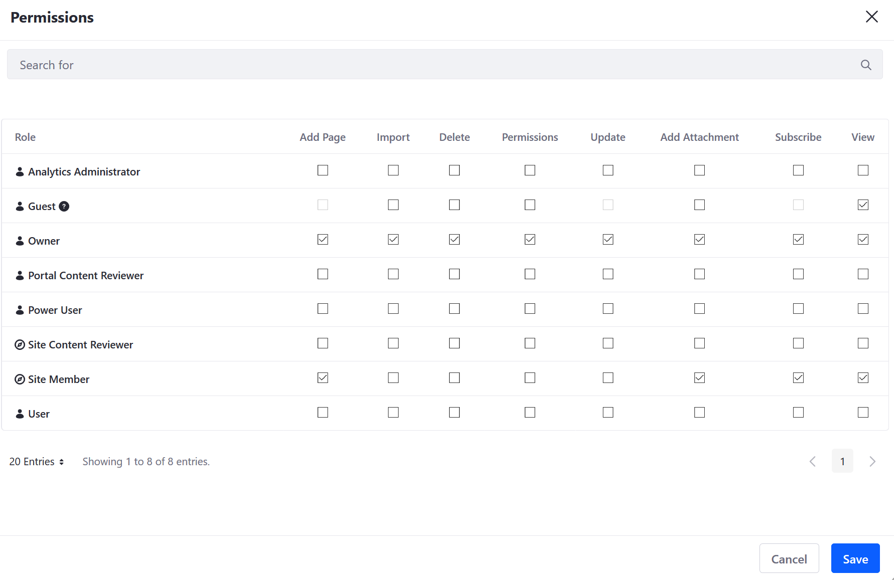

# Wiki Permissions Reference

This article documents permissions in the _Wiki_ widget and serves as a reference when assigning permissions to users and roles. To learn more about DXP Roles and Permissions in general, see [Roles and Permissions](https://help.liferay.com/hc/articles/360017895212-Roles-and-Permissions).

## Wiki Node Permissions

1. Navigate to _Site Administration_ &rarr; _Content & Data_ &rarr; _Wiki_.
1. Click _Options_ () next to the node (for example, _New Node_) then _Permissions_.

    

The available _wiki node_ permissions are:

| Permission | Description |
| --- | --- |
| Add Page | Grants users the ability to add a wiki page to the node |
| Import | Grants users the ability to import wiki pages as a `.lar` file; see [Exporting and Importing a Wiki](./exporting-and-importing-a-wiki.md) |
| Delete | Grants users the ability to delete a _Wiki Node_ |
| Permissions | Grants users the ability to view a wiki node's permissions |
| Update | Grants users the ability to modify the _Wiki Node_ |
| Add Attachment | Grants users the ability to add an attachment |
| Subscribe | Grants users the ability to subscribe to the node |
| View | Allows users to view the _Wiki Node_ |

## Wiki Page Permissions

To view a wiki page's permissions:

1. On any wiki page, click _Details_.
1. Click _Permissions_ in the _Advanced Actions_ section.

| Permission | Description |
| --- | --- |
| Update Discussion| Grants users the ability to update a comment to a _Wiki Page_ |
| Delete | Grants users the ability to delete a _Wiki Page_ |
| Permissions | Grants users the ability to view a page's permissions |
| Delete Discussion | Grants users the ability to delete a comment |
| Update | Grants users the ability to modify the _Wiki Page_ |
| View | Allows users to view the _Wiki Page_ |
| Add Discussion | Allows users to comment on the _Wiki Page_ |

## Wiki Widget Permissions

1. Navigate to the site page where the _Wiki_ widget has been deployed.
1. Mouse over the _Wiki_ and click _Options_ ()
1. Click _Permissions_.

| Permission | Description |
| --- | --- |
| Add Display Template | Grants the ability to add a display template to the wiki page |
| Permissions | Grants users the ability to view a _Wiki_ widget's permissions |
| Preferences | Grants users the ability to view a _Wiki_ widget's preferences |
| Configuration | Grants users the ability to access a _Wiki_ widget's Configuration menu |
| View | Allows users to view the _Wiki_ widget |
| Add to Page | Grants the ability to add a _Wiki_ widget to a site page |

## Wikis Permissions

These permissions are found in the _Site Administration_.

1. Navigate to _Site Administration_ &rarr; _Content & Data_ &rarr; _Wiki_.
1. Click the _Options_ () &rarr; _Wikis Permissions_.

The available permissions are:

| Permission | Description |
| --- | --- |
| Permissions | Grants users the ability to view a page's permissions |
| Add Node| Grants users the ability to add a wiki node |
