# Wiki Widget UI Reference

## FrontPage

The _FrontPage_ tab is the landing page for the _Wiki_ widget. From here, content creators can add a child page, edit the existing _FrontPage_ page, view the _FrontPage_'s page details, print the page, add a rating, or add a comment to the wiki.

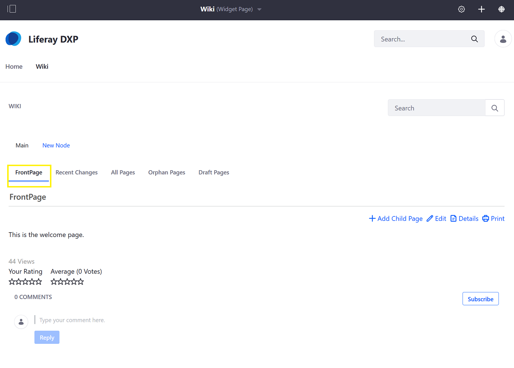

### Details

Clicking the _Details_ link on the _FrontPage_ tab displays information about that wiki page.

#### Content Tab

This is similar to the _Edit_ function; users can edit the wiki page.

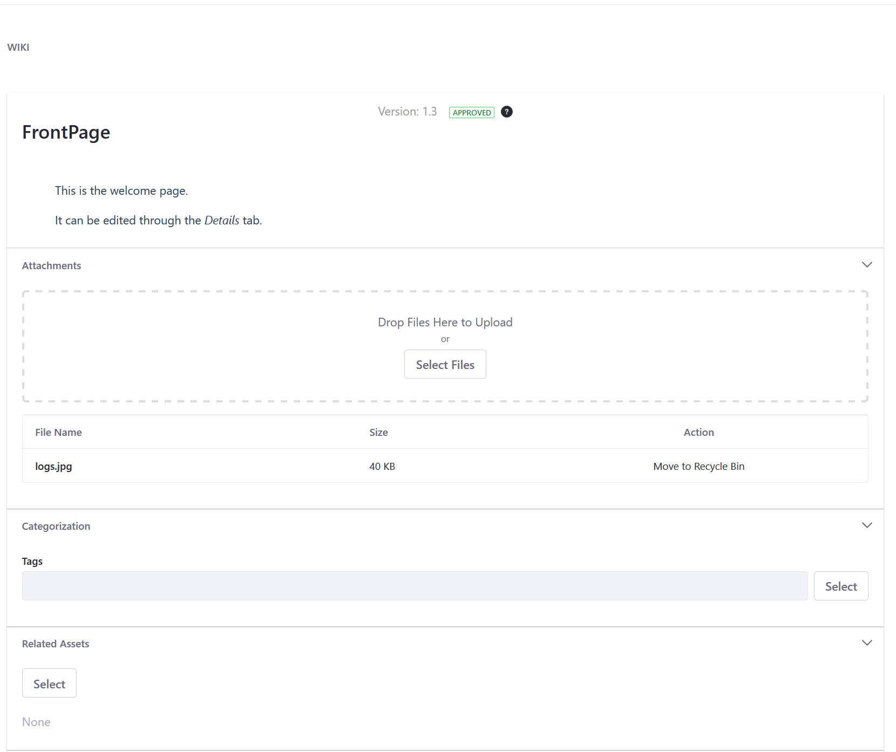

#### Details Tab

The _Details_ function displays the _FrontPage_'s metadata:

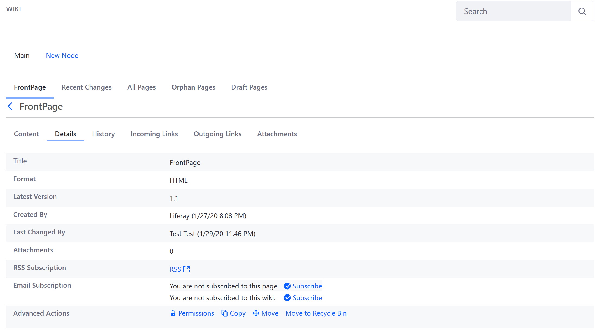

#### History

The _History_ tab displays the wiki page's revision history.

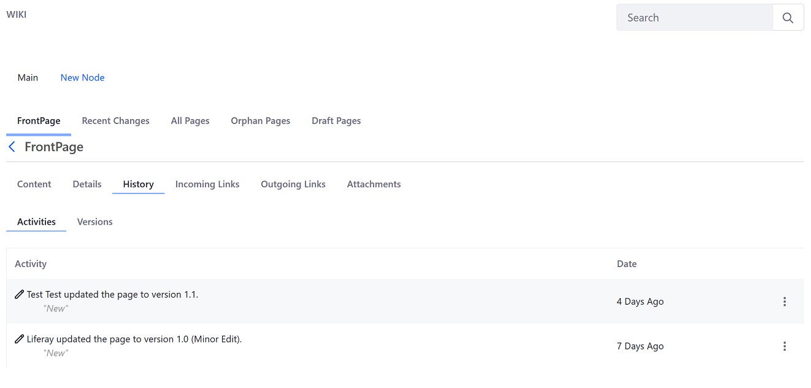

#### Incoming Links

The _Incoming Links_ tab lists all pages that link to this wiki page.

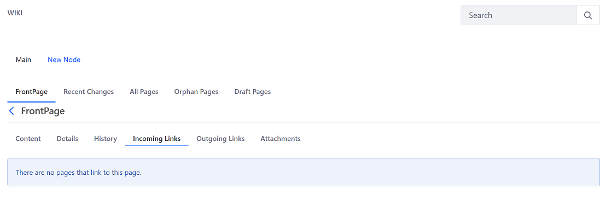

#### Outgoing Links

The _Outgoing Links_ tab lists all links found in the wiki page.

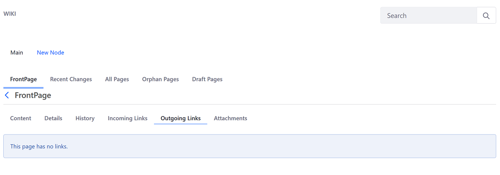

#### Attachments

The _Attachments_ tab lists all of the wiki page's attachments.

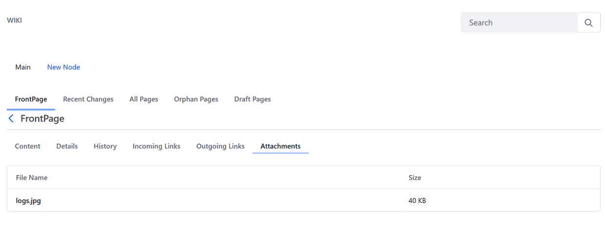

## Recent Changes

The _Recent Changes_ tab lists all the pages in the selected node, starting from the most recent.

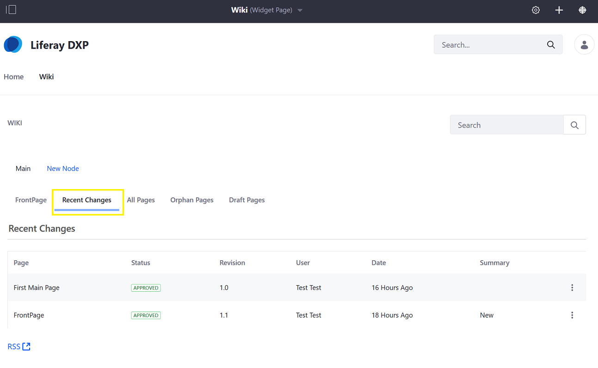

## All Pages

The _All Pages_ tab lists all the pages created in the selected wiki node.

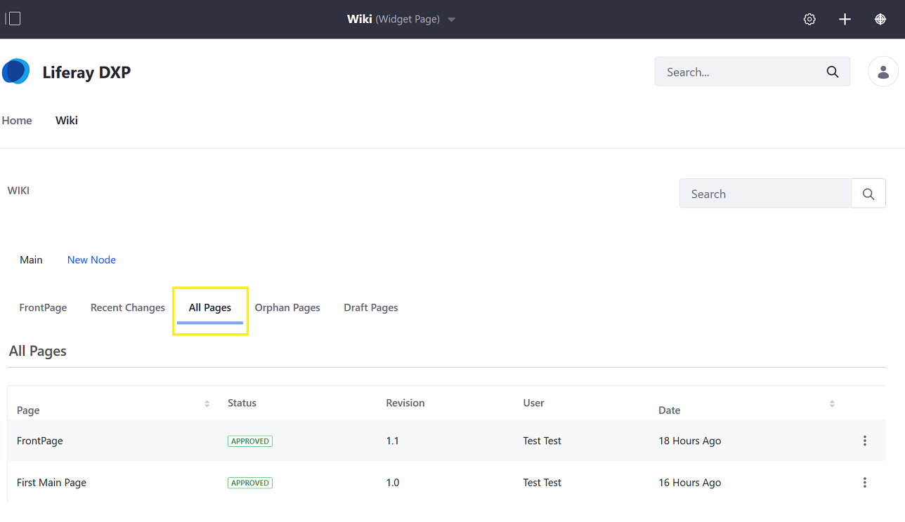

## Orphan Pages

Orphan Pages are pages existing on a website without any other page linking to them.

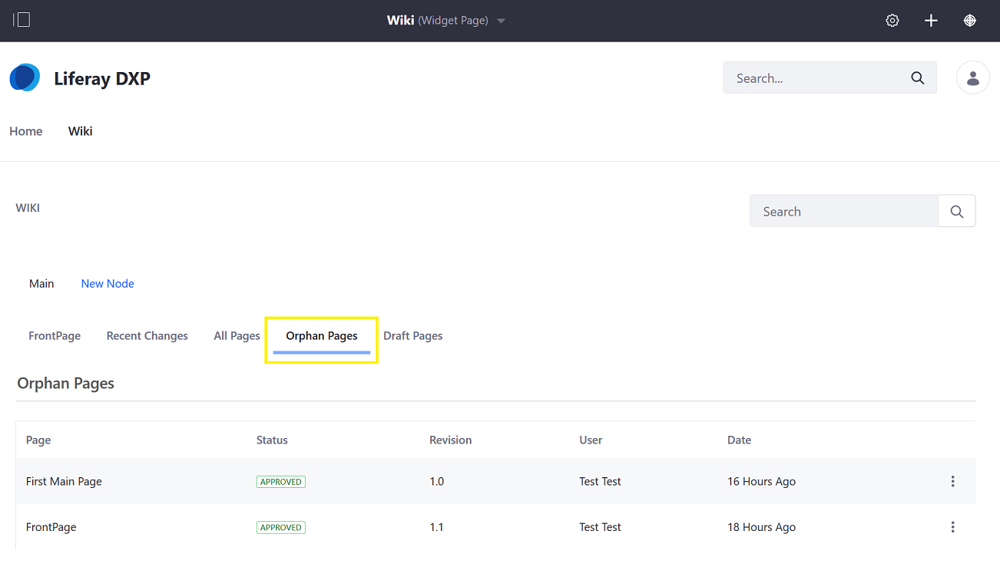

## Draft Pages

The _Draft Pages_ tab lists all _Wiki pages_ saves as a draft.

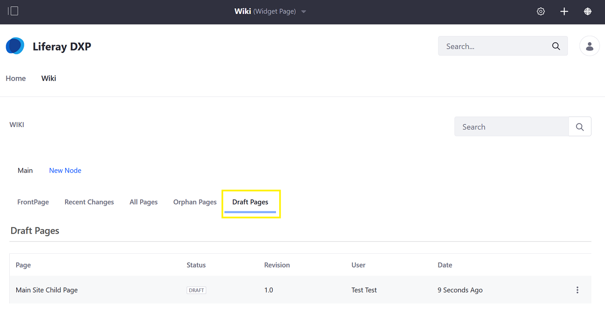
