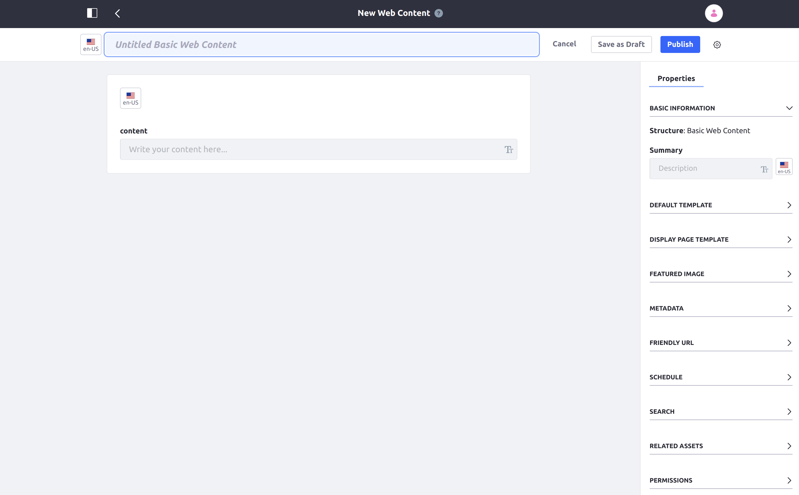

# Adding Web Content Articles

Web content is the most practical method of creating content to Users in DXP. Once they are created, web content articles can be displayed through widgets on pages, or on special [display pages](https://help.liferay.com/hc/en-us/articles/360029133291-Creating-Display-Page-Templates) designed specifically to display the content.

All web content articles are based on a structure that defines the fields available to it. <!-- TODO: See the [Introduction to Web Content Structures](../web-content-structures/introduction-to-web-content-structures.md) for more information.--> DXP provides one default structure out-of-the-box, _Basic Web Content._ The steps below will use this default structure.

## Creating a Basic Web Content Article

Use the following steps to create a _Basic Web Content_ article:

1. Open the Site menu and navigate to _Content & Data_ → _Web Content._

1. On the _Web Content_ screen, click the add  button, and then click _Basic Web Content_ in the menu that appears.

	.

1. Add a title and content into their respective fields.

	.

1. Click _Publish_.

Congratulations! You have added a basic web content article to your Site. <!-- TODO: See [Using the Web Content Display Widget](../../../../site-building/displaying-content/using-the-web-content-display-widget.md) for more information on displaying this article on a page. -->

## Properties Tab

You can see and edit more details for the article you are editing by opening the _Properties_ tab on the right side of the screen. The following properties are available here:

| **Property** | **Purpose** | **Extra Information** |
| --- | --- | --- |
| **Basic Information** | Displays the structure the web content is based on, and a Summary field where you can enter a short description. | The structure cannot be edited once the article is created. See [Web Content Structures](https://help.liferay.com/hc/en-us/articles/360029133211-Editing-Structures) for more information. |
| **Default Template** | Used to select which template to use to display this web content, by default. | See [Adding Web Content Templates](https://help.liferay.com/hc/en-us/articles/360028820252-Adding-Templates-with-Structures) for more information. |
| **Display Page Template** | Used to select a Display Page Template for this article, if one is desired. | See [Display Page Templates](https://help.liferay.com/hc/en-us/articles/360029133291-Creating-Display-Page-Templates) for more information. |
| **Featured Image** | Used to select a small image to use as the article's thumbnail. | The image can come from a URL or uploaded from your system. |
| **Metadata** | Used to set any tags or priority for the article. | See [Tagging Content](../../../tags-and-categories/user-guide/tagging-content.md) for more information. |
| **Friendly URL** | Used to set a custom friendly URL for this article. | |
| **Schedule** | Used to schedule a date to display or expire the article, if desired. | See [Scheduling Web Content](https://help.liferay.com/hc/en-us/articles/360029042011-Scheduling-Web-Content-Publication) for more information. |
| **Search** | Used to set whether this article will be indexed for search. | |
| **Related Assets** | Used to select any related assets, if desired. | |
| **Permissions** | Used to set any permissions for Guests or Site Members, specific to the article. | Click More Options to see permissions for more than who can view the article. See [Roles and Permissions](../../../../users-and-permissions/roles-and-permissions/introduction-to-roles-and-permissions.md) for more information. | 

## Additional Information

* [Display Page Templates](https://help.liferay.com/hc/en-us/articles/360029133291-Creating-Display-Page-Templates)

<!-- TODO: * [Introduction to Web Content Structures](../web-content-structures/introduction-to-web-content-structures.md) 
* [Using the Web Content Display Widget](../../../../site-building/displaying-content/using-the-web-content-display-widget.md)-->