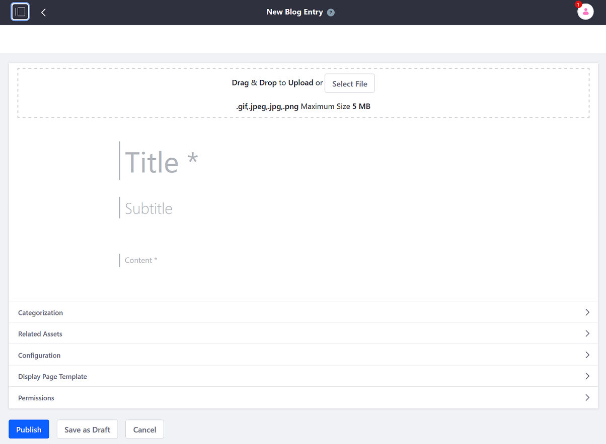

# Adding Blog Entries

Blog entries are scoped to Sites. By default, only authenticated users have the ability to create blog entries. See the [Blogs Permissions Reference](./blog-permissions-reference.md) for more information.

The easiest way to create a blog entry is on the _Blogs_ widget deployed on a site page.

## Creating an Entry

1. Open the _Product Menu_ () then click the compass icon () on the _Site Administration_ menu. Select the site where the blog will be created.
1. Once the _Blogs_ widget has been added to the Site page, Click the _New Entry_ button.

    

1. _Drag \& Drop to Upload_ an optional cover image for the entry. By default, this cover image is published as part of the blog entry's abstract. Insert the desired image, either via drag and drop or the _Select File_ button.
1. Enter a title for the blog entry.
1. Enter an optional subtitle for the entry.
1. Enter the entry's content in the _Content_ field. To learn more about the different text editing features, see the [Blog Entry Editor Reference](./blog-entry-editor-reference.md) article.

### Organizing Blog Entries with Tags and Related Assets

Adding Tags and relating other assets to the blog entry can help users better find content on your site.

To add tags:

1. Expand the _Categorization_ section.
1. Click the _Select_ button to select an existing tag. Alternately, create a new tag by entering the tag name in the _Tags_ field and clicking _Add_. See [the documentation on tags](https://help.liferay.com/hc/articles/360028820472-Tagging-Content) for more information.

To add an asset relation:

1. Expand the _Related Assets_ section and use the _Select_ button to select the desired asset to link.

### Configuring How the Entry is Displayed

To customize the blog entry's URL, abstract, or display date:

1. Expand the _Configuration_ menu.
1. Leave the default URL setting as _Automatic_; the URL is based on the blog entry's title. Alternately, selecting _Custom_ lets you enter your own URL.
1. Specify the blog entry's abstract. By default, the _Blogs_ application uses the first 400 words. Alternately, enter a custom abstract.
1. Finally, you can allow _pingbacks_ for the blog entry. Pingbacks are XML-RPC requests that are sent automatically when you link to another site.

    

1. Expand the _Display Page Template_ panel if you want to select a [display page template](https://help.liferay.com/hc/articles/360028820332-Display-Page-Templates-for-Web-Content) for displaying your blog entry. Otherwise, use the _Default Display Page Template_.

1. Click _Publish_ to publish the blog entry.

The entry is now published. Fellow site members can add comments, rate the entry, or share it on other social media sites.
