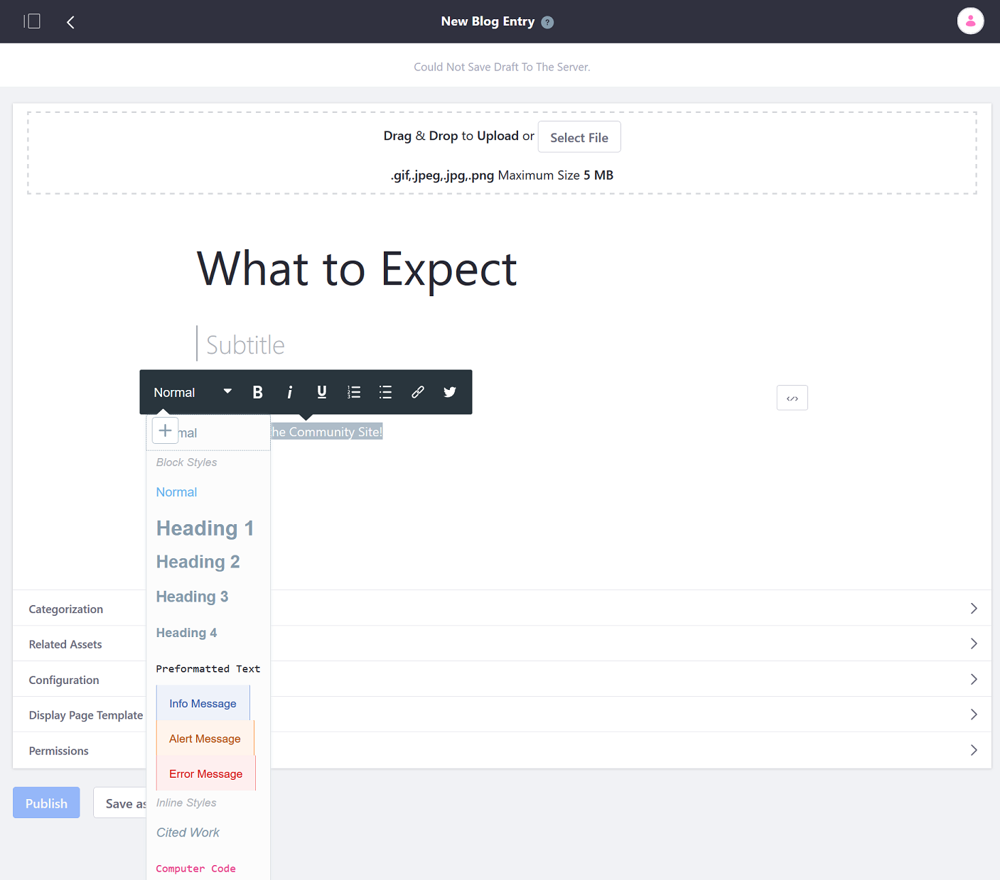
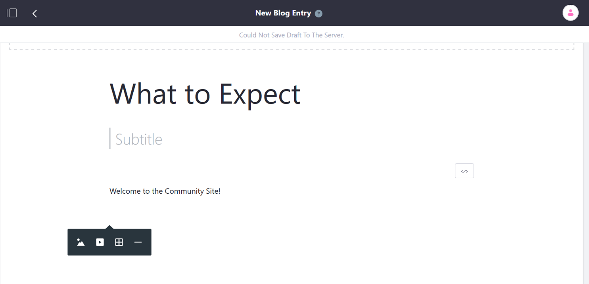

# Blog Entry Editor Reference

The blog entry editor provides context appropriate editing tools for formatting text, managing images, tables, and other rich features. Users are able to switch to code view to directly edit the content’s HTML. All draft entries are automatically saved every 25 seconds.

## Using the Editor’s Text View

The Text view is a WYSIWYG editor that lets you enter and edit text and other types of content.

To style or format text in the _Content_ area, select the text. A toolbar appears above the text that contains the following options:

| Function | Description |
| --- | --- |
| Text Style | Choose the text’s style. Normal is typical body text, but you can also select from different heading styles, alert or error message styles, code style, and more. |
| Typeface | Select bold, italic, or underline. |
| List Style | Select a numbered or bulleted list. |
| Link | Link the selected text to a specific URL, or to an item in the portal. |
| Twitter | Generates a link to tweet the selected text. |

When the cursor hovers in the entry's content area, the Add icon (+) appears. Clicking the Add icon shows controls for inserting an image, video, table, or horizontal line ().

| Function | Description |
| --- | --- |
| Image | Upload an image to the blog entry. |
| Video | Insert a video link. |
| Table | Insert a table. |
| Line | Insert a simple, lightweight horizontal line then appears in your content for separating sections of content in a large blog entry. |

## Using the Editor's Code View

To switch to code view, click the the Source icon (</>) that appears when you place your cursor in the Content area. The following buttons exist at the top-right of code view:

| Function | Description |
| --- | --- |
| Fullscreen | Work in a dual-pane view that shows your HTML code on the left and a preview pane on the right. |
| Dark/Light Theme | Switch the code editor between dark and light theme. |
| Text View | Switch back to text view. |
