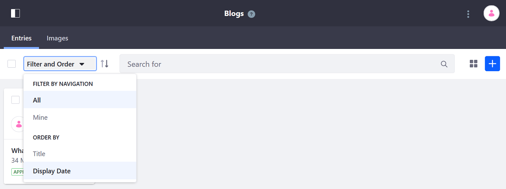

# Managing Blog Entries

Bloggers and blog administrators manage blog entries using the _Blogs_ application in the _Site Administration_ menu. To access this app, click the Product Menu button () to open the product menu and select _Content & Data_ &rarr; _Blogs_. 

The _Entries_ tab is selected by default, which lists the site's blog entries. Use the Management Bar to manage your site's blog entries.

## View Types

The _View Types_ button is to the left of the _Add_ button. Users can choose how to display the blog entries in the Blogs app. The_ View Types_ button's icon depends on the selected view type:

| View Type | Description |
| --- | --- |
| Cards () | Shows a card-like rendering of the blog entry, with the author's profile picture. Each card also contains the entry's timestamp, title, [workflow](../../../process-automation/workflow/user-guide/introduction-to-workflow.md)) status (e.g., Approved, Draft, etc.), and an Actions menu (). |
| List () | Shows the same information as the Cards view type, in a list with the author's profile picture instead of the blog entry's cover image. |
| Table () | Shows the same information as the other view types, in a list with no file renderings. |

## Finding and Arranging Blog Entries

The Management Bar also contains tools that help you locate and arrange blog entries. The most prominent of these tools is the *Search* bar, where you can find files by keywords.

To the left of the Search bar, the Sort button () arranges entries in ascending or descending order.

Click _Filter and Order_ to sort entries using these criteria:

| Filter | Description |
| --- | --- |
| All | Shows all of the site's entries.|
| Mine | Shows only the current user's entries. |
| Display Date | Orders the entries by display date. |

## Deleting Blog Entries

1. Check the checkbox to select the entry to be deleted.
1. Click the _Trash_ button () to move the selected entries to the Recycle Bin.

## Sharing Blog Entries

You can also share blog entries from the Blogs app in Site Administration. Sharing is enabled by default, as described in [Configuring Sharing](https://help.liferay.com/hc/en-us/articles/360029040731-Configuring-Sharing).
Sharing blog entries works the same as [sharing files](https://help.liferay.com/hc/en-us/articles/360029040711-Sharing-Files).

To share a blog entry:

1. Click the _Actions_ menu () and then _Share_.

