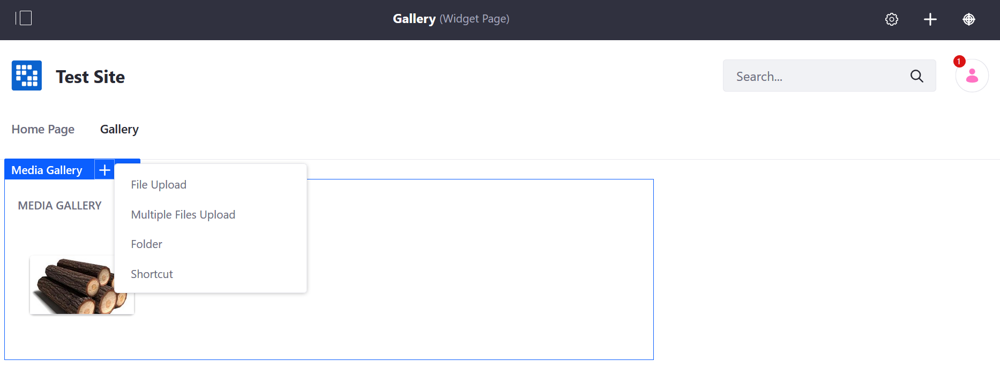

# Using the Media Gallery Widget

The _Media Gallery_ widget publishes uploaded assets in a simple gallery-like style. It shows a large thumbnail of each media file, lets the user download files, and has slideshow capabilities. A common way to use the Media Gallery is to create a separate page for displaying media and add a Media Gallery widget to it. The widget does not display `.doc` files.

To use the _Media Gallery_:

1. Navigate to the site page where the _Media Gallery_ widget is deployed.
1. Click on the desired folder where the file is to be located.
1. If there are any media files previously uploaded from the _Documents and Media_ widget, they are displayed here. Users can upload additional media and add folders to organize the files.

    

1. The steps are the same when [adding a folder](./../../uploading-and-managing/creating-folders.md#adding-a-folder) and [uploading media files](../../uploading-and-managing/uploading-files.md) in the widget.

    

Once the media files have been uploaded, clicking on a file automatically starts a slideshow.

## Additional Information

* [Managing Folders](../../uploading-and-managing/creating-folders.md)
* [Uploading Files](../../uploading-and-managing/uploading-files.md)
