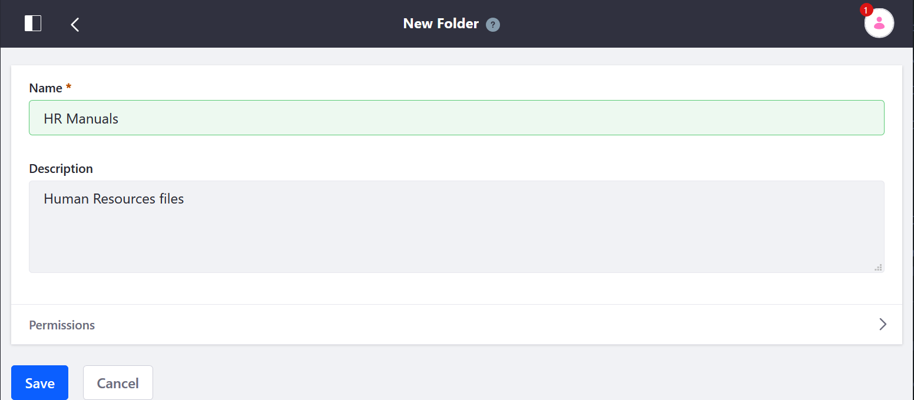
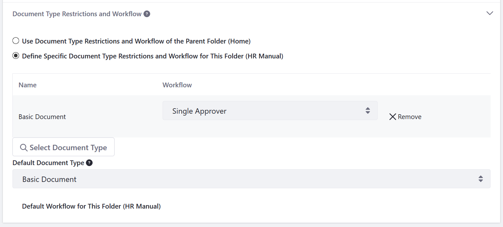

# Creating Folders

Documents and Media Folders can be used to organize their files. Only authenticated users with the required permissions can manage a folder. See the [Documents and Media Permissions Reference](../publishing-and-sharing/managing-document-access/documents-and-media-permissions-reference.md) for more information. To learn more about DXP Roles and Permissions in general, see [Roles and Permissions](https://help.liferay.com/hc/articles/360017895212-Roles-and-Permissions).

## Adding a Folder

The quickest way to add a folder is on the _Documents and Media_ widget deployed on a site page.

1. Navigate to the site page where the _Documents and Media_ widget is deployed.
1. Mouse over the widget title menu and click the _Add_ icon () and select _Folder_.

    

1. Enter a name for the folder.
1. Enter a description for the folder.

    

1. Click _Save_.

Upon creating the folder, it appears in the Document Library. Users can also create subfolders. To create subfolders, click on the folder designated as the parent folder then repeat the steps.

## Document Type Restrictions and Workflow

After creating a folder, you can restrict what document types are allowed in it. You can also choose what [workflow](../../../process-automation/workflow/user-guide/introduction-to-workflow.md) (if any) to use for approving files added to or edited in the folder.

To change a folder's Document Type restrictions:

1. Navigate to the _Site Administration_ menu for your site.
1. Click _Content & Data_ &rarr; _Documents and Media_.
1. Click the folder's _Actions_ menu () and select _Edit_.
1. Expand the _Document Type Restrictions and Workflow_ section.
1. Click _Define Specific Document Type Restrictions and Workflow for this Folder (the current folder)_.
1. Click _Select Document Type_.

    

1. Click _Choose_ next to the Document Types to be associated with this folder.
1. Select any workflow to be associated with this folder.

    

1. Click *Save* when you're finished.

## Additional Information

* [Activating Workflow](../../../process-automation/workflow/user-guide/activating-workflow.md#documents-and-media-folders)
* [Uploading Files](./uploading-files.md)
* [Using the Media Gallery](../publishing-and-sharing/publishing-documents-on-a-dxp-site/using-the-media-gallery-widget.md)
* [Enabling Xuggler and ImageMagick for previews](./../../../../system-administration/using-the-server-administration-panel/configuring-external-services-in-server-administration.md)

