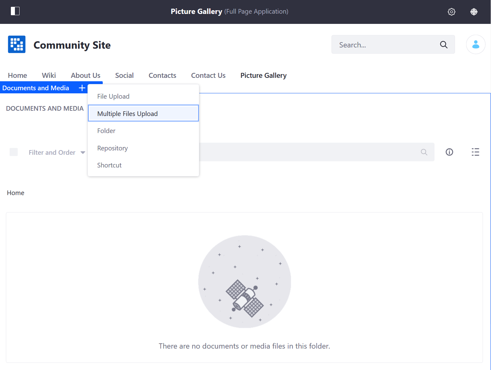

# Uploading Files

The _Documents and Media_ application is where users can store their files natively inside the DXP instance. Unless a certain file format is disallowed, users can upload most types of files: documents, images, and videos.

Users with adequate permissions have the ability to upload a single file or multiple files simultaneously. See the [Documents and Media Permissions Reference](../publishing-and-sharing/managing-document-access/documents-and-media-permissions-reference.md) for more information. To learn more about DXP Roles and Permissions in general, see [Roles and Permissions](https://help.liferay.com/hc/articles/360017895212-Roles-and-Permissions).

## Uploading a Single File

The quickest way to upload a file is on the _Documents and Media_ widget deployed on a site page. You can upload a file to the Root folder or inside a specific folder.

1. Navigate to the site page where the _Documents and Media_ widget is deployed.
1. Click on the desired folder where the file is to be located.
1. Mouse over the widget title menu and click the _Add_ icon () and select _File Upload_.
1. Click the _Browse..._ button and navigate to where the file is located locally.
1. Select the file then click _Open_.
1. By default, the _Title_ field is auto-populated with file name. Users can always change the name before publishing the file to the Site.
1. Enter a description.

    

1. Click _Publish_ when finished.

When a file is published, it is uploaded to the Site. Clicking on the file itself generates a preview inside the widget. You can download the file or share the file's URL. Depending on whatever permissions the user has, they can also lock the file to prevent others from modifying the file.  

## Uploading Multiple Files

To upload multiple files at once:

1. Select the folder where the files are to be published.
1. Mouse over the widget title menu and click the _Add_ icon () and select _Multiple Files Upload_.

    

1. Drag and drop the desired files. Users can update the file's Document Type before publishing. The files are not yet published to the Site.
1. Enter a description.
1. Click _Publish_.

The files are now published to the Site.

## Additional Information

* [Creating Folders](./creating-folders.md)
* [Using the Media Gallery](../publishing-and-sharing/publishing-documents-on-a-dxp-site/using-the-media-gallery-widget.md)
