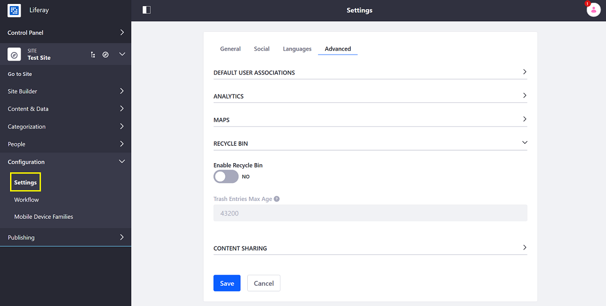
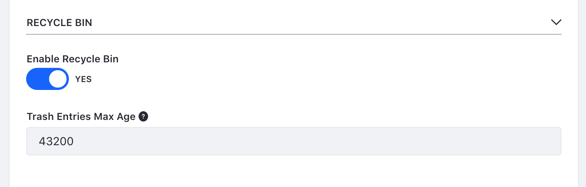

# Configuring the Recycle Bin

The Recycle Bin supports instance-wide scope or site-specific scope. By default, the Recycle Bin is enabled instance-wide.

```tip::
   You can disable the Recycle Bin on a specific site. If you disable the Recycle Bin while it is still holding recycled items, the recycled items remain stored and reappear in the Recycle Bin if it is re-enabled.
```

To configure the Recycle Bin:

1. Open the _Product Menu_ () then click the compass icon () on the _Site Administration_ menu.
1. Select the site.
1. Click _Configuration_ &rarr; _Settings_.

   

1. Click the _Advanced_ tab.
1. Expand the _Recycle Bin_ dropdown menu.
1. Switch the toggle to _YES_ to enable settings for the Recycle Bin's site-specific scope. Alternately, slide the toggle to _NO_ to disable settings.
1. Leave the **Trash Entries Max Age** 43200 (or 30 days).

    

1. Click _Save_ when finished.

The Trash Entries Max Age values must be expressed in minutes. By default, items sit in the Recycle Bin for 30 days before they are deleted automatically. You can shorten or lengthen the period.

## What's Next

* [Using the Recycle Bin](./using-the-recycle-bin.md)
* [Restoring Deleted Assets](./restoring-deleted-assets.md)
