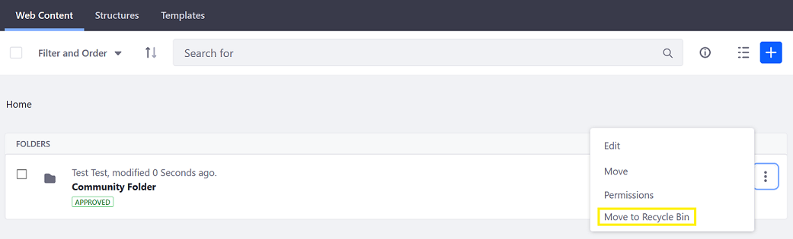
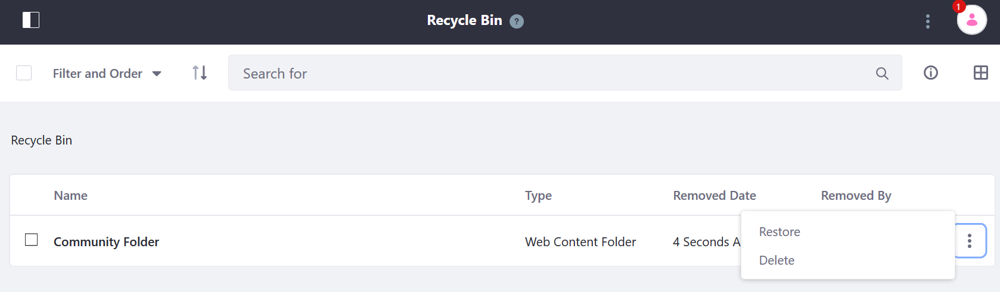
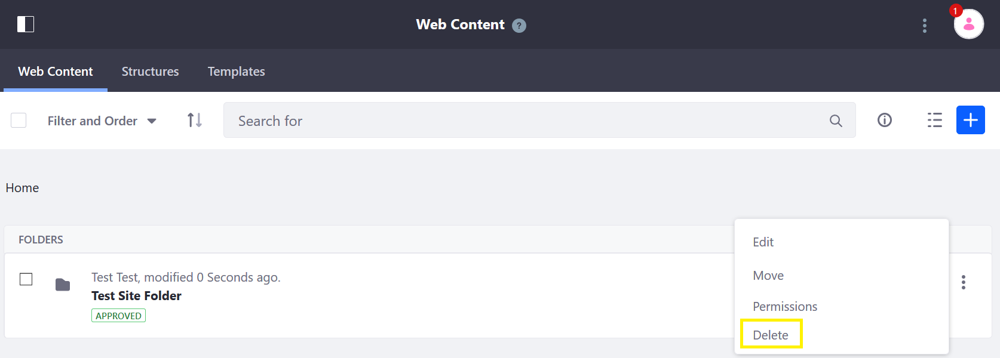

# Introduction to the Recycle Bin

Assets that are deleted are placed it in the Recycle Bin. Assets in the Recycle Bin can be restored by users. Assets in the Recycle Bin can expire after a configured period of time, resulting in permanent deletion. By default, the Recycle Bin is enabled instance-wide and can be disabled on a site by site basis.

With the Recycle Bin enabled, the _Move to the Recycle Bin_ action replaces _Delete_ for certain asset types. <!-- What asset types? -->

When viewing the Recycle Bin, users can restore or permanently delete an asset.

If the Recycle Bin is disabled on a site, assets that are deleted are permanently deleted and cannot be restored.

## What's Next

* [Using the Recycle Bin](./using-the-recycle-bin.md)
* [Configuring the Recycle Bin](./configuring-the-recycle-bin.md)
