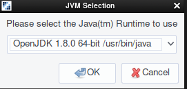
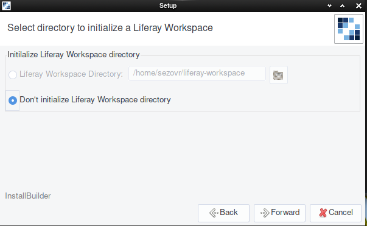
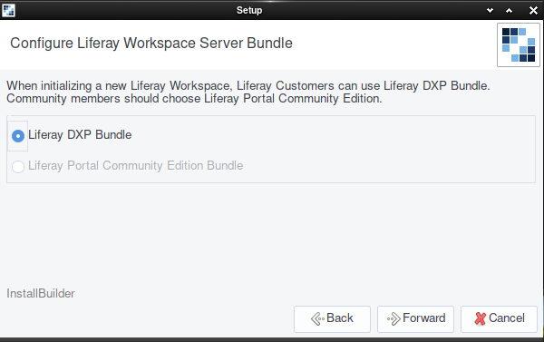

# Installing and Updating Blade CLI

Blade CLI can be installed through a command line interface or a graphical installer. If you're behind a proxy, once it's installed you can configure it to operate through the proxy. Blade CLI informs you when a new version is released, and you can upgrade from the CLI at any time.

## Installing Blade CLI

No matter how you install Blade CLI, make sure you have an implementation of the Java JDK installed first.

### Installing from the CLI

Installing Blade CLI for Linux and Mac operating systems is a one-line command:

```bash
curl -L https://raw.githubusercontent.com/liferay/liferay-blade-cli/master/cli/installers/local | sh
```
<!-- is there a success message after running the above script to let someone know they 'did it right'? -->
After the install completes, open a new command line and type `blade`. If you get a command not found error, you must [add the `blade` command to your path](./troubleshooting-blade-cli.md#the-blade-command-is-not-available-in-my-cli).

### Installing from the Graphical Installer

If you're more comfortable with an installer, download the latest [Liferay Project SDK Installer](https://sourceforge.net/projects/lportal/files/Liferay%20IDE/) and run it.

1. Select your Java runtime. This should be auto-detected.

   

1. After the introduction, click *Next*.

1. You can initialize a [Liferay Workspace](../../tooling/liferay-workspace.md) during the install. Liferay Workspace is an environment (a set of folders) on your system where you'll manage your Liferay projects. Set its location if you wish to initialize it now.

   

1. If you're initializing a Liferay Workspace, you must next choose Liferay DXP or Community Edition.

   

   Choose the product type and click *Next*.

1. Click *Next* to install Blade CLI.

On Windows environments, the `blade` command is added to your path automatically on Windows or if you're using `bash` or `zsh` on Mac and Linux. See [Troubleshooting Blade CLI](./troubleshooting-blade-cli.md) for further information.

## Configuring a Proxy

If you're behind a proxy server, you can configure it from your CLI:

```bash
jpm command --jvmargs "-Dhttp(s).proxyHost=[your proxy host] -Dhttp(s).proxyPort=[your proxy port]" jpm
```

Now Blade can use your proxy server when accessing Liferay samples and templates from the Internet.

## Updating Blade CLI

When you use Blade CLI, it checks to see if there's an update. If an update is available, you'll see this message when your command completes:

```bash
Update available 3.9.1 -> 3.9.2
Run `blade update` to install
```

To update Blade, run the following command:

```bash
blade update
```

If you want bleeding-edge features, you can optionally switch to the snapshot version, which is updated more frequently:

```bash
blade update -s
```

Snapshot versions can be unstable, so use them at your own risk.

## Blade Commands

Below is a summary of the available blade commands. Help is available at the CLI by typing `blade help [command]`.

Command | Description
------- | -------------
`convert` | Converts a Plugins SDK plugin project to a Gradle Workspace project.
`create` | Creates a new Liferay project from available templates.
`deploy` | Builds and deploys projects to Liferay.
`extension install` | Installs an extension into Blade CLI.
`extension uninstall` | Uninstalls an extension from Blade CLI.
`gw` | Executes a Gradle command using the Gradle Wrapper, if detected (e.g., `blade gw tasks`).
`help` | Provides information for Blade CLI's commands.
`init` | Initializes a new Liferay Workspace.
`samples` | Generates a sample project.
`server init` | Initializes the Liferay server configured in Liferay Workspace's `gradle.properties` file. Set the `liferay.workspace.bundle.url` property to configure the server to initialize.
`server start` | Starts the Liferay server in the background. You can add the `-d` flag to start the server in debug mode. Debug mode can be customized by adding the `-p` tag to set the custom remote debugging port (defaults are `8000` for Tomcat and `8787` for Wildfly) and/or the boolean `-s` tag to set whether you want to suspend the started server until the debugger is connected.
`server stop` | Stops the Liferay server.
`server run` | Starts the Liferay server in the foreground. See the `server start` property for more information.
`sh` | Connects to Liferay DXP, executes a Gogo command, and returns the output. For example, `blade sh lb` lists all bundles using the Gogo shell.
`update` | Updates Blade CLI to the latest version.
`upgradeProps` | Analyzes your old `portal-ext.properties` and your newly installed 7.x server to show you properties moved to OSGi configuration files or removed from the product.
`watch` | Watches for changes to a deployed project and automatically redeploys it when changes are detected. This command does not rebuild your project and copy it to your installation every time a change is detected, but instead installs it into the runtime as a reference. This means that Liferay DXP does not make a cached copy of the project, so it can see changes that are made to your project's files immediately. When you cancel the `watch` task, your module is uninstalled automatically. The `blade deploy -w` command works similarly to `blade watch`, except it manually recompiles and deploys your project every time a change is detected. This is slower, but it preserves your deployed project between restarts.
`version` | Displays version information about Blade CLI.
