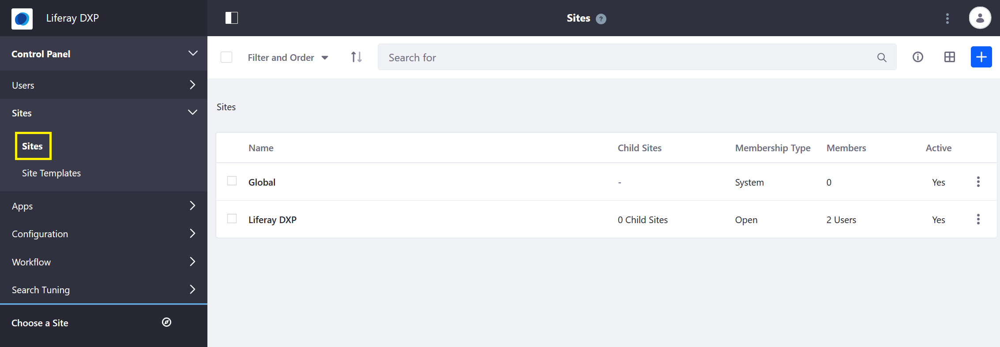
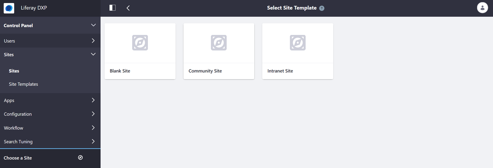
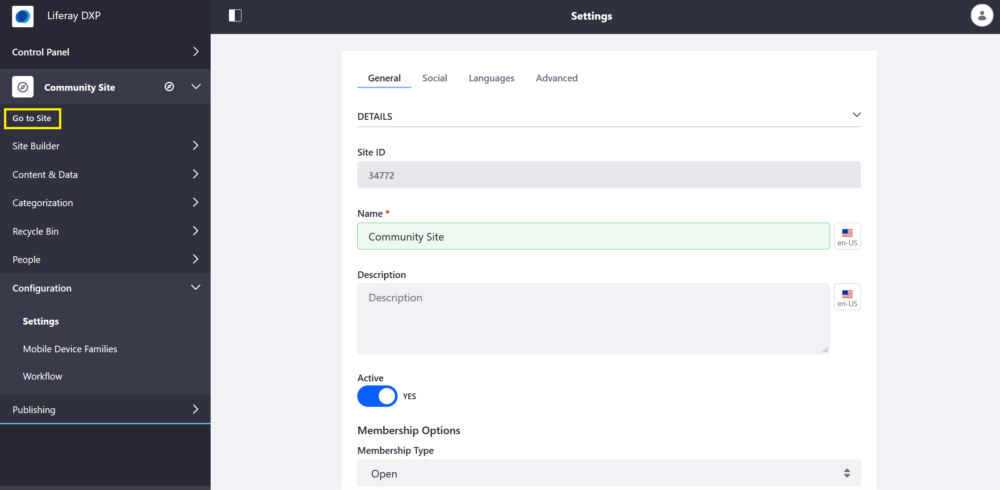
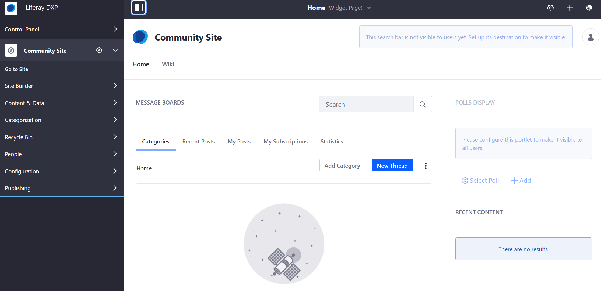

# Creating Your First Site

Sites are collections of pages that contain and display content. This article walks through creating a new Site based on an existing out-of-the-box template.

## Creating a Site

To create a new Site, follow these steps:

1. Open the _Product Menu_ and navigate to the _Control Panel_ and select _Sites_ → _Sites_.

    

1. Click the Add icon () at the top right of the page.
1. Select a _Site Template_.

   

1. Click _Community Site_.
1. Enter a name for the site.
1. Click _Save_.

A new site is created and ready for use. Users will be presented a variety of Site Settings options to further configure their new site. Click to learn more about [Site Settings](../site-building/01-introduction-to-site-building.md).

## Viewing the Site

To view a newly created site:

1. Expand the _Site Menu_.
1. Verify that the site selector shows the _Community Site_.
1. Click _Go to Site_.

    

Sites built with the _Community Site_ template come with two pages: _Home_ and _Wiki_. Each page has several applications already deployed that you may begin exploring.

## What's Next

Continue our Getting Started guide by learning how to change the look and feel of your site by [changing your site's theme](./changing-your-theme.md).

Liferay Sites are flexible, powerful, and can be configured to meet many different needs. See our [Introduction to Site Building](../site-building/01-introduction-to-site-building.md).
