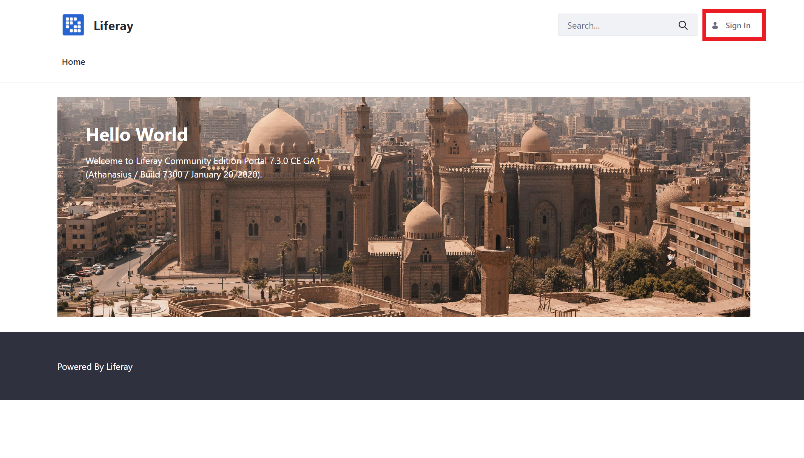
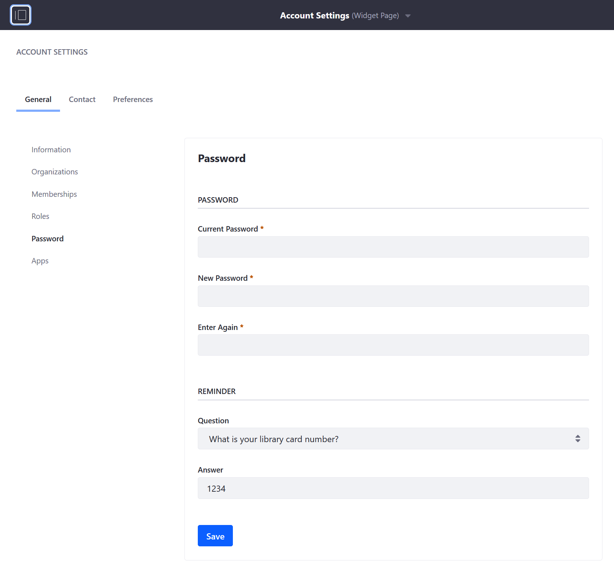
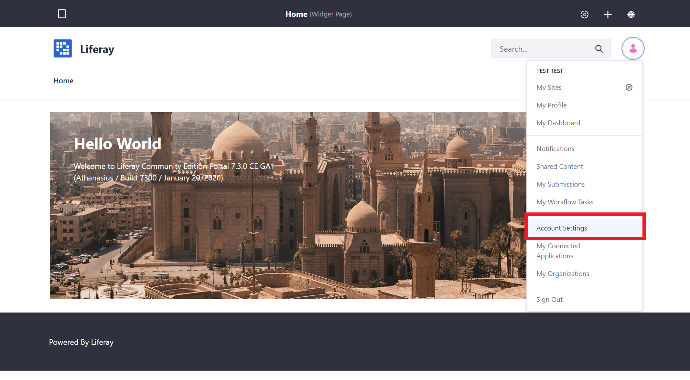
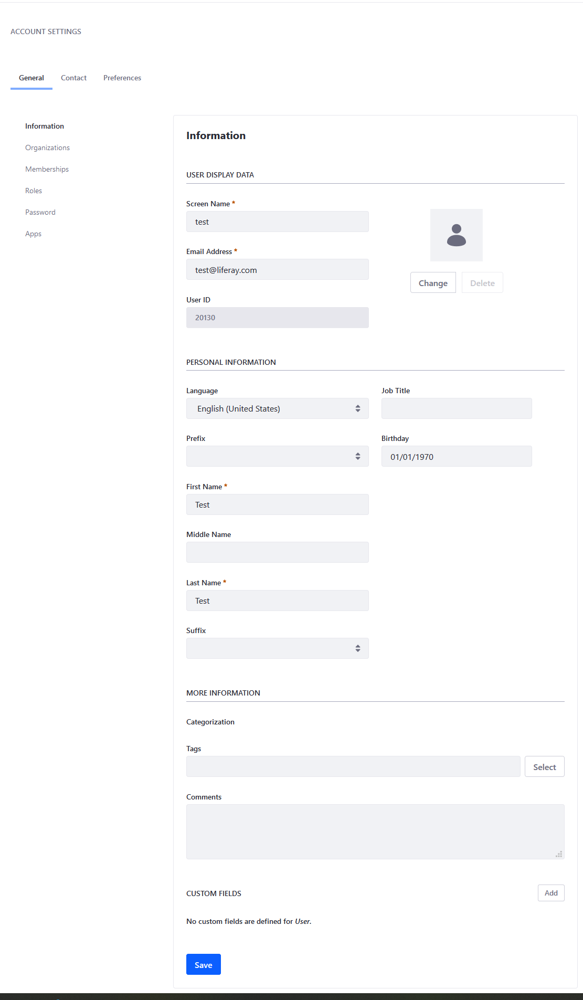
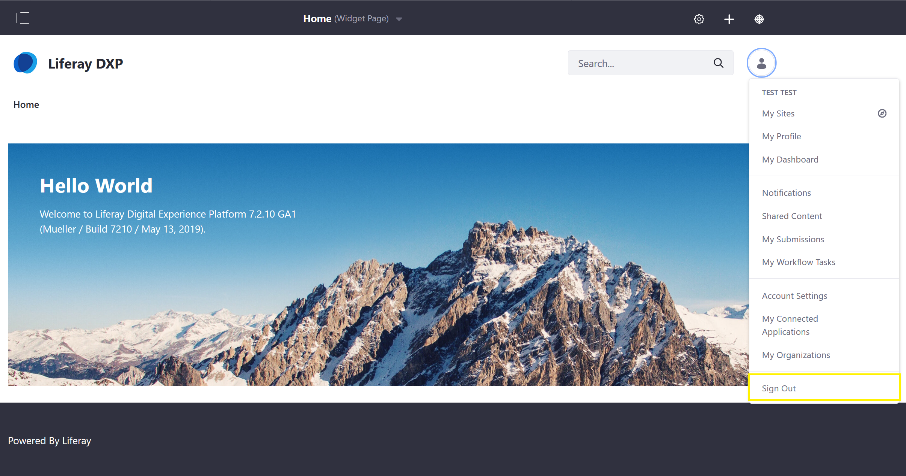

# Introduction to the Admin Account

The Admin user is created by default in any new installation of Liferay DXP and has full permissions to modify every facet of a Liferay DXP instance. The Admin user can create, modify, and delete sites, pages, users, accounts, catalogs and products, and perform all store and site administrative tasks.

## Accessing Liferay DXP as the Admin User

1. Open a browser to `http://localhost:8080`.
1. Click the _Sign In_ link. <!-- Screenshot must be updated to latest 7.2 DXP -->

    <!--  -->

    > **Note:** If a Liferay DXP bundle is being used, you may be presented with the [_Setup Wizard_](https://help.liferay.com/hc/en-us/articles/360017896652-Installing-Liferay-DXP-#using-the-setup-wizard). Follow the on-screen instructions to configure your Admin user.

1. Enter the default admin credentials to log in. Email Address: `test@liferay.com` Password: `test`

    > **Important:** It is **highly** recommended that the default login credentials be updated when starting a new Liferay DXP installation.

## Configuring the Admin User

### Changing the Login Password

1. Open the [_Product Menu_](./using-the-product-menu.md) and navigate to the _Account Menu_ -> _My Account_ -> _Account Settings_ -> _Password_.
1. Enter your _Current Password_ and provide a _New Password_.

    <!--  -->

### Changing Account Information

1. Open the _Product Menu_ and navigate to the _Account Menu_ -> _My Account_ -> _Account Settings_.

    <!--  -->

1. In the _Information_ tab, change or add user information as needed.

    <!--  -->

## Signing Out

To log out of your account:

1. Open the _Product Menu_ and navigate to the _Account Menu_ -> _Sign Out_.

    <!--  -->

## What's Next

Continue our Getting Started walkthrough by familiarizing yourself with the [DXP Product Menu](./using-the-product-menu.md).

Learn more about [configuring how users log into DXP](../advanced-installation-and-upgrades/05-securing-liferay/02-configuring-authentication.md).
