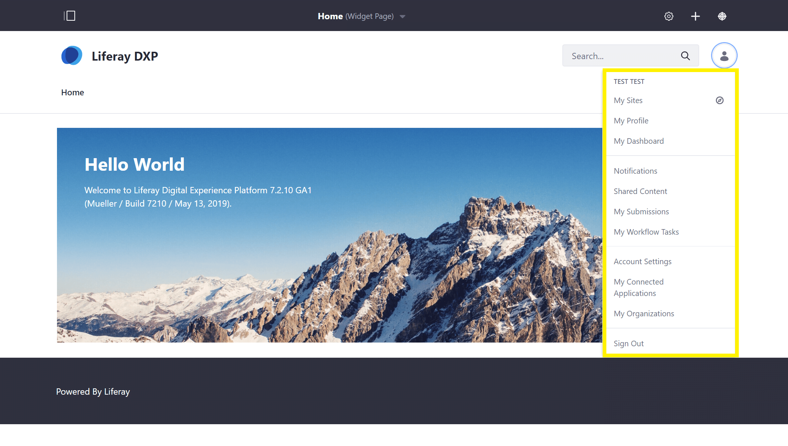
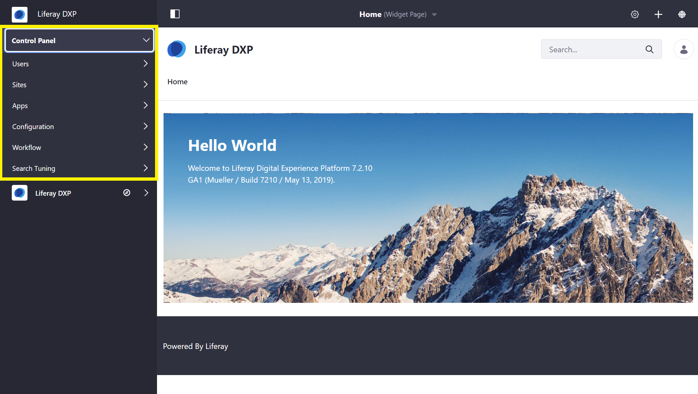
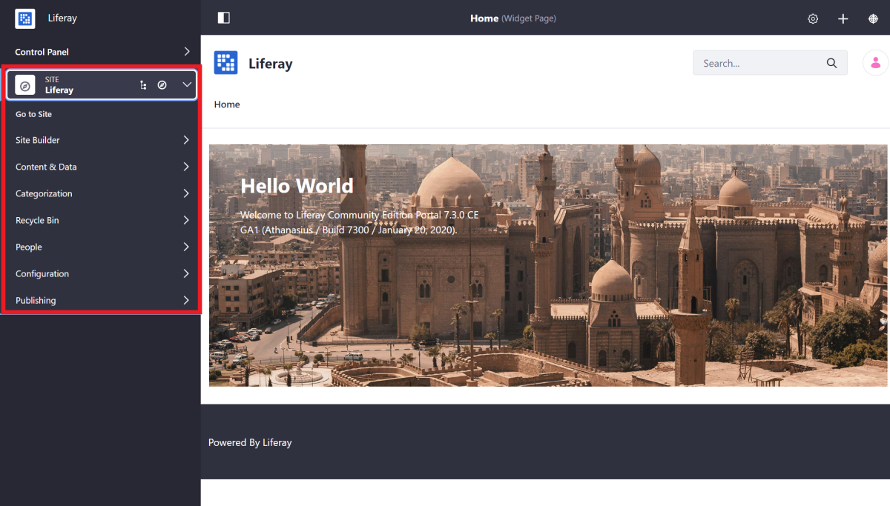

# Navigating DXP

Liferay DXP's out-of-the-box navigation is organized into two major areas: the _Personal Menu_ and the _Product Menu_.

## Personal Menu

The Personal Menu is the hub for information and activities for a user that is logged in.

Users can use the personal menu to:

* [Change account information](../user-and-system-management/README.md) (Name, Password, etc.)
* [See what sites they are members of](../site-building/01-building-sites/05-adding-members-to-sites.md)
* [Review site notifications](../collaboration-and-social/05-notifications-and-requests/README.md)
* [Sign out](./introduction-to-the-admin-account.md#signing-out)
* And more...

## Product Menu

The DXP Product menu contains the _Control Panel_ and the _Site Menu_.

> **Note:** By default, users with the _Guest_ or _User_ roles are not be able to access the Product Menu.

### Control Panel

The _Control Panel_ contains general administrative actions and configurations that apply _globally_ to the Liferay DXP installation.

The following common administrative activities can be done in the Control Panel:

* [Manage Users, Permissions, and Roles](../user-and-system-management/README.md)
* [Change the System Password Policy](../installation-and-upgrades/05-securing-liferay/README.md)
* [Create new Sites](../site-building/01-introduction-to-site-building.md)
* Add new Custom Fields to applications on the site
* And more...

### Site Menu

The DXP _Site Menu_ drop down contains actions, content, and configurations that are scoped to the specific site that is being currently viewed.

> **Note:** The _Site Menu_ indicates which site you are working with when using the Site Menu. In this example the site is `Liferay DXP`. You may change what site you are working with by clicking the  in the Site Menu.

The following common site building and management activities can be done in the _Site Menu_:

* [Adding Pages](../site-building/02-creating-pages/README.md)
* [Creating Content](../content-authoring-and-management/README.md)
* [Managing Site Memberships](../site-building/01-building-sites/05-adding-members-to-sites.md)
* [Configuring and Optimizing Site Behavior and Functionality](../site-building/07-optimizing-sites/README.md)
* And more...

## What's Next

Continue our Getting Started walkthrough and learn about [Creating Your First Site](./creating-your-first-site.md).
