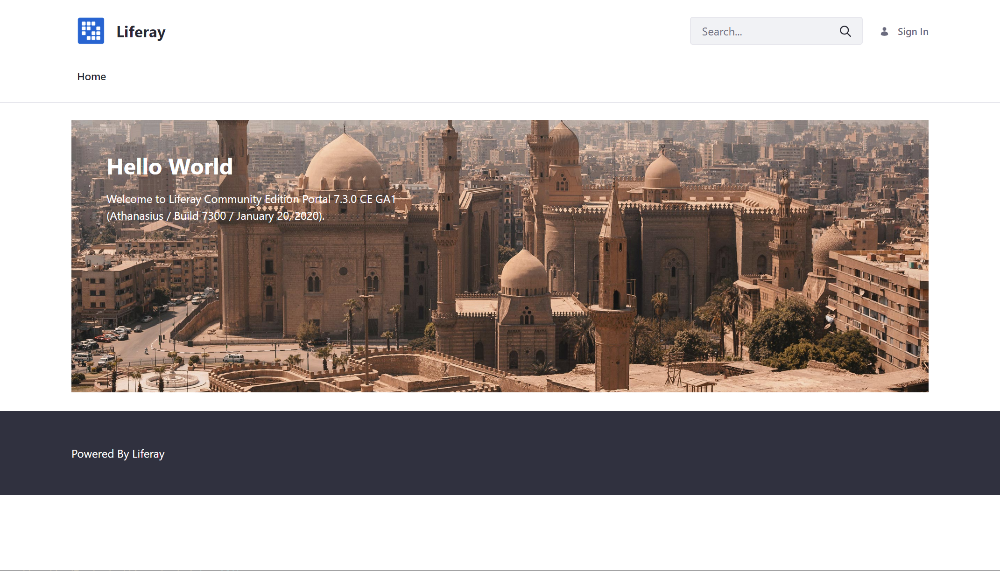

# Starting With the DXP Docker Image

The latest version of Liferay DXP is available as a Docker image. Follow these steps to download, launch, and begin touring the latest release of Liferay DXP.

1. Get Liferay DXP.

    > **Note:** Don't have Docker? Go here first: [Linux](https://docs.docker.com/install/linux/docker-ce/ubuntu/) | [Windows](https://docs.docker.com/docker-for-windows/install/) | [OSX](https://docs.docker.com/docker-for-mac/install/)

    ```bash
    docker pull liferay/dxp:7.2.10.1-sp1
    ```

1. Start Liferay DXP

    ```bash
    docker run -it -p 8080:8080 liferay/dxp:7.2.10.1-sp1
    ```

    > **Note:** Wait until you see `org.apache.catalina.startup.Catalina.start Server startup in [x] milliseconds` to indicate startup completion.

1. Open your browser to `https://localhost:8080`

    

## What's Next

Continue our Getting Started walkthrough and learn about logging in for the first time using [the Admin account](./introduction-to-the-admin-account.md).

Doing more than just checking things out? See the [Installing a Liferay DXP Tomcat Bundle](../installation-and-upgrades/installing-liferay/installing-a-liferay-dxp-tomcat-bundle.md) to learn more.

Want to learn more about what you can build with Liferay DXP? Learn how to [Build Solutions on DXP](../building-solutions-on-dxp/README.md).
