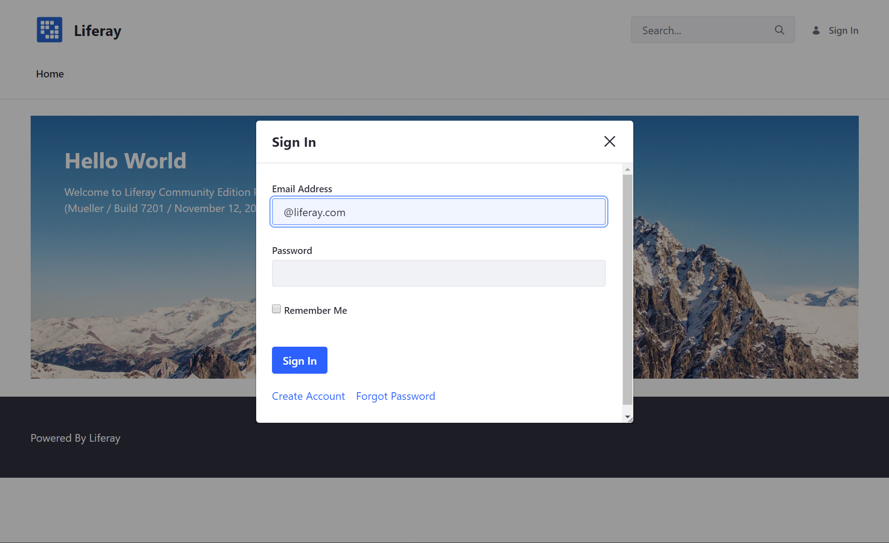
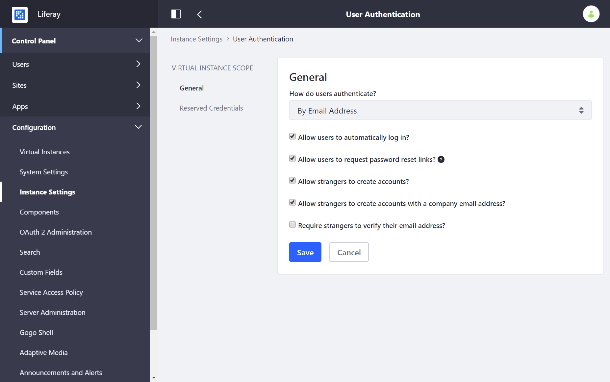
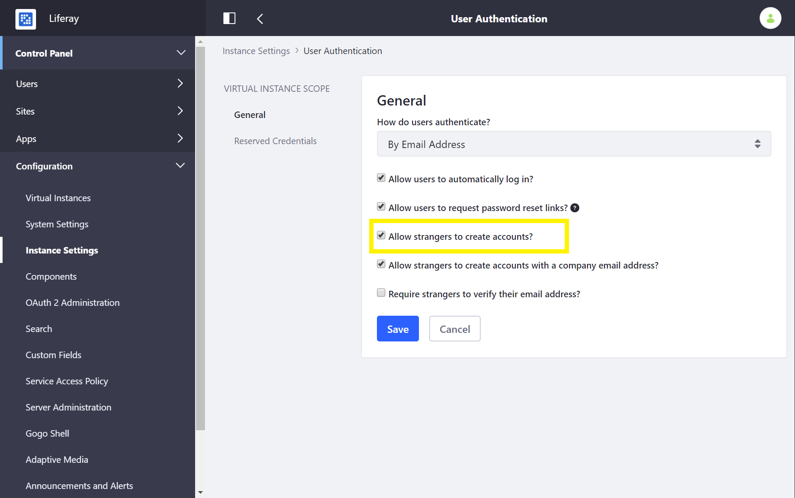
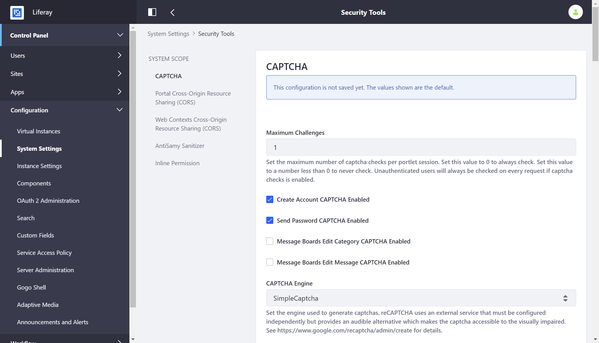

# Authentication Basics

By default, Liferay DXP uses the *Sign In* widget to authenticate users.

```note::
   The Sign In widget appears on the default home page at `http[s]://[server-name:port]/web/guest/home`. If the Sign In widget is unavailable on any page, it can be accessed directly via its URL: `http[s]://[server-name:port]/c/portal/login`.
```



You can configure other methods of authenticating users and/or applications:

* [LDAP](../../users-and-permissions/devops/connecting-to-a-user-directory/connecting-to-an-ldap-directory.md)
* [SAML](./configuring-sso/authenticating-with-saml/01-intro.md)
* [Kerberos](./configuring-sso/authenticating-with-kerberos.md)
* [OpenID Connect](./configuring-sso/other-ssos/using-openid-connect.md)
* [Token-Based solutions](./configuring-sso/token-based-authentication.md)
* [OAuth 2.0](./configuring-sso/using-oauth2/introduction-to-using-oauth2.md)

[Authentication Verifiers](./securing-web-services/using-authentication-verifiers.md) can manage authentication for remote applications, and [Authentication Pipelines](../../developing-applications/README.md) define the ways users are validated by one or several systems.

## Authentication Types

Users can be configured to log in using one of three authentication types:

| Authentication Type | Description | Used by Default? |
| --- | --- | --- |
| Screen Name | Determined by administrator or user at account creation | No |
| Email Address | Determined by administrator or user at account creation  | Yes |
| User ID | Automatically generated when the account is created | No |

```note::
   Only one authentication type can be used at a time.
```

Regardless of the authentication type, users must always enter a password. You can create [Password Policies](../../users-and-permissions/devops/README.md) to define password length, password format, expiration periods, and more.

_Authentication Type_ can be configured through the Control Panel or a properties file.

### Configuring Authentication Type Through the Control Panel

1. Navigate to the Control Panel
1. Click on *Configuration* &rarr; *Instance Settings* &rarr; *Platform* &rarr; *User Authentication*
1. Choose an option under the *How do users authenticate?* selector.

    

### Configuring Authentication Type Using Properties

To use the [`portal-ext.properties`](https://help.liferay.com/hc/en-us/articles/360028712292-Portal-Properties) file, paste in the below properties and uncomment the desired authentication type:

```properties
company.security.auth.type=emailAddress
#company.security.auth.type=screenName
#company.security.auth.type=userId
```

## Using and Configuring the Sign In Widget

The Sign In widget calls the various mechanisms (the portal database, an LDAP server, a SAML identity provider, or any of the ways users can authenticate) that authenticate users. Its behavior can be configured and customized in several ways.

### Disabling Guest Account Creation

To prevent guest users from creating new user accounts:

1. Navigate to the Control Panel &rarr; *Configuration* &rarr; *Instance Settings* &rarr; *Platform* &rarr; *User Authentication*.
1. Un-check *Allow strangers to create accounts?*.
1. Click *Save*.

    

### Preventing Password Resets

If users should not be able to reset their own passwords, you can configure this from the same screen:

1. Navigate to the Control Panel &rarr; *Configuration* &rarr; *Instance Settings* &rarr; *Platform* &rarr; *User Authentication*.
1. Uncheck *Allow users to request password reset links?*.
1. Click *Save*.

### Configuring CAPTCHA or reCAPTCHA

Prevent bots from creating and logging into accounts by enabling CAPTCHA or reCAPTCHA:

1. Navigate to the Control Panel &rarr; *Configuration* &rarr; *System Settings* &rarr; *Security Tools* &rarr; *CAPTCHA*.

    

    ```note::
       By default, *Create Account CAPTCHA* and *Send Password CAPTCHA* are enabled. If necessary, enable Message Boards CAPTCHA.
    ```

1. Choose a CAPTCHA engine. By default, Simple CAPTCHA is enabled. You can also select Google's reCAPTCHA, which requires you configure the external service separately. If you select reCAPTCHA, supply your public and private key from Google.
1. The other options allow developers to customize the Simple CAPTCHA engine.
1. Click *Save* when finished.

## Additional Information

* [Securing Liferay](./introduction-to-securing-liferay.md)
* [Introduction to Securing Web Services](./securing-web-services/introduction-to-securing-web-services.md)
