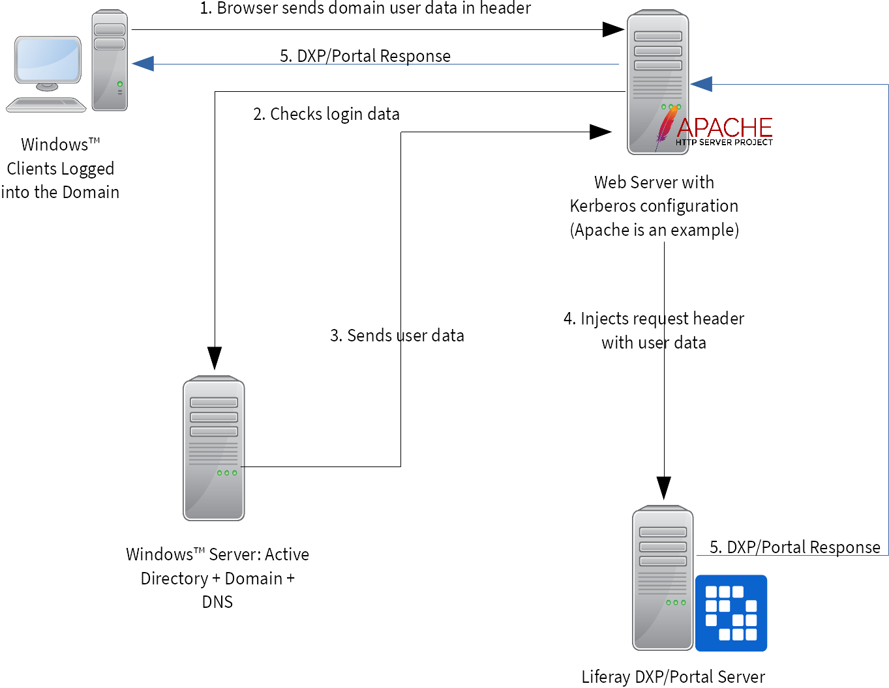
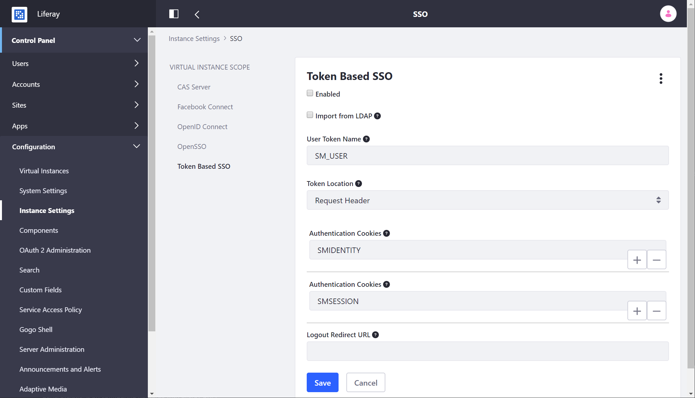

# Authenticating with Kerberos

You can use Kerberos to authenticate Microsoft Windows&trade; accounts with Liferay DXP. This is done by using a combination of Liferay DXP's LDAP support and a web server that supports the Kerberos protocol.

Note that this configuration is preferred above [NTLM](https://portal.liferay.dev/docs/7-1/deploy/-/knowledge_base/d/ntlm-single-sign-on-authentication) because security vulnerabilities persist.

## Prerequisites

While it's beyond the scope of this article to explain how to set up Kerberos and Active Directory on a Windows&trade; server, we can describe the minimum prerequisites for setting up Liferay authentication:

1. A Windows&trade; server with Active Directory and DNS set up so the AD server and Liferay DXP can resolve each other on the network. In other words, they must be able to ping each other *by name*.

1. An administrative user in AD Liferay DXP can use to bind to AD.

1. A Kerberos keytab file exported via the `ktpass` command containing the cryptographic information the Liferay DXP server needs to bind to AD.

1. A web server in front of Liferay DXP that supports Kerberos, such as Apache, NGNIX, or IIS. The web server must also support injecting a header to be used as a token in the Liferay DXP configuration (see below).

1. A Liferay DXP installation that can also resolve by name the other servers. It should never run on the same server as the Active Directory server.

When you have all of these prerequisites in place, you're ready to configure Kerberos authentication.

## How Kerberos Authentication Works

From the prerequisites, you may be able to guess that there are several moving parts to how SSO works with Kerberos.



First, a properly configured web browser sends a negotiate request using encrypted Windows user data. To configure this, the browser must recognize the site as a trusted site (explained below). The web server's Kerberos module uses the keytab file to bind over the Kerberos protocol to AD and verify the user information. If this works, the AD server confirms the connection with a valid response.

The web server you choose must support both the Kerberos protocol and the injection of a custom header into the request that Liferay DXP can later read. When the web server forwards the request to Liferay DXP, it reads the header to obtain the user data and authenticate the user.

Next, you'll learn how to get all of this working.

## Configuring Kerberos Authentication

There are four components to configure:

1. A user keytab from Active Directory
1. A web server in front of your application server
1. Liferay DXP
1. Your Windows&trade; clients.

### Step 1: Creating the User Keytab

1. Create a user so Liferay DXP can bind to Active Directory.

1. Generate a Kerberos keytab file using `ktpass`:

    ```bash
    ktpass -princ HTTP/[web server host name]@[domain] -mapuser [user name]@[domain] -crypto ALL -ptype KRB5_NT_PRINCIPAL -pass [password] -out c:\kerberos.keytab
    ```

    For example:

    ```bash
    ktpass -princ HTTP/mywebserver.intdomain.local@INTDOMAIN.LOCAL -mapuser Marta@INTDOMAIN.LOCAL -crypto ALL -ptype KRB5_NT_PRINCIPAL -pass password-for-Marta -out c:\kerberos.keytab
    ```

1. Ensure that the AD domain controller and the web server can see each other on the network via DNS configuration or `hosts` file.

### Step 2: Configuring Your Web Server

1. Configure Kerberos authentication. On Linux, this involves installing `krb5` and configuring it to match your realm that's already configured for Active Directory. The example domain for the user configured in step two above would look like this:

    ```ini
    [libdefaults]
        default_realm = INTDOMAIN.LOCAL

    [domain_realm]
        mywebserver.intdomain.local = INTDOMAIN.LOCAL intdomain.local = INTDOMAIN.LOCAL .intdomain.local = INTDOMAIN.LOCAL

    [realms]
    INTDOMAIN.LOCAL = { admin_server = winserver.intdomain.local kdc = winserver.intdomain.local
    }
    ```

1. Copy the keytab file you generated on your AD server to your web server.

1. Configure your web server, making sure you set the correct server name, Kerberos service name, Kerberos authentication realms, and the path to the keytab file. For example, if you're using the Apache HTTP server, the configuration might look like this:

    ```apache
    LoadModule headers_module /usr/lib/apache2/modules/mod_headers.so
    LoadModule rewrite_module /usr/lib/apache2/modules/mod_rewrite.so
    LoadModule proxy_module /usr/lib/apache2/modules/mod_proxy.so
    LoadModule proxy_http_module /usr/lib/apache2/modules/mod_proxy_http.so
    LoadModule proxy_ajp_module /usr/lib/apache2/modules/mod_proxy_ajp.so
    LoadModule auth_kerb_module /usr/lib/apache2/modules/mod_auth_kerb.so

    <VirtualHost *:10080>
        <Proxy *>
            Order deny,allow
            Allow from all
        </Proxy>
        ProxyRequests     Off
        ProxyPreserveHost On
        ProxyPass / ajp://localhost:8009/
        ProxyPassReverse / ajp://localhost:8009/
        ServerName mywebserver.intdomain.local
        <Location />
                    Order allow,deny
                    Allow from all
                    AuthType Kerberos
                    KrbServiceName HTTP/mywebserver.intdomain.local@INTDOMAIN.LOCAL
                    AuthName "Domain login"
                    KrbAuthRealms INTDOMAIN.LOCAL
                    Krb5KeyTab /etc/apache2/kerberos.keytab
                    require valid-user
                    KrbMethodNegotiate  On
                    KrbMethodK5Passwd   Off
                    #KrbLocalUserMapping On

                    # Below directives put logon name of authenticated user into http header X-User-Global-ID
                    RequestHeader unset X-User-Global-ID
                    RewriteEngine On
                    RewriteCond   %{LA-U:REMOTE_USER} (.+)
                    RewriteRule   /.* - [E=RU:%1,L,NS]
                    RequestHeader set X-User-Global-ID %{RU}e

                    # Remove domain suffix to get the simple logon name
                    # RequestHeader edit X-User-Global-ID "@INTDOMAIN.LOCAL$" ""

        </Location>
    </VirtualHost>
    Listen 10080
    ```

The last line is commented out based on user preference. If you want the domain removed from the user name when saved in Liferay DXP, uncomment it. Otherwise, leave it commented out to store the domain with the user name.

### Step 3: Connecting Liferay DXP to Active Directory over LDAP

1. Finally, configure Liferay DXP to access Active Directory via the LDAP protocol. Change authentication to be by Screen Name by selecting it in Configuration &rarr; Instance Settings &rarr; Authentication &rarr; General.

1. Connect Liferay DXP to AD over LDAP by going to Configuration &rarr; Instance Settings &rarr; Authentication &rarr; LDAP and adding an LDAP server. Provide the information appropriate to your installation:

    | Configuration | Description |
    | --- | --- |
    | **Base Provider URL** | Your AD server on the proper port. |
    | **Base DN** | Your domain configuration. The example above might be `DC=INTDOMAIN.DC=LOCAL`. |
    | **Principal/Credentials** | Supply the credentials for the user exported to the keytab file. |
    | **Authentication Search Filter** | Supply the appropriate search filter to return user objects. For example, `(&(objectCategory=person)(sAMAccountName=*))` |
    | **UUID** | Supply what uniquely identifies a user, such as `sAMAccountName`. |
    | **Screen Name** | Supply the field that should be mapped to Liferay DXP's screen name field, such as `sAMAccountName`. |
    | **Password** | Supply the field that contains the user's password, such as `userPassword`. |

1. Test the connection, save, and enable the configuration.

1. Finally, configure the token for single sign-on at Configuration &rarr; System Settings &rarr; Security &rarr; SSO &rarr; Token Based SSO. Make sure the User Token Name matches *exactly* the token you configured in your web server. Click the *Enabled* and *Import from LDAP* boxes and click *Save*.

    

Excellent! You've configured your servers. All that's left is to configure your clients.

### Step 4: Configuring your Clients

You must do two things: make your computer log into the domain and configure your Liferay DXP server as a trusted Internet site.

1. Join your computer to your domain. In keeping with the example above, you'd make your computer a member of the `INTDOMAIN.LOCAL` domain.

2. Log in as a user in that domain.

3. Internet Explorer, Edge, and Chrome use the Windows&trade; settings for trusted sites. If you use these browsers, go to Internet Options &rarr; Security &rarr; Local Intranet Sites and add your Liferay DXP server's URL. For example, add `http://mywebserver.intdomain.local:10080`.

4. Firefox can be configured by typing `about:config` in its address bar. Search for the below two preferences and add the Liferay DXP server's URL as the value for both:

   - `network.negotiate-auth.delegation-uris`
   - `network.negotiate-auth.trusted-uris`

After configuring these things, test your configuration by accessing Liferay DXP through the web server's URL. Since you are already logged into your client machine, you should be automatically logged into Liferay DXP without a user/password prompt.

Congratulations on configuring Kerberos with Liferay DXP!
