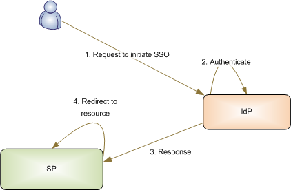
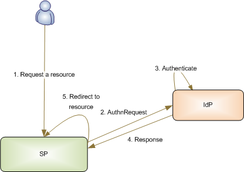
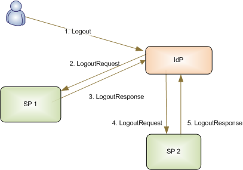
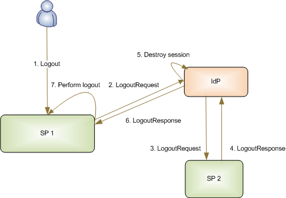

# How SAML Does Single Sign-On

Coming soon!

<!-- Both the IdP and the SP can initiate the Single Sign On process, and the SSO flow is different depending on each one. Regardless of how it's initiated, SSO is configured for HTTPS between the SP and IdP, so all transport-level communication is encrypted. SAML requests are signed using certificates configured in Liferay DXP, using the SAML Web Browser SSO profile as defined in the [SAML 2.0 specification](http://saml.xml.org/saml-specifications). In all cases, responses are sent using HTTP-POST or HTTP-Redirect. HTTP-POST is preferred because it reduces the risk that the URL is too long for a browser to handle.

Consider IdP initiated SSO first.

## Identity Provider Initiated SSO

Sometimes a user enters the SSO cycle by sending a request directly from the browser to the IdP.

### The SSO Request to the IdP

If Liferay is the IdP, the IdP initiated SSO URL

* Must specify the path as `/c/portal/saml/sso`.
* Must include the `entityId` parameter which is the identifier to a previously configured Service Provider Connection (SPC).
* May include a `RelayState` parameter which contains a URL encoded value where the user is redirected upon successful authentication. This URL should point to a location on the desired SPC (according to the [SAML 2.0 standards section 3.4.3](https://docs.oasis-open.org/security/saml/v2.0/saml-bindings-2.0-os.pdf), this value *must not* exceed 80 bytes in length). It is useful to specify a landing page after SSO has been executed.

For non-Liferay IdPs (Siteminder, ADFS, etc.), consult the vendor's documentation on constructing IdP initiated SSO URLs.

If the IdP determines that the user isn't authenticated, it prompts the user with the appropriate login screen.

### The SSO Response from the IdP

Upon successful authentication, the IdP constructs a SAML Response. It includes attribute statements configured in the designated Service Provider Connection (SPC; see [Setting Up Liferay as an Identity Provider](./02-setting-up-identity-provider.md) on setting up the SPC in Liferay's SAML adapter).

The IdP sends the response to the Assertion Consumer Service URL. The request contains two parameters: `SAMLResponse` and `RelayState`.

**Note:** The method for sending the SAML response (for example, HTTP-POST) and the Assertion Consumer Service URL are usually imported as part of the SAML metadata XML provided by the SP. In @product@, you import the SP's metadata in the SAML Adapter's Service Provider Connections tab.

### The SP Processes the SSO Response

The SP validates and processes the SAML Response. Liferay's SAML solution requires signed `SAMLResponse` messages. This signature process ensures proper identification for the IdP and prevents potential SAML Response spoofing.

* If one Liferay instance is the IdP and another is the SP, make sure the SAML metadata XML file imported into the SP contains the IdP's certificate.
* If Liferay is the IdP and another application is the SP, export the certificate from the IdP and import it into the SP's certificate store.

If a `RelayState` is included in the SAML Response, the user is redirected to it. Otherwise the home page of the SP is served.

## Service Provider Initiated SSO

Most of the time, authentication requests come from the Service Provider.

### The SSO Request to the SP

When the user's browser requests a protected resource or login URL on the SP, it triggers the SP initiated SSO process. When @product@ is the SAML SP, SSO is initiated either by requesting `/c/portal/login` URL or a protected resource that requires authentication (for example, a document not viewable by the Guest Role). If the user requests a protected resource, its URL is recorded in the `RelayState` parameter. If the user requested `/c/portal/login`, the `RelayState` can be set by providing the `redirect` parameter. Otherwise, if the [portal property](http://docs.liferay.com/portal/7.2-latest/propertiesdoc/portal.properties.html) `auth.forward.by.last.path` is set to `true`, the last accessed path is set as the `RelayState`. For non-@product@ SPs, consult the vendor documentation on initiating SSO.

### The AuthnRequest to the IdP

The SP looks up the IdP's Single Sign On service URL and sends an `AuthnRequest`. When Liferay is the SP it looks up the configured SAML Identity Provider Connection and sends a SAML `AuthnRequest` to the IdP's Single Sign On service URL as defined in the SAML metadata XML document. Liferay supports sending and receiving the `AuthnRequest` using HTTP-POST or HTTP-Redirect binding. HTTP-POST is preferred.

If the user doesn't have an active session or if `ForceAuthn` was requested by the SP, the user must authenticate by providing credentials. When Liferay is the IdP, authentication occurs in the Login Portlet. Liferay decodes and verifies the `AuthnRequest` before requesting the user to authenticate.

### The SSO Response from the IdP

After authentication, a SAML Response is constructed, sent to the Assertion Consumer Service URL of the SP, and verified. The IdP automatically makes this choice based on the SP metadata.

When Liferay is configured as the IdP, any attributes configured on the Service Provider Connection are included in the response as attribute statements. The Assertion Consumer Service URL is looked up from the SAML metadata XML of the SP.

When Liferay is configured as the SP, response and assertion signatures are verified. Liferay requires the sender to be authenticated. This is done via whole message signature from the issuing IdP. Responses missing the signature are considered unauthenticated and the response is rejected. For non-Liferay SP or IdP vendors, consult their documentation.

The user is redirected to the requested resource or to the URL contained in the `RelayState` parameter (for example, the last page the user accessed before initiating SSO).

## Single Log Off

The Single Log Off request is sent from the user's browser to the IdP or an SP, and the SLO flow differs in each case. First consider IdP initiated SLO.

## Identity Provider Initiated SLO

### The SLO Request to the IdP

An IdP initiated SLO request is sent directly to the IdP by the user's browser. When Liferay is the IdP, the IdP initiated SSO URL must specify the URL path as

`/c/portal/logout`

If the user is signed on to any configured SP, the SAML plugin takes over the logout process, displaying all the signed on services. The single logout screen displays the authentication status of each SP and whether any SPs can't be logged out of (for example, if the SP is down or doesn't support SLO). For non-Liferay IdPs (Siteminder, ADFS, etc.) consult the vendor's documentation on constructing IdP initiated SLO URLs.

The IdP sends a SAML `LogoutRequest` to the SP.

* When Liferay is configured as the IdP, the `LogoutRequest` is sent using either HTTP-POST, HTTP-Redirect, or SOAP binding. HTTP-Post binding is preferred but in its absence, the first available SLO endpoint with supported binding is selected.
* When Liferay is configured as the SP, supported bindings for `LogoutRequest` are HTTP-Post, HTTP-Redirect, or SOAP.
* For other IdPs or SPs, please consult the vendor's documentation.

### The SLO Response from the SP

The SP delivers a `LogoutResponse` to the IdP.

The IdP sends a SAML `LogoutRequest` to the second SP.

The second SP then delivers the `LogoutResponse` to the IdP. The process is repeated for all SPs the user is logged into. When Liferay is the IdP, Liferay logs the user out after the last SP has delivered its `LogoutResponse` or has timed out.

## Service Provider Initiated SLO

### The SLO Request to the SP

In SP initiated SLO, the user's browser sends a logout request directly to the SP. When Liferay is configured as the SP, the SLO is initiated by requesting this logout URL:

    /c/portal/logout

For other SPs, consult the vendor's documentation on initiating SLO.

A SAML `LogoutRequest` is sent to the Single Log Out service URL of the IdP.

*  If Liferay serves as the SP, the `LogoutRequest` is sent to the IdP configured by the IdP Connections tab of the SAML provider (see [Setting Up Liferay as an Identity Provider](./02-setting-up-identity-provider.md) to set up the IdP Connection) and the SLO service URL defined in the SAML metadata.

*  When Liferay is the IdP, if the user has logged on to other SPs, the user is presented with a single logout screen with the status of each SP logout, flagging any that can't be logged out of (some SPs might not support SLO or are currently down). If there are no other SPs to log out of, the SAML session terminates and the IdP destroys its session.

### The SLO Response from the SP

If the user is logged in to additional SPs (beyond just the initiating SP), the IdP sends the SAML `LogoutRequest` to each one. When Liferay is the IdP, the `LogoutResponse` is sent using either HTTP-Post, HTTP-Redirect, or SOAP binding.

Each SP delivers its `LogoutResponse` to the IdP. When Liferay is the SP, the `LogoutResponse` is sent using either HTTP-Post, HTTP-Redirect or direct response to SOAP request.

After all additional SPs deliver their `LogoutResponse`s to the IdP, the IdP destroys its SSO session. When Liferay is the IdP, once the last SP has delivered its `LogoutResponse` or has timed out, the IdP destroys the Liferay session, logging out the user.

Finally, the IdP sends a `LogoutResponse` to the SP that initiated SLO. The initiating SP terminates its SAML session and logs the user out. -->
