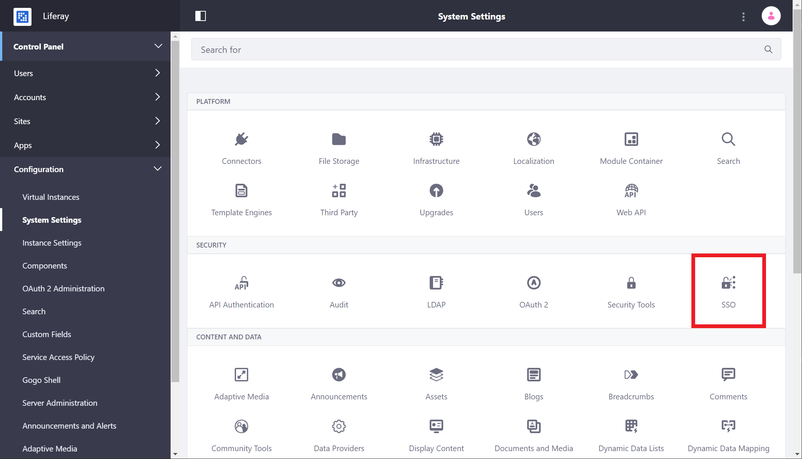

# Token-based Single Sign On Authentication

Token-based SSO authentication was introduced in Liferay Portal 7.0 to standardize support for Shibboleth, SiteMinder, Oracle OAM, and any SSO product that works by propagating a token via one of the following mechanisms:

* HTTP request parameter
* HTTP request header
* HTTP cookie
* Session attribute

Since these providers have a built-in web server module that reads and sets these parameters, headers, cookies, or attributes, you should use the Token SSO configuration.

The authentication token contains the User's screen name or email address, whichever has been configured to use for the particular company (portal instance). Liferay Portal supports three authentication methods:

* By email address
* By screen name
* By user ID

Token-based authentication only supports email address and screen name. If user ID is configured when a token-based authentication is attempted, the `TokenAutoLogin` class logs this warning:

```
Incompatible setting for: company.security.auth.type
```

Furthermore, you must use a security mechanism external to Liferay Portal, such as a fronting web server like Apache with a module or plugin for the authentication mechanism. Having a reverse proxy prevents malicious User impersonation that otherwise might be possible by sending HTTP requests directly to Liferay Portal's app server from the client's web browser.

## Configuring Token Based Authentication

Token-based authentication is disabled by default. To manage token-based SSO authentication, navigate to Control Panel &rarr; *System Settings*, &rarr; *Security* &rarr; *SSO*.



Here are the configuration options for the Token-Based SSO module:

| Configuration | Description |
| --- | --- |
| **Enabled** | Check this box to enable token-based SSO authentication. |
| **Import from LDAP** | Check this box to import users automatically from LDAP if they don't exist. |
| **User token name** | Set equal to the name of the token. This is retrieved from the specified location. (Example: `SM_USER`) |
| **Token location** | Set this to the type of user token: HTTP request parameter, HTTP request header, HTTP cookie, Session attribute  |
| **Authentication cookies** | Set this to the cookie names that must be removed after logout. (Example: `SMIDENTITY`, `SMSESSION`)  |
| **Logout redirect URL** | When user logs out of Liferay Portal, the user is redirected to this URL.  |

Remember to click *Save* to activate Token Based SSO.

## Required SiteMinder Configuration

If you use SiteMinder, note that Liferay Portal sometimes uses the tilde character in its URLs. By default, SiteMinder treats the tilde character (and others) as bad characters and returns an HTTP 500 error if it processes a URL containing any of them. To avoid this issue, change this default setting in the SiteMinder configuration to this one:

```
BadUrlChars       //,./,/.,/*,*.,\,%00-%1f,%7f-%ff,%25
```

The configuration above is the same as the default except without the `~` character. Restart SiteMinder to make your configuration update take effect. For more information, please refer to SiteMinder's [documentation](https://techdocs.broadcom.com/us/product-content/recommended-reading/technical-document-index/ca-siteminder-informational-documentation-index.html).

## Summary

Liferay Portal's token-based SSO authentication mechanism is highly flexible and compatible with any SSO solution that provides it with a valid Liferay Portal user's screen name or email address. These include Shibboleth and SiteMinder.
