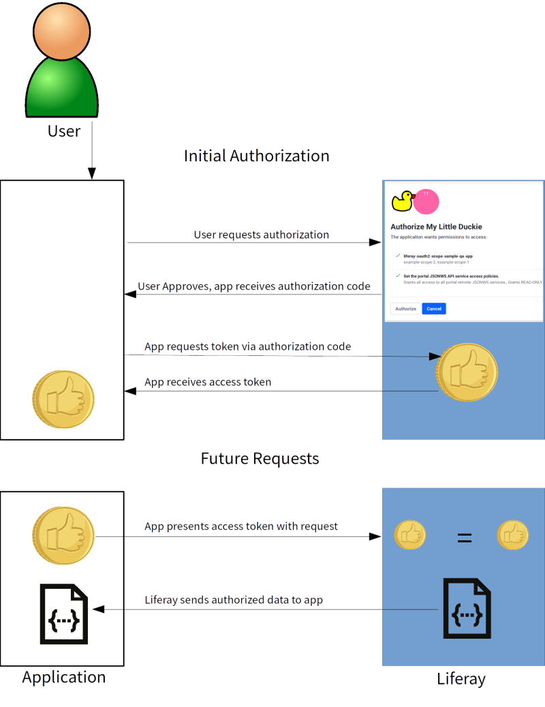

# Introduction to Using OAuth 2.0

OAuth 2.0 is an industry-standard authorization protocol. Users can seamlessly share select credentials from your Liferay-based website with various clients. OAuth 2.0 works by authorizing password-less access to portions of user-owned resources (such as an email address, a user profile picture, or something else from your account) and other permissioned resources. OAuth 2.0's design encrypts all authorization transport through HTTPS, which prevents data passed between the systems from being intercepted.

You can jump into creating OAuth 2.0 apps or continue reading to learn how it works.

1. [Creating an OAuth 2.0 Application](./creating-oauth2-applications.md)
2. [Defining Scopes](./oauth2-scopes.md)
3. [Authorizing Account Access](./authorizing-account-access-with-oauth2.md)

## Flow of OAuth 2.0

OAuth 2.0 takes advantage of web standards wherever possible: transport is encrypted with HTTPS; tokens are implemented as HTTP headers; data is passed via web services.

Here's how OAuth 2.0 works:

1. A user accesses a third-party application that supports authorization via credentials from a Liferay-based website. In the application (web or mobile), the user requests authorization via OAuth, sending the browser or app to the Liferay-based website. When using _PKCE_ (explained below), the application also generates a code verifier and sends a code challenge that is created by applying a transformation to it.

1. The user authenticates and is shown the resources the application wants permission to access. When the user gives permission by clicking *Allow*, Liferay generates an authorization code that's sent to the application over HTTPS.

1. The application then requests a more permanent authorization token and sends the code with the request (along with the _PKCE_ code verifier).

1. If the authorization code matches (and the transformed _PKCE_ code verifier matches the previously sent code challenge), Liferay cryptographically generates an authorization token for this user and application combination. It sends the token to the application over HTTPS. Initial authorization is now complete!

1. When the application must retrieve data, it sends the token with the request to prove it's authorized to have that data.

1. Provided the token matches what Liferay has for that user and application, access is granted to retrieve the data.

That description throws around a lot of terms. Definitions provided below.

## OAuth 2.0 Terminology

**Authentication:** Providing credentials so a system can verify who you are by matching those credentials with what it has stored. OAuth is not an authentication protocol.

**Authorization:** Granting access to resources stored on another system. OAuth is an authorization protocol.

**Application:** Any client (web, mobile, etc.) that must be authorized to have access to resources. Applications must be registered by administrators before users can authorize access to their resources.

**Client:** Almost synonymous with *application*, except that applications can have variants, such as web and mobile. These variants are clients.

**Client ID:** An identifier given to a client so it can be recognized.

**Client Secret:** A previously agreed-upon text string that identifies a client as a legitimate client.

**Access Token:** A cryptographically generated text string that identifies a user/client combination for access to that User's resources.

**Response Type:** OAuth 2.0 supports several response types. Pictured and described above is the most common: the authorization code. Other response types are *password* (logging in with a user name and password), and *client credentials* (headless predefined application access).

**Scope:** A list of items that define what the application wants to access. This list is sent during the initial authorization request (or otherwise defaults to scopes selected in the application registration) so users can grant or deny access to their resources.

**Callback URI:** Also called a Redirection Endpoint URI. After authorization is complete, the authorization server (i.e., Liferay) sends the client to this location.

Ready to start configuring OAuth 2.0? The next step is to [create an application](./creating-oauth2-applications.md).
