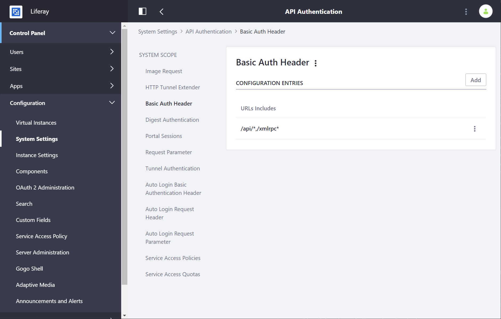

# Using Authentication Verifiers

Authentication Verifiers authenticate remote invocations of Liferay Portal's API in a centralized and extensible way. They have two main responsibilities:

1. Verify provided credentials using registered `AuthVerifier` instances
1. Create portal authorization contexts based on verification results

If no available `AuthVerifier` can determine that the provided credentials match a user account, an authorization context supporting non-authenticated access is created for a guest user. This allows each API to expose only a single API endpoint. In contrast, legacy (prior to 6.2) versions of Liferay Portal exposed two API endpoints for each API: the `/api/endpoint` URI was for non-authenticated access and the URI `/api/secure/endpoint` was for authenticated access.

There are built-in `AuthVerifier` implementations for the most common situations, such as when remote clients use HTTP Basic or HTTP Digest authentication, send credentials in request parameters, send authenticated `JSESSIONID`s, or use shared secrets to establish trust. Other `AuthVerifier` implementations can be deployed as modules containing implementations of the `AuthVerifier` interface that are registered as services in the OSGi runtime.

```important::
   The authentication verification layer's focus is on verifying authentication, not on providing credentials. It does NOT issue tokens, credentials, or display Sign In portlets. Instead, the layer verifies existing credentials and authenticated sessions and is a complement to authentication endpoints. To ensure backwards compatibility the default implementations support requests providing user name and password credentials. Thus, the authentication verification layer stands on the border between authentication and authorization.
```

## Authentication Verification Process

To configure Authentication Verifiers, go to *Control Panel* &rarr; *Configuration* &rarr; *System Settings* &rarr; *Security* &rarr; *API Authentication*.



### Step 1: Verify Request Credentials

The layer uses the chain of responsibility design pattern to support both built-in and third party `AuthVerifier` implementations. Each `AuthVerifier` can provide configurations where it specifies mapped URLs and other properties.

Each incoming request is matched against all registered `AuthVerifier`s to select the final list of `AuthVerifier`s that is used to process the request. It's the responsibility of each `AuthVerifier` to verify the incoming request credentials.

### Step 2: Create an Authorization Context

When a request is processed by all matching `AuthVerifier`s, Liferay DXP creates an authorization context for the resolved user.

This encompasses setting the `HttpServletRequest` `remoteUser` to return the resolved user ID setting `ThreadLocal`s to the resolved user.

The resolved user can be the user returned by one of the `AuthVerifier` instances or a guest user if no instance was able to verify the provided credentials.

## Configuring Built-In Authentication Verifiers

`AuthVerifier`s are created by developers, and are processed automatically as long as they're registered in the OSGi runtime. This layer and surrounding processes are provided by the `AuthVerifierFilter` class that implements the `javax.servlet.Filter` interface. Configuration for Auth Verifiers that ship with the product include:

* [Basic Auth Header](#basic-auth-header)*
* [Digest Authentication](#digest-auth-header)
* [HTTP Tunnel Extender](#http-tunnel-extender)
* [Image Request](#image-request-authentication-verifier)
* [Portal Sessions](#portal-sessions-auth-verifiers)*
* [Request Parameter](#request-parameter)
* [Tunnel Auth](#tunnel-auth)

> *Enabled by default and can be used to access remote APIs out-of-the-box.

### Basic Auth Header

This Auth Verifier allows the remote client to authenticate using [HTTP Basic Authentication](https://en.wikipedia.org/wiki/Basic_access_authentication). Configure it by providing URL paths that should be authenticated this way. When _Force Basic Authentication_ field is checked then HTTP Basic Authentication is required.

The default URLs are `/api/*,/xmlrpc*` for web services. The mapping excludes `/api/liferay*` to prevent accessing `TunnelServlet`. For more information please see  Tunnel Authentication Verifiers.

### Digest Auth Header

This Auth Verifier allows the remote client to authenticate using [HTTP Digest Authentication](https://en.wikipedia.org/wiki/Digest_access_authentication). Configure it by providing URL paths that should be authenticated this way. When Force Digest Authentication field is checked then HTTP Basic Authentication is required.

This Auth Verifier is not enabled by default.

### HTTP Tunnel Extender

As Liferay embraced modularity, this extender was written to enable modules to be part of `TunnelServlet`. It maps `TunnelServlet` and `TunnelingServletAuthVerifier` to the module servlet context. Modules with `Http-Tunnel` in the manifest can make use of the Tunnel Servlet, and can expose the API via `/o/_module_/api/liferay/do`.

Configure it by setting client IP addresses allowed to tunnel. For more information, please see [the properties documentation](https://docs.liferay.com/portal/7.2-latest/propertiesdoc/portal.properties.html#HTTP%20Tunneling) as well as [remote staging](../../site-building/staging.md).

Note that this is not a recommended way to export remote APIs; it's far better to expose remote services using JAX-RS or Liferay JSON Web Service technologies.

### Image Request Authentication Verifier

When connected to LibreOffice/OpenOffice, the Office process must download images from Liferay Portal to render docs with images. To do this, a [JWT Token](https://jwt.io) is created to access the images securely.

Configure this by setting the Hosts Allowed, URLs included, and URLs excluded if necessary.

This Auth Verifier is not enabled by default.

### Portal Sessions Auth Verifiers

Enables JavaScript in a browser to access Liferay JSON Web Services using an existing portal session.

In the default configuration, the URLs included field shields access to the legacy JSON remote services layer: `/api/json*,/api/jsonws*,/c/portal/json_service*`.

### Request Parameter Auth Verifiers

For backwards compatibility with `RequestParameterAutoLogin` you can authenticate and access portal endpoints with credentials inside HTTP request parameters `parameterAutoLoginLogin` and `parameterAutoLoginPassword`.

This Auth Verifier is not enabled by default.

### Tunnel Authentication Verifiers

`TunnelServlet` is a legacy remote API endpoint mapped at `/api/liferay/do` to provide access to the portal remote services. The Tunnel Auth Verifier allows trusted remote clients authenticated access using any user ID provided, on behalf of the user.

An example of a trusted remote client is the Staging remote publishing feature.

Trusted remote clients authenticate using a shared secret stored in the portal property `tunneling.servlet.shared.secret`. The default value is empty and forbids all access.

Even though the default configuration is enabled by default, access is limited to localhost only. Configure it by setting client IP addresses allowed to tunnel. For more information, please see [the properties documentation](https://docs.liferay.com/portal/7.2-latest/propertiesdoc/portal.properties.html#HTTP%20Tunneling) as well as [remote staging](../../site-building/staging.md).

## Related Topics

[Service Access Policies](./03-setting-service-access-policies.md)
