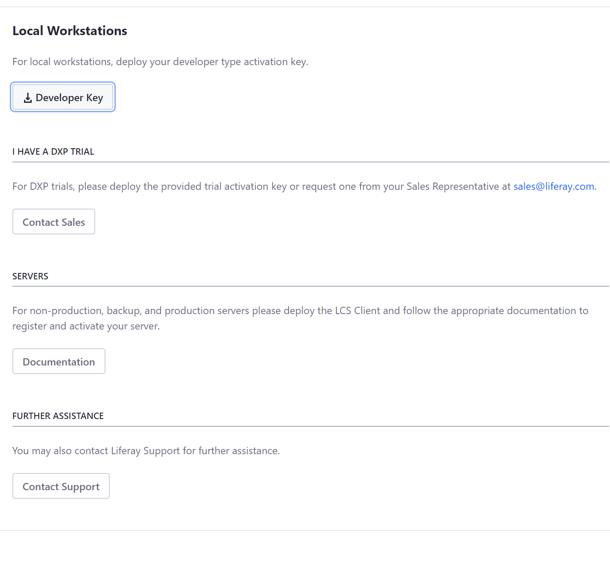

# Activating Liferay DXP

> Subscribers

Liferay DXP is activated using an XML (`.xml`) activation key.  It specifies your DXP subscription terms or trial agreement. When you [run Liferay DXP for the first time](../installing-liferay-dxp-on-premises/running-liferay-dxp-for-the-first-time.md), the license page appears and requests an activation key.



## Activating DXP Using a Key

If you have an activation key, copy it to the `deploy` folder in your [Liferay Home](../reference/liferay-home.md).

```
[LIFERAY_HOME]
    ├── data
    ├── deploy
    ├── license
    │   └── my-license.xml
    ├── logs
    ├── osgi
    ├── patching-tool
    ├── tools
    └── work
```

A message in the DXP console confirms the registration.

```bash
License registered ...
```

DXP is ready to use.

## Need a Key?

If you have an enterprise subscription, visit the
[Activation Keys](https://customer.liferay.com/activation-key) page to download an activation key or to request one.

Trying out DXP? Get a [30 day trial activation key](https://www.liferay.com/products/dxp/30-day-trial).

```note::
   If you're using Liferay Connected Services (LCS) with Liferay DXP 7.2 or earlier, see the `LCS documentation <https://help.liferay.com/hc/en-us/articles/360017897492-Introduction-to-Managing-Liferay-DXP-with-Liferay-Connected-Services->`_ for instructions on activating your DXP instance with LCS.
```

## Reactivating Liferay DXP

If you have a new DXP activation key and your DXP instance is currently activated by a key or by Liferay Connected Services (LCS), it's best to remove remnants of the former activation method before deploying your new activation key. This removes any ambiguity as to which activation key you're using.

Here are the steps for reactivating DXP with your new key:

1. Stop the application server.

1. If you've been using LCS to activate DXP, remove the Liferay Connected Services Client LPKG file (`.lpkg`) from your `osgi/marketplace` folder in your [Liferay Home](../reference/liferay-home.md).

1. Delete the _contents_ of your `[Liferay Home]/data/license` folder but preserve the folder.

1. Remove all `activation-key-[...].xml` files from your `[Liferay Home]/osgi/modules` folder.

1. Start the application server.

1. Copy your new activation key file to your `[Liferay Home]/deploy` folder.

A DXP console message confirms the registration.

```bash
License registered ...
```

You can continue using DXP.

If you have an enterprise subscription and need further assistance, contact [Account Support](https://help.liferay.com/hc/en-us/articles/360018414031) or create a [support ticket](https://help.liferay.com/hc/requests/new).
