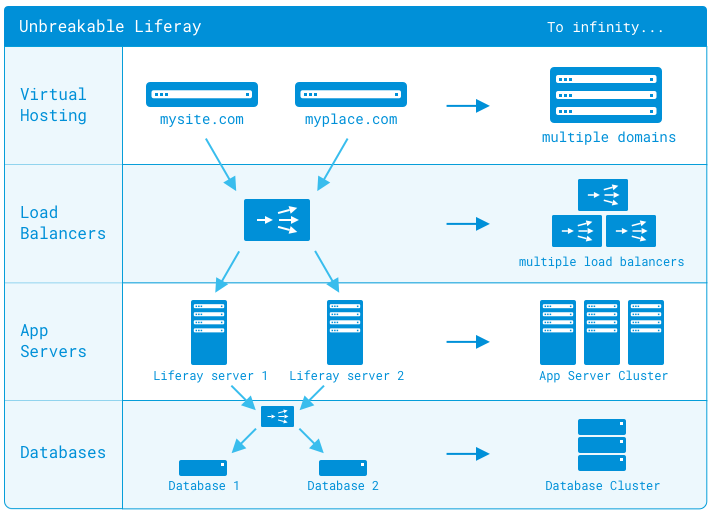

# Clustering for High Availability

Liferay DXP can scale to serve everything from the smallest to the largest web sites. Out-of-the-box, it's configured optimally for a single server environment. If one server isn't sufficient to serve your site's high traffic needs, DXP scales to the size you need. <!-- I'd consider re-writing the last sentence to be a bit more inclusive of the different scenarios where clustering has a use case: "If you expect to have high traffic or want to improve the overall fault tolerance of your site, you should consider clustering." -->

 <!-- I know this image is an oldie but I find the diagram presented in the "example creating a dxp cluster" article a lot clearer. -->

Liferay DXP works well in clusters of multiple machines (horizontal cluster) or in clusters of multiple VMs on a single machine (vertical cluster), or any combination.

## Clustering Requirements

In order for a cluster to effectively function, there are several optimizations<!-- optimizations or configurations? --> that must be made.

1. Liferay DXP [installed](../../installing-liferay/installing-a-liferay-dxp-tomcat-bundle.md) on each application server node.

1. [All nodes must point to the same database or database cluster.](./database-configuration-for-cluster-nodes.md)

1. The [File Store](../../../system-administration/file-storage/configuring-file-storage.md) must have the same configuration and be accessible to all nodes.

1. [Search should be on a separate search server that is optionally clustered.](./clustering-search.md)

1. [Cluster Link must be enabled so the cache replicates across all nodes of the cluster.](./configuring-cluster-link.md)

1. Applications must be deployed to each node individually. <!-- Is this really necessary for the intro? Maybe this is a better point to make about how to run/manage/maintain a cluster (in the "maintaining a Liferay DXP installation section"? Or in system administration? -->

Many of these configuration changes can be made by adding or modifying properties in your [`portal-ext.properties`](../../reference/portal-properties.md) file. Remember that this file overrides the [defaults](https://docs.liferay.com/portal/7.3-latest/propertiesdoc/portal.properties.html) in the `portal.properties` file. Best practice is to copy the relevant section you want to modify from `portal.properties` into your`portal-ext.properties` file, and then modify the values there.

Creating a cluster by way of example is a great first step in understanding DXP clustering. See [Example: Creating a DXP Cluster](./example-creating-a-dxp-cluster) to learn more.

```note::
   This documentation describes a DXP-specific cluster configuration without getting into specific implementations of third party software, such as Java EE application servers, HTTP servers, and load balancers. Please consult the documentation for those components of your cluster to configure them. Before creating a DXP cluster, make sure your OS is not defining the hostname of your system to the local network at 127.0.0.1.
```
