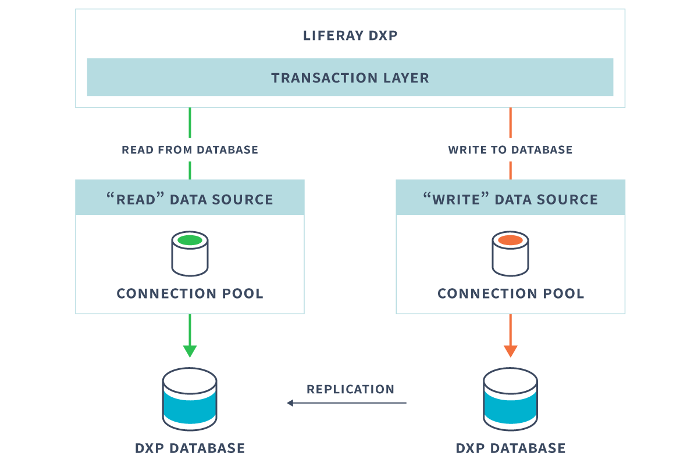

# Database Configuration for Cluster Nodes

Each DXP cluster node must share the same Liferay DXP database (or database cluster). This means that DXP cannot (and should not) use the embedded HSQL database that is shipped with DXP bundles. And, of course, the database server should be set up on a server separate from the DXP server.

## Database Replication

Using a database cluster improves fault tolerance and DXP performance. Database cluster instances must be stay in sync. Replication is the process of copying changed data and changed schema from one database instance to another. All supported databases support replication. If you're using a database cluster, set up the databases for replication by following the database vendor's instructions.

## Read-Writer Database Configuration

For even better performance, you can also use a read-writer database configuration. Instead of using the same data source for read and read-write operations, this strategy uses a separate data source for each operation type. DXP's Aspect Oriented Programming (AOP) transaction infrastructure directs read transactions to the read data source and read-write transactions to the write data source.



Connections to separate read and read-write [data sources](https://docs.liferay.com/portal/7.3-latest/propertiesdoc/portal.properties.html#JDBC) are configured using JDBC or JNDI [Portal Properties](../../reference/portal-properties.md) (e.g., in a [`portal-ext.properties` file](../../reference/portal-properties.md)), as explained in the following sections. The data sources should use separate instances of the DXP database, where the read-write database instance is replicated to the read database instance.

### JDBC

Follow these steps to use [JDBC](../../installing-liferay/configuring-a-database.md) to connect directly to your read and write data sources:

1. Set the default connection pool provider. For provider information, see the [JDBC properties reference](https://docs.liferay.com/portal/7.3-latest/propertiesdoc/portal.properties.html#JDBC). The default setting specifies [HikariCP](https://github.com/brettwooldridge/HikariCP) as the pool provider:

    ```properties
    jdbc.default.liferay.pool.provider=hikaricp
    ```

1. Configure JDBC connections to your separate read and write data sources. Here's an example:

    ```properties
    jdbc.read.driverClassName=com.mysql.jdbc.Driver
    jdbc.read.url=jdbc:mysql://dbread.com/lportal?useUnicode=true&characterEncoding=UTF-8&useFastDateParsing=false
    jdbc.read.username=**your user name**
    jdbc.read.password=**your password**

    jdbc.write.driverClassName=com.mysql.jdbc.Driver
    jdbc.write.url=jdbc:mysql://dbreadwrite.com/lportal?useUnicode=true&characterEncoding=UTF-8&useFastDateParsing=false
    jdbc.write.username=**your user name**
    jdbc.write.password=**your password**
    ```

1. Apply the following setting so that DXP uses the write data source (the data source whose prefix is `jdbc.write.`) to create the [Counter](https://docs.liferay.com/portal/7.3-latest/propertiesdoc/portal.properties.html#Counter) data source. A separate data source is always dedicated to the counter.

    ```properties
    counter.jdbc.prefix=jdbc.write.
    ```

1. Validating a database connection before using it, lets you handle bad connections gracefully. Validation is optional and might have a small cost, but avoids bad connections.

    Some connection pools used with JDBC4 (check your driver's JDBC version) validate connections automatically. Other connection pools may require additional, vendor-specific connection validation properties---specify them in a Portal Properties file. Refer to your connection pool provider documentation for connection validation details.

1. Enable the read-writer database configuration by uncommenting the following Spring configuration files from the `spring.configs` and `spring.infrastructure.configs` properties:

    ```properties
    spring.configs=\
        [..]
        META-INF/dynamic-data-source-spring.xml,\
        [..]

    spring.infrastructure.configs=\
        [..]
        META-INF/dynamic-data-source-infrastructure-spring.xml,\
        [..]
    ```

    For more information, see the [Spring configuration portal properties](https://docs.liferay.com/portal/7.3-latest/propertiesdoc/portal.properties.html#Spring).

### JNDI

Follow these steps to use JNDI to connect to your read and write data sources on your app server:

1. Set your read and write JNDI data source usernames and passwords.

    ```properties
    jdbc.read.jndi.name=**your user name**

    jdbc.read.username=**your user name**
    jdbc.read.password=**your password**

    jdbc.write.jndi.name=**your password**

    jdbc.write.username=**your user name**
    jdbc.write.password=**your password**
    ```

1. Apply the following setting so that DXP uses the write data source (the data source whose prefix is `jdbc.write.`) to create the [Counter](https://docs.liferay.com/portal/7.3-latest/propertiesdoc/portal.properties.html#Counter) data source. A separate data source is always dedicated to the counter.

    ```properties
    counter.jdbc.prefix=jdbc.write.
    ```

1. Validating a database connection before using it, lets you handle bad connections gracefully. Validation is optional and might have a small cost, but avoids bad connections.

    Some connection pools used with JDBC4 (check your driver's JDBC version) validate connections automatically. Other connection pools may require additional, vendor-specific connection validation properties---specify them in a Portal Properties file. Refer to your connection pool provider documentation for connection validation details.

1. Enable the read-writer database configuration by uncommenting the following Spring configuration files from the `spring.configs` and `spring.infrastructure.configs` properties:

    ```properties
    spring.configs=\
        [..]
        META-INF/dynamic-data-source-spring.xml,\
        [..]

    spring.infrastructure.configs=\
        [..]
        META-INF/dynamic-data-source-infrastructure-spring.xml,\
        [..]
    ```

    For more information, see the [Spring configuration portal properties](https://docs.liferay.com/portal/7.3-latest/propertiesdoc/portal.properties.html#Spring).

DXP uses a read data source, a write data source, and a counter data source the next time it starts.