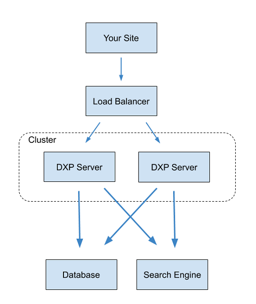
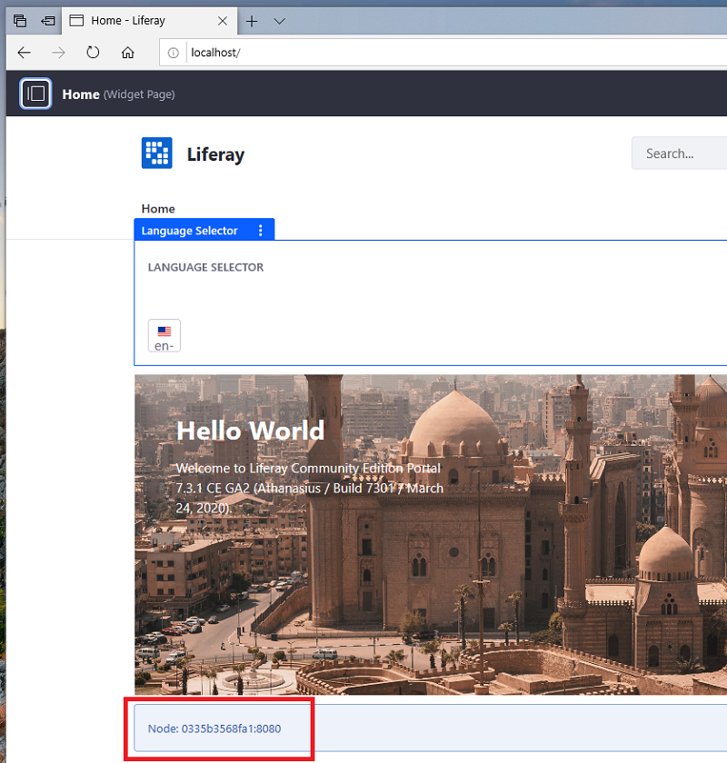
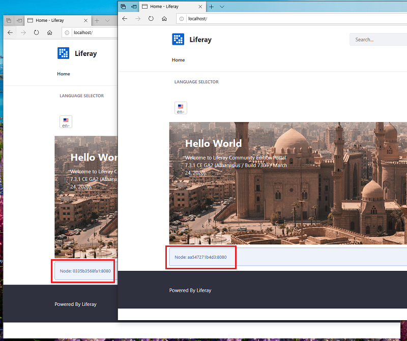

# Example: Creating a Simple DXP Cluster

An easy way to learn DXP clustering is to set up a two node DXP cluster environment on a single machine using [Docker containers](https://docs.docker.com/get-started/overview/). Here you'll prepare each required server and two DXP app server nodes in their own containers. The containers will refer to each other by container name over a Docker bridge network. This is a fast way to set up a DXP cluster development environment.

Here are the server's you'll create:

| Server Type | Implementation | Server Container |
| :---------- | :------- | :---------- |
| Database | MariaDB  | `some-mariadb` |
| Search Engine | Elasticsearch | `elasticsearch` |
| File Store | DBStore | `some-mariadb` |
| App Server | Tomcat | `dxp-1` |
| App Server | Tomcat | `dxp-2` |
| App Server | Apache Httpd | `httpd` |

The following figure depicts the DXP cluster environment you'll create.



Here are the steps for creating the cluster:

1. [Configure a Network for the Containers](#configure-a-network-for-the-containers) (example-specific)
1. [Prepare a Database Server](#prepare-a-database-server)
1. [Prepare a Search Engine Server](#prepare-a-search-engine-server)
1. [Prepare a File Store](#prepare-a-file-store)
1. [Configure the DXP Server Cluster](#configure-the-dxp-server-cluster)
1. [Front the Cluster with a Web Server](#front-the-cluster-with-a-web-server)
1. [Test the Cluster](#test-the-cluster)

```note::
   DXP cluster environments can also be set up using an `on-premises DXP Tomcat bundle <../../installing-liferay/installing-a-liferay-tomcat-bundle.md>`_, using `DXP installed to an app server <../../installing-liferay/installing-liferay-on-an-application-server/README.md>`_ on-premises, or using any combination of Docker containers and DXP installations.
```

## Configure a Network for the Containers

Since the server containers in this example run on the same machine, the server IP addresses can be complicated. By launching all of the containers on a [Docker bridge network](https://docs.docker.com/network/bridge/), the containers can refer to each other by container name, rather than IP address. Outside of this kind of environment, IP addresses would be used.

Create an arbitrarily named Docker bridge network for the containers to use on your host machine:

```bash
docker network create --driver=bridge my-bridge
```

A bridged network called `my-bridge` is available.

## Prepare a Database Server

A DXP cluster requires a data source that's accessible to all of the app server nodes. The data source can be a JNDI data source, a database server, or a database server cluster. See the [compatibility matrix](https://www.liferay.com/compatibility-matrix) for the database servers your DXP version supports.

Create a database server container based on a [MariaDB Docker image](https://hub.docker.com/_/mariadb/):

1. Create a MariaDB database server container. First, download the MariaDB Docker image.

    ```bash
    docker pull mariadb:10.2
    ```

    Run the Maria DB Docker image.

    ```bash
    docker run --name some-mariadb --network=my-bridge -e MYSQL_ROOT_PASSWORD=my-secret-pw -d mariadb:10.2
    ```

    The `docker run` command creates a MariaDB Docker container called `some-mariadb` on the `my-bridge` Docker network. The database server's `root` user password is `my-secret-pw`. See the [MariaDB Docker Hub page](https://hub.docker.com/_/mariadb/) for more information.

1. In a shell on the container, [create a database](../../reference/database-configurations.md) for DXP.

    Connect to your MariaDB container's terminal.

    ```bash
    docker exec -it some-mariadb bash
    ```

    Log in to the database.

    ```bash
    mysql -uroot -pmy-secret-pw
    ```

    Create the database.

    ```sql
    create database dxp_db character set utf8;
    ```

    End your database session.

    ```bash
    quit
    ```

    End your terminal session.

    ```bash
    exit
    ```

See [Database Configuration for Cluster Nodes](./database-configuration-for-cluster-nodes.md) for more information.

Your database server is ready for DXP.

## Prepare a Search Engine Server

A DXP cluster requires a search engine server that's accessible to all of the app server nodes. See [Configuring a Search Engine in a Cluster](./clustering-search.md) for more information.

Create a search engine server container based on an [Elasticsearch Docker image](https://hub.docker.com/_/elasticsearch):

1. Download the Elasticsearch Docker image that's compatible with your DXP version.

    ```bash
    docker pull elasticsearch:6.8.7
    ```

1. Start an Elasticsearch server container, mounting the container's data folder to a host machine folder.

    Create a folder to hold the Elasticsearch indexes.

    ```bash
    mkdir -p ~/elasticsearch/es_data_volume
    ```

    Run the Elasticsearch container.

    ```bash
    docker run -it -p 9200:9200 -p 9300:9300  -e cluster.name=LiferayElasticsearchCluster -e ES_JAVA_OPTS="-Xms512m -Xmx512m" --network my-bridge --name elasticsearch -v ~/elasticsearch/es_data_volume:/usr/share/elasticsearch/data elasticsearch:6.8.7
    ```

    The `docker run` command creates an Elasticsearch Docker container that publishes on ports `9200` and `9300`, and has an Elasticsearch cluster called `LiferayElasticsearchCluster`. `512m` of initial memory is allocated to the server. The `-v ...` option maps the container's data folder to the host machine folder you created.

1. In a shell on the container, install the required Elasticsearch plugins.

    Connect to the Elasticsearch container terminal.

    ```bash
    docker exec -it elasticsearch bash
    ```

    Navigate to the `/elasticsearch` directory.

    ```bash
    cd /usr/share/elasticsearch
    ```

    Install required plugins.

    ```bash
    ./bin/elasticsearch-plugin install analysis-icu
    ```

    ```bash
    ./bin/elasticsearch-plugin install analysis-kuromoji
    ```

    ```bash
    ./bin/elasticsearch-plugin install analysis-smartcn
    ```

    ```bash
    ./bin/elasticsearch-plugin install analysis-stempel
    ```

    Finish your terminal session.

    ```bash
    exit
    ```

Your search engine server is ready to store and retrieve search indexes for DXP.

## Prepare a File Store

A DXP cluster requires a File Store that's accessible to all of the app server nodes. For convenience, this example uses a [DBStore File Store](../../../system-administration/file-storage/other-file-store-types/dbstore.md) configured on the DXP database. It's configured by the app server nodes (described next). See [File Store](../../../system-administration/file-storage/configuring-file-storage.md) for other file store types.

## Configure the DXP Server Cluster

Each DXP app server that you add as a cluster node must be configured for the cluster and configured to connect to the servers you created.

Here's a summary of the items to configure:

| Item | Configuration Method |
| :--- | :---------- |
| Search engine connection | Configuration file |
| Data source connection | `portal-ext.properties` file | See [Database Templates](../../reference/database-templates.md) |
| File Store connection | `portal-ext.properties` file. Some File Store types require a configuration file too. | See [Configuring a File Store](../../..//system-administration/file-storage/configuring-file-storage.md) |
| Cluster Link | `portal-ext.properties` file | See [Configuring Cluster Link](./configuring-cluster-link.md) |

The Portal Properties can be specified using Docker environment variables or a `portal-ext.properties` file. Since this example uses several properties, properties files are used.

One way to organize your node configurations is to create a folder for each node:

```bash
mkdir dxp-1 dxp-2
```

You're ready to configure the DXP server nodes.

### Configure the Search Engine Connection

1. Create a search engine configuration file:

    Create an `/osgi/config/` folder.

    ```bash
    mkdir -p dxp-1/files/osgi/configs
    ```

    Create the search engine configuration file.

    ```bash
    touch dxp-1/files/osgi/configs/com.liferay.portal.search.elasticsearch6.configuration.ElasticsearchConfiguration.config
    ```

1. Add the following Elasticsearch server connection settings to the `.config` file:

    ```properties
    operationMode="REMOTE"
    transportAddresses="elasticsearch:9300"
    clusterName="LiferayElasticsearchCluster"
    ```

1. Copy the configuration to your other node(s).

    Create a `/osgi/config/` directory for the second DXP node.

    ```bash
    mkdir -p dxp-2/files/osgi/configs
    ```

    Copy the search configurations to the second DXP node.

    ```bash
    cp dxp-1/files/osgi/configs/com.liferay.portal.search.elasticsearch6.configuration.ElasticsearchConfiguration.config dxp-2/files/osgi/configs/
    ```

See [Using Configuration Files](../../../system-administration/system-settings/using-configuration-files.md) for more information.

### Configure Cluster Link and the Other Server Connections

On each DXP server, use [Portal Properties](../../reference/portal-properties.md) to enable Cluster Link and to configure connections with the data source and file store.

1. Create a `portal-ext.properties` file for each node:

    ```bash
    touch dxp-1/files/portal-ext.properties
    ```

    ```bash
    touch dxp-2/files/portal-ext.properties
    ```

1. Add the following configurations to the `dxp-1/files/portal-ext.properties` file:

    ```properties
    jdbc.default.jndi.name=

    jdbc.default.driverClassName=org.mariadb.jdbc.Driver
    jdbc.default.url=jdbc:mariadb://some-mariadb:3306/dxp_db?useUnicode=true&characterEncoding=UTF-8&useFastDateParsing=false
    jdbc.default.username=root
    jdbc.default.password=my-secret-pw

    dl.store.impl=com.liferay.portal.store.db.DBStore

    cluster.link.enabled=true

    cluster.link.autodetect.address=some-mariadb:3306

    cluster.link.channel.logic.name.control=control-channel-logic-name-1
    cluster.link.channel.logic.name.transport.0=transport-channel-logic-name-1

    web.server.display.node=true
    ```

1. Add the following configurations to the `dxp-2/files/portal-ext.properties` file:

    ```properties
    jdbc.default.jndi.name=

    jdbc.default.driverClassName=org.mariadb.jdbc.Driver
    jdbc.default.url=jdbc:mariadb://some-mariadb:3306/dxp_db?useUnicode=true&characterEncoding=UTF-8&useFastDateParsing=false
    jdbc.default.username=root
    jdbc.default.password=my-secret-pw

    dl.store.impl=com.liferay.portal.store.db.DBStore

    cluster.link.enabled=true

    cluster.link.autodetect.address=some-mariadb:3306

    cluster.link.channel.logic.name.control=control-channel-logic-name-2
    cluster.link.channel.logic.name.transport.0=transport-channel-logic-name-2

    web.server.display.node=true
    ```

You've configured the properties required to configure the server connections, to enable and configure Cluster Link. Cluster Link enables communication between the nodes and replicates cache between them.

The tables below describe the common and unique property settings.

#### Common Properties

These property settings are common to each node:

| Property Setting | Description |
| :--------------- | :---------- |
| `cluster.link.autodetect.address=some-mariadb:3306` | Known address to ping to get cluster node addresses |
| `cluster.link.enabled=true` | Enables Cluster Link |
| `dl.store.impl=com.liferay.portal.store.db.DBStore` | File Store (Document Library Store) class |
| `jdbc.default.jndi.name=` | Data source JNDI name |
| `jdbc.default.driverClassName=org.mariadb.jdbc.Driver` | Database driver class |
| `jdbc.default.url=jdbc:mariadb://some-mariadb:3306/dxp_db?useUnicode=true&characterEncoding=UTF-8&useFastDateParsing=false` | Data source URL |
| `jdbc.default.username=root` | Database admin user name |
| `jdbc.default.password=my-secret-pw` | Database admin user password |
| `web.server.display.node=true` | Displays the server address and web server port |

#### Distinguishing Properties

The following port properties and cluster logic name properties distinguish each node.

| Property | dxp-1 | dxp-2 |
| :------- | :---- | :---- |
| `cluster.link.channel.logic.name.control` | control-channel-logic-name-1 | control-channel-logic-name-2 |
| `cluster.link.channel.logic.name.transport.0` | transport-channel-logic-name-1 | transport-channel-logic-name-2 |

See [Cluster Link](./configuring-cluster-link.md) for more information on cluster configuration.

## Front the Cluster with a Web Server

Lastly, a web server is used as a reverse proxy and a load balancer. It accepts all requests and redirects them to the application server that's most available. The web server makes the application servers transparent to users.

This example fronts the application server cluster with an [Apache Web Server](http://httpd.apache.org/) that balances load by request count. But you can front DXP with the web server you want.

1. Download the [Apache Web Server image](https://hub.docker.com/_/httpd).

    ```bash
    docker pull httpd
    ```

1. Create a container for the web server.

    ```bash
    docker run -it --name httpd -p 80:80 --network my-bridge httpd
    ```

1. Copy its configuration file locally for editing.

    ```bash
    docker cp httpd:/usr/local/apache2/conf/httpd.conf .
    ```

1. In the `httpd.conf` file, add or uncomment lines for loading these modules:

    ```
    LoadModule xml2enc_module modules/mod_xml2enc.so
    LoadModule proxy_html_module modules/mod_proxy_html.so
    LoadModule proxy_module modules/mod_proxy.so
    LoadModule proxy_http_module modules/mod_proxy_http.so
    LoadModule proxy_ajp_module modules/mod_proxy_ajp.so
    LoadModule proxy_balancer_module modules/mod_proxy_balancer.so
    LoadModule slotmem_shm_module modules/mod_slotmem_shm.so
    LoadModule ssl_module modules/mod_ssl.so
    LoadModule lbmethod_byrequests_module modules/mod_lbmethod_byrequests.so
    LoadModule lbmethod_bytraffic_module modules/mod_lbmethod_bytraffic.so
    ```

1. Configure the request proxy and load balancing (using Apache's [`byrequests` method](https://httpd.apache.org/docs/2.4/mod/mod_lbmethod_byrequests.html)), by adding the [`VirtualHost` element](https://httpd.apache.org/docs/2.4/vhosts/) to the end of `httpd.conf` file:

    ```xml
    <VirtualHost *:80>
      ProxyRequests off
      ProxyPass / balancer://liferaycluster/
      ProxyPassReverse / balancer://liferaycluster/

      # Set the header for the http protocol
      RequestHeader set X-Forwarded-Proto "http"

      # Serve /excluded from the local httpd data
      ProxyPass /excluded !

      # Preserve the host when invoking tomcat
      ProxyPreserveHost on

      Header add Set-Cookie "ROUTEID=.%{BALANCER_WORKER_ROUTE}e; path=/" env=BALANCER_ROUTE_CHANGED

      <Proxy balancer://liferaycluster>
        BalancerMember "http://dxp-1:8080" route=liferay1
        BalancerMember "http://dxp-2:8080" route=liferay2

        ProxySet lbmethod=byrequests
        ProxySet stickysession=ROUTEID
      </Proxy>
    </VirtualHost>
    ```

1. Copy the edited `httpd.conf` file back to the `httpd` container.

    ```bash
    docker cp httpd.conf httpd:/usr/local/apache2/conf
    ```

1. Restart the `httpd` container to apply the changes.

   ```bash
   docker stop httpd
   docker start -i httpd
   ```

Your web server is ready to proxy requests and balance request load between the DXP application servers. It's time to see the DXP cluster in action.

## Start the DXP Cluster Nodes

The DXP cluster node containers will have this configuration:

| Configuration | dxp-1 | dxp-2 |
| :------------ | :---- | :---- |
| AJP port mapping | `8009:8009` | `9009:8009` |
| HTTP port mapping | `8080:8080` | `9080:8080` |
| OSGi container port mapping | ``11311:11311`` | `11312:11311` |
| Volume bind mount | `${PWD}/dxp-1/files:/mnt/liferay` | `${PWD}/dxp-2/files:/mnt/liferay` |

The port mappings are from the host port to the container port. The host ports are unique to avoid collisions between them on the host. The container ports need only be unique within each container, and can therefore be the same on each node (e.g., each container uses the `8080` as its web server HTTP port). Remember that the example proxy server and load balancer directs requests to each container via each container's HTTP port. Here's an excerpt from the proxy configuration:

```xml
  ...
  <Proxy balancer://liferaycluster>
    BalancerMember "http://dxp-1:8080" route=liferay1
    BalancerMember "http://dxp-2:8080" route=liferay2
    ...
  </Proxy>
  ...
```

The OSGi container mapping is for using Gogo shell on each container. The volume bind mount, leverages the DXP container's configuration phase to copy the `portal-ext.properties` files to the DXP server's [Liferay Home](../../reference/liferay-home.md).

It's time to start the DXP cluster nodes:

1. Start `dxp-1`:

    ```bash
    docker run -it --name dxp-1 --network my-bridge -p 8009:8009 -p 8080:8080 -p 11311:11311 -v ${PWD}/dxp-1/files:/mnt/liferay liferay/portal:7.3.1-ga2
    ```

    As DXP finishes stating up, it prints JGroups cluster messages like these to the console:

    ```bash
    ...
    INFO  [SCR Component Actor][JGroupsClusterChannelFactory:173] Autodetecting JGroups outgoing IP address and interface for some-mariadb:3306
    INFO  [SCR Component Actor][JGroupsClusterChannelFactory:210] Setting JGroups outgoing IP address to 172.18.0.4 and interface to eth0

    -------------------------------------------------------------------
    GMS: address=control-channel-logic-name-1, cluster=liferay-channel-control, physical address=172.18.0.4:47533
    -------------------------------------------------------------------
    INFO  [SCR Component Actor][JGroupsReceiver:93] Accepted view [control-channel-logic-name-1|0] (1)[control-channel-logic-name-1]
    INFO  [SCR Component Actor][JGroupsClusterChannel:110] Create a new JGroups channel {channelName: liferay-channel-control, localAddress: control-channel-logic-name-1, ...
    ...
    -------------------------------------------------------------------
    GMS: address=transport-channel-logic-name-1, cluster=liferay-channel-transport-0, physical address=172.18.0.4:53231
    -------------------------------------------------------------------
    ...
    INFO  [SCR Component Actor][JGroupsReceiver:93] Accepted view [transport-channel-logic-name-1|0] (1) [transport-channel-logic-name-1]
    INFO  [SCR Component Actor][JGroupsClusterChannel:110] Create a new JGroups channel {channelName: liferay-channel-transport-0, localAddress: transport-channel-logic-name-1,...
    ...
    ```

    The messages above indicate the following:

    * JGroups auto-detects `dxp-1`'s IP address as `"172.18.0.4`.
    * JGroups created `dxp-1`'s control channel and accepted it into the JGroups view.
    * JGroups created `dxp-1`'s transport channel and accepted it into the JGroups view (the cluster).

1. Start `dxp-2`:

    ```bash
    docker run -it --name dxp-2 --network my-bridge -p 9009:8009 -p 9080:8080 -p 11312:11311 -v ${PWD}/dxp-2/files:/mnt/liferay liferay/portal:7.3.1-ga2
    ```

    As the `dxp-2` node starts, the `dxp-1` prints cluster messages like these to the console:

    ```bash
    INFO  [jgroups-42,liferay-channel-control,control-channel-logic-name-1][JGroupsReceiver:93] Accepted view [control-channel-logic-name-1|1] (2) [control-channel-logic-name-1, control-channel-logic-name-2]
    INFO  [jgroups-41,liferay-channel-transport-0,transport-channel-logic-name-1][JGroupsReceiver:93] Accepted view [transport-channel-logic-name-1|1] (2) [transport-channel-logic-name-1, transport-channel-logic-name-2]
    INFO  [default-2][ClusterExecutorImpl:544] Updated cluster node {bindInetAddress=/172.18.0.5, clusterNodeId=e6ee6b63-4625-1996-0bd6-dd2edf106d95, portalInetSocketAddress=/127.0.0.1:8080, portalProtocol=http}
    ```

    These messages state `dxp-2`'s IP address (`172.18.0.5`) and that JGroups created `dxp-2`'s control channel and transport channel, and accepted the channels into the JGroups view.

DXP is available at <http://localhost>. The web server directs your request to the DXP server cluster.

### Test the Cluster

Test your cluster to make sure they show the same content changes and that DXP stays available when there is at least one cluster node running.

Start by adding content (e.g., the Language Selector widget) to your site at <http://localhost>.

Note the node's address and port (`Node: [address]:[port]`). Since the node is running in a Docker container the container ID is displayed instead of an IP address. See the figure below as an example.



You can match the container ID with the DXP container using the `docker container ls -a` command:

```bash
$ docker container ls -a | grep dxp-1
0335b3568fa1        liferay/portal:7.3.1-ga2       "/bin/sh -c /usr/loc…"   About an hour ago   Up About an hour (healthy)   8000/tcp, 8009/tcp, 11311/tcp, 0.0.0.0:8080->8080/tcp   dxp-1
$ docker container ls -a | grep dxp-2
aa547271b4d3        liferay/portal:7.3.1-ga2       "/bin/sh -c /usr/loc…"   43 minutes ago      Up 43 minutes (healthy)      8000/tcp, 8009/tcp, 11311/tcp, 0.0.0.0:9080->8080/tcp   dxp-2
```

Test server failover by stopping that DXP container. For example, if the browser is using the `dxp-1` container, stop that container.

```bash
docker stop dxp-1
```

Refresh your browser to verify that the remaining DXP server handles your request and shows the content you added earlier.



Congratulations on creating a working DXP cluster!

```tip::
   When you're ready to stop containers, use the ``docker container stop [container ID]`` command like you did to stop the DXP container above. Similarly, use the ``docker container start -i [container ID]`` command to restart the containers.
```

## What's Next

Tune your [database](./database-configuration-for-cluster-nodes.md) for your DXP cluster.

## Additional Information

* [Database Configuration for Cluster Nodes](./database-configuration-for-cluster-nodes.md)
* [Clustering Search](./clustering-search.md)
* [Configuring Cluster Link](./configuring-cluster-link.md)