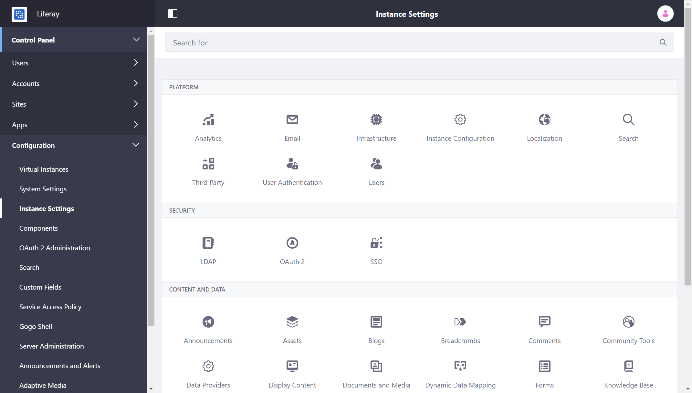
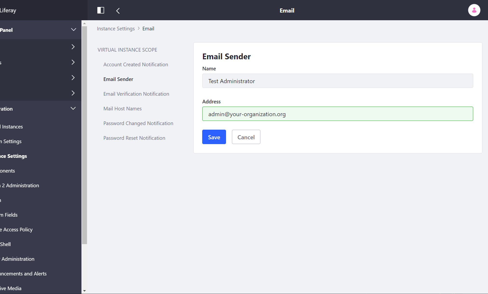

# Configuring Default Email Senders

By default, emails sent by Liferay DXP use the name and email address as the default admin user. This behavior can be configured for each of the different email types.

## Changing the Default Email Sender

To change the default email sender, follow these steps:

1. Open the *Product Menu* and navigate to the *Control Panel* → *Configuration* → *Instance Settings*.

    

1. Click *Email*.

1. Click *Email Sender*.

1. Enter your values for the following fields:

    * Name
    * Address

    

1. Click *Save*.

### Using Portal Properties to Configure the Default Email Sender

The default email sender can also be configured using a [`portal-ext.properties` file](../../reference/portal-properties.md). The following property values can be replaced with your own:

```properties
admin.email.from.name=Joe Bloggs
admin.email.from.address=test@domain.invalid
```

## Changing the Email Sender for Announcements

The Announcements application uses its own distinct sender. To configure the sender name and address for announcement emails you must use a `portal-ext.properties` file. Replace the following property values with your own:

```properties
announcements.email.to.name=
announcements.email.to.address=noreply@domain.invalid
```

## Blacklisted Emails

The following emails are blacklisted by default and cannot be used in any DXP installation:

* `noreply@liferay.com`
* `test@liferay.com`
* `noreply@domain.invalid`
* `test@domain.invalid`

Attempts to use the above emails result in a logged `WARN` trace:

```bash
Email xxx will be ignored because it is included in mail.send.blacklist
```
## Additional Information

* [Connecting to a Mail Server](./connecting-to-a-mail-server.md)
* [Alternative Email Configuration Methods](./alternative-email-configuration-methods.md)
* [Portal Properties](../../reference/portal-properties.md)