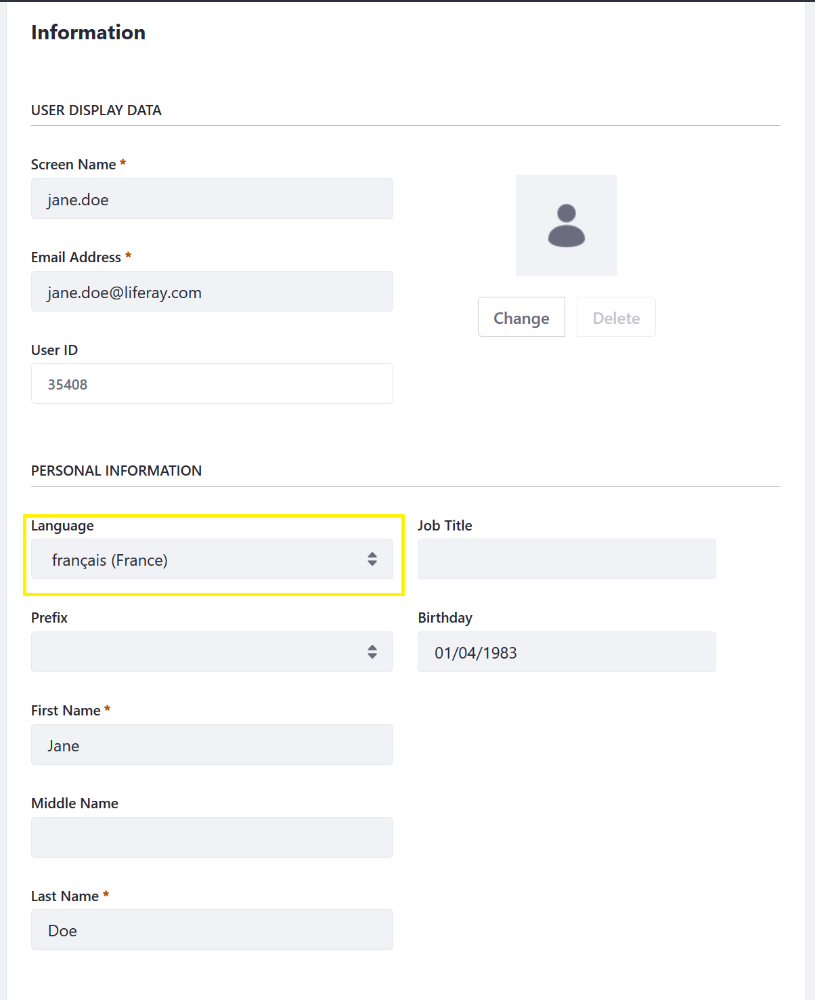

# Configuring Localization

Liferay DXP supports localization by language, time zone, and more. The English (US) language translation and GMT time zone are the defaults, but DXP has over forty translations and can be set to any time zone. Localization is scoped for virtual instances, widgets in each instance, and individual users.
 
Localization can be configured using these interfaces:

* [Setup Wizard](#setup-wizard)
* [Control Panel](#control-panel)
* [Portal Properties](#portal-properties)

## Setup Wizard

The [Setup Wizard](../../installing-liferay/running-liferay-dxp-for-the-first-time.md) sets the DXP instance's default language and time zone. They're available to select in the _Default Language_ and _Time Zone_ dropdown menus.


The Setup Wizard is enabled by default for [DXP Tomcat Bundles](../../installing-liferay/installing-a-liferay-dxp-tomcat-bundle.md) and [DXP application server installations](../../installing-liferay/installing-liferay-dxp-on-an-application-server.html).

If you have already launched DXP, change the instance's default language and time zone in the Control Panel.

## Control Panel

Localization settings at every scope (virtual instance, widget, and user) can be set in the Control Panel. 

### Virtual Instance and Widget Settings

Localization for instances and their configurable widgets can be set in that instance's _Localization_ pages. See [Configuring a Virtual Instance Localization](../../../system-administration/virtual-instances/configuring-a-virtual-instance-localization.md) for instructions.

### User-Specific Settings

Here's how to set an individual user's language and time zone:

1. Navigate to the _Control Panel_ &rarr; _Users and Organizations_.
1. Select a language in the _Language_ dropdown menu.

    

1. Click _Save_.
1. Click the _Preference_ tab.
1. Click _Display Settings_ in the left menu.
1. Select the desired time zone.

    

1. Click _Save_.

For this user, the DXP instance is now displayed in her specific language and all assets are time-stamped in her time zone.

## Portal Properties 

If you want to configure the default virtual instance's localization before starting DXP, use a [`portal-ext.properties` file](../../../reference/portal-properties.md).

| **Portal Property** | **Description** |
| :------------------ | :-------------- |
| `company.default.locale` | Set it to any available locale, defined for the [`locales`](https://docs.liferay.com/ce/portal/7.3-ga2/propertiesdoc/portal.properties.html#Languages%20and%20Time%20Zones) portal property. |
| `company.default.time.zone` | Set it to any of the time zones defined in the [`time.zones`](https://docs.liferay.com/ce/portal/7.3-ga2/propertiesdoc/portal.properties.html#Languages%20and%20Time%20Zones) portal property. |

For example,

```properties 
company.default.locale=pt_PT
company.default.time.zone=Europe/Lisbon
```

The properties above localize the virtual instance for users in Lisbon, Portugal.

## Additional Information

* [Configuring a Virtual Instance Localization](../../system-administration/virtual-instances/configuring-a-virtual-instance-localization.md)

* [Overriding Global Language Keys](https://help.liferay.com/hc/en-us/articles/360029122551-Overriding-Global-Language-Keys)

* [Localizing Your Application](https://help.liferay.com/hc/en-us/articles/360028746692-Localizing-Your-Application)