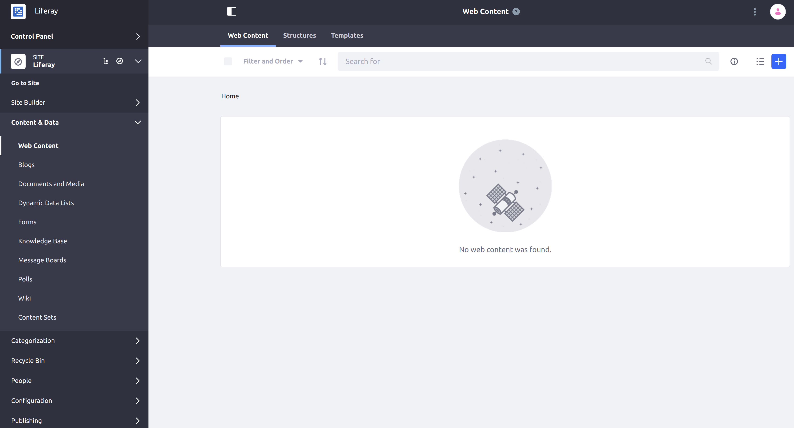

# Creating a Model Listener

Model listeners listen for persistence method calls that signal changes to a specified model (such as `update` or `add` methods). Most of the methods model listeners use are called from DXP's [`BasePersistenceImpl`](https://github.com/liferay/liferay-portal/blob/7.3.1-ga2/portal-kernel/src/com/liferay/portal/kernel/service/persistence/impl/BasePersistenceImpl.java) class. You can define model listeners for out-of-the-box entities (like `JournalArticle` or `AssetEntry`), or for your own entities.

To add a model listener, you implement the [`ModelListener`](https://github.com/liferay/liferay-portal/blob/7.3.1-ga2/portal-kernel/src/com/liferay/portal/kernel/model/ModelListener.java) interface.

Here, you'll learn how to create model listeners:

1. [Examine a Running Model Listener](#examine-a-running-model-listener)
1. [Identify a Model Class and Event](#identify-a-model-class-and-event)
1. [Declare the Model](#declare-the-model)
1. [Declare the Event](#declare-the-event)
1. [Implement Your Business Logic](#implement-your-business-logic)
1. [Deploy and Test](#deploy-and-test)

## Examine a Running Model Listener

First, deploy an example model listener for the `JournalArticle` model on your instance of Liferay DXP:

1. Start the DXP image.

    ```bash
    docker run -it -p 8080:8080 liferay/portal:7.3.1-ga2
    ```

1. Download and unzip `Acme Model Listener`.

    ```curl
    curl https://learn.liferay.com/dxp-7.x/liferay-internals/extending-liferay/liferay-n4g6.zip -O
    ```

    ```bash
    unzip liferay-n4g6.zip
    ```

1. Build and deploy the example.

    ```bash
    ./gradlew deploy -Ddeploy.docker.container.id=$(docker ps -lq)
    ```

    ```note::
      This command is the same as copying the deployed jars to /opt/liferay/osgi/modules on the Docker container.
    ```

1. Confirm the deployment in the Docker container console.

    ```
    STARTED com.acme.n4g6.impl_1.0.0
    ```

1. Verify that the example model listener was added by viewing the added log message. Open your browser to `https://localhost:8080` and navigate to the Site menu → _Content & Data_ → _Web Content_.

   

   Click the add  button, then click _Basic Web Content_ to add a new article. Fill out a title and some content; then click _Publish_. A warning message appears in the console:

   ```
   2020-03-17 23:14:56.301 WARN  [http-nio-8080-exec-5][N4G6ModelListener:23] A new web content article was added.
   ```

Congratulations! You've successfully built and deployed a new model listener that implements `ModelListener`.

As you can see, Model Listeners listen for an *event* on a particular *model*. For this listener, the event is `onAfterCreate`. When the content is created, the listener "hears" the event, and the action is fired when the event happens.

Now you'll modify the example to listen for a different event.

## Identify a Model Class and Event

Model classes in Liferay DXP are generated by [Service Builder](../../developing-applications/data-frameworks/service-builder.md). Model interfaces can be found in the `-api` module of any application. For example, to find the model interface for a Message Boards message, look in the `modules/apps/message-boards/message-boards-api` project in Liferay DXP's source code.

The exception to this rule is for core models. If you want to create a Model Listener for a core class such as `User`, you can find its interface in the `portal-kernel` folder of Liferay DXP's source code.

The model listener you'll create is for a Message Boards message. You'll trigger a message that prints in the log a report when a message is deleted. For a list of possible events, see the Javadoc for [BaseModelListener](https://docs.liferay.com/portal/7.3-latest/javadocs/portal-kernel/com/liferay/portal/kernel/model/BaseModelListener.html).

## Model Listener Behavior

Model listeners implement the [`ModelListener`](https://github.com/liferay/liferay-portal/blob/7.3.1-ga2/portal-kernel/src/com/liferay/portal/kernel/model/ModelListener.java) interface for specific entities. Model listeners can have code to execute before or after those entities are created, updated, or removed. All of these methods are called from the `BasePersistenceImpl` class; the code for created or updated entities is called from the `update` method in `BasePersistenceImpl`, and the code for removed entities is called from the `remove` method in `BasePersistenceImpl`.

Model listeners can also have code to execute before or after other kinds of related entities are added or removed. These methods are called from the `_addTableMapping` method in [`TableMapperImpl`](https://github.com/liferay/liferay-portal/blob/7.3.1-ga2/portal-kernel/src/com/liferay/portal/kernel/internal/service/persistence/TableMapperImpl.java).

Now you'll modify the project so it operates on the `MBMessage` class and the `onBeforeRemove` event.

## Declare the Model

1. Open the `N4G6ModelListener` class in your text editor or IDE.

1. Find the class declaration:
    ```java
    @Component(immediate = true, service = ModelListener.class)
    public class N4G6ModelListener extends BaseModelListener<JournalArticle> {
    ```

    When extending `BaseModelListener`, you define the model class where your listener listens for events (in this example, `JournalArticle`).

1. Modify the model class to `MBMessage`:

   ```java
   @Component(immediate = true, service = ModelListener.class)
   public class N4G6ModelListener extends BaseModelListener<MBMessage> {
   ```

   When this model listener is registered, it listens to events for the model defined. The model can be an out-of-the-box entity or a custom entity. Extending the `BaseModelListener` class gives a default, empty implementation for each of `ModelListener`'s methods, so your code stays clean and contains overrides for only the events you need.

## Declare the Event

Next, override the implementation for the event you want:

1. Find the `onAfterCreate` method:

   ```java
   public void onAfterCreate(JournalArticle model)
   ```

1. Change the method so it overrides `onBeforeRemove` and passes the `MBMessage` as a parameter:

   ```java
   public void onBeforeRemove(MBMessage model)
   ```

## Implement Your Business Logic

Triggering a particular action is a typical reason to listen for a particular model event. This example keeps things simple: when a Message Boards message is deleted, we want to report the message's subject in the logs.

1. In your new `onBeforeRemove` method, replace the `if` statement with this one:

   ```java
   if (_log.isWarnEnabled()) {
       _log.warn("Warning! Message " + model.getSubject() + " was just removed.");
   }
   ```

1. Add the new import for `MBMessage` to your imports section at the top of the file:

   ```java
   import com.liferay.message.boards.model.MBMessage;
   ```

   Remove the unused import for `JournalArticle`.

1. Save your new model listener.

## Deploy and Test

You can build and deploy the model listener as you did above:

```bash
./gradlew deploy -Ddeploy.docker.container.id=$(docker ps -lq)
```

Test your listener by adding and then deleting a message boards message:

1. Go to *Product Menu* &rarr; *Content & Data* &rarr; *Message Boards*.

1. Click the add  button, type a Subject and a Body, and click *Publish*.

1. Click *Message Boards* from the menu again to see your message. Click the Action  button and choose *Move to Recycle Bin*. Notice that you don't see your message in the logs yet because the message has only been recycled.

1. Click *Recycle Bin* from the Product Menu, and you'll see your message.

1. Click the Action  button and select *Delete*. Confirm the deletion.

1. Check your log. Your message appears:

   ```
   2020-04-17 21:10:31.080 WARN  [http-nio-8080-exec-5][N4G6ModelListener:19] Warning! Message This is a Test Message was just removed.
   ```

## Conclusion

Congratulations! You now know how to implement the `ModelListener` interface, and have added a new model listener to Liferay DXP.

## Related Topics

[ModelListener Javadoc](https://docs.liferay.com/portal/7.3-latest/javadocs/portal-kernel/com/liferay/portal/kernel/model/BaseModelListener.html)

[Service Builder](../../developing-applications/data-frameworks/service-builder.md)
