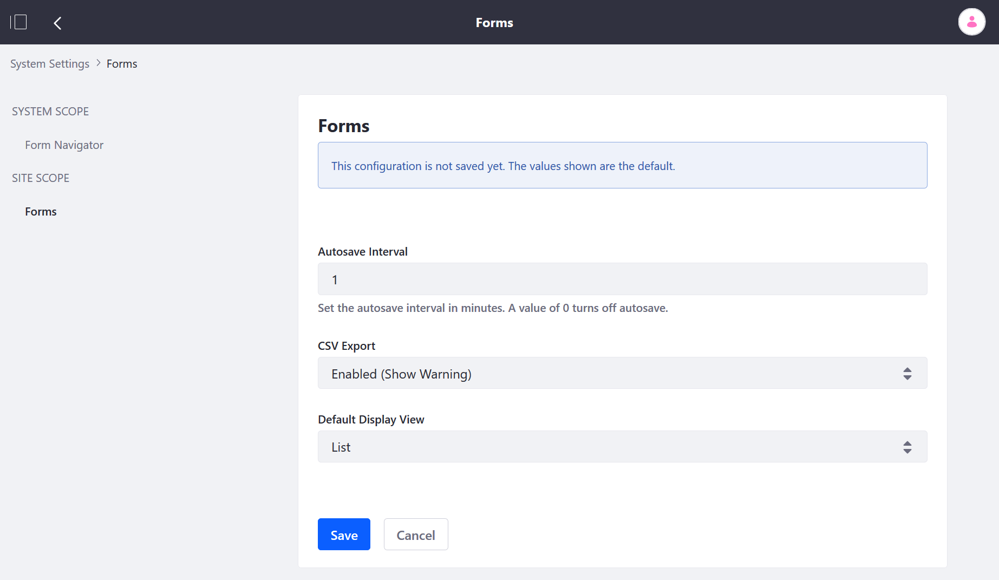

# Customizing Auto-Save Behavior

The _Forms_ application automatically saves the form's progress as you [create a form](../creating-forms.md). By default, a form's draft is auto-saved every minute.

To change the duration:

1. Navigate to the _Control Panel_ &rarr; _Configuration_ &rarr; _System Settings_.
1. Under _Content and Data_, click _Forms_.
1. On the left menu, click _Forms_ under _Site Scope_.

    

1. Enter a different Autosave Interval value to increase the interval. To disable Autosave, enter 0.
1. Click _Save_.

## Additional Information

* [Creating Forms](../creating-forms.md)
