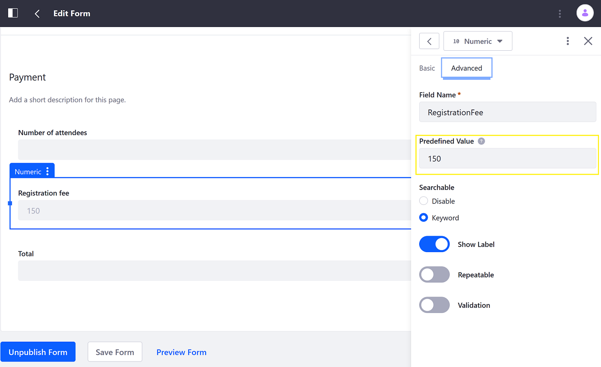

# Providing Help Text and Predefined Values

Form fields can be configured to have help text, placeholder text, and predefined values that assist users in understanding and filling out a form.

* **Help Text:** Text that appears as a sub-heading to the field label, but does not appear in the field entry area. Enter help text in the Basic tab of the field's sidebar menu.

* **Placeholder Text:** Text in the field entry area that is not submitted if the field is left untouched by the user.

* **Predefined Value:** Text in the field entry area that is submitted if the field is left untouched by the user.

All form field types can have help text, and all form field types that accept user input can have predefined values. Only text and numeric fields can have placeholder text.

## Entering Help or Placeholder Texts

To enter placeholder text:

1. Open a field's sidebar menu.
1. Click the _Basic_ tab.

    

1. Enter the following:

    * **Placeholder Text**: John Smith
    * **Help Text**: Enter your full name.

1. Click _Save Form_ when finished.

The form now has placeholder values.

## Entering a Predefined Value

1. Click the _Advanced_ tab.
1. Enter the Predefined Value.

    

1. Click _Save Form_ when finished.

## Additional Information

* [Creating Forms](./creating-forms.md)
